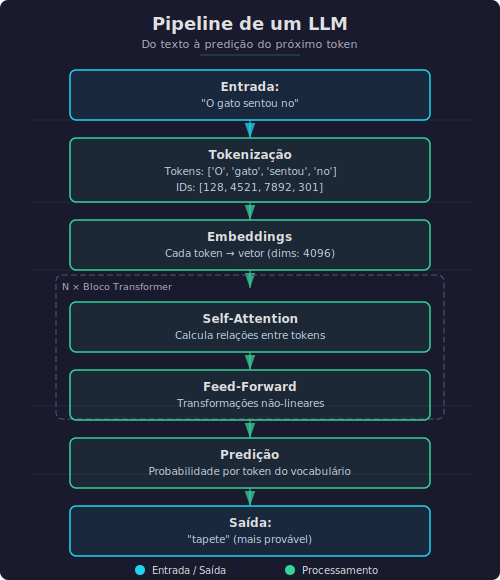
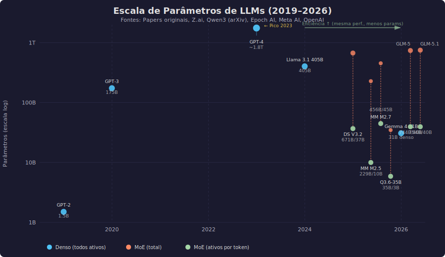
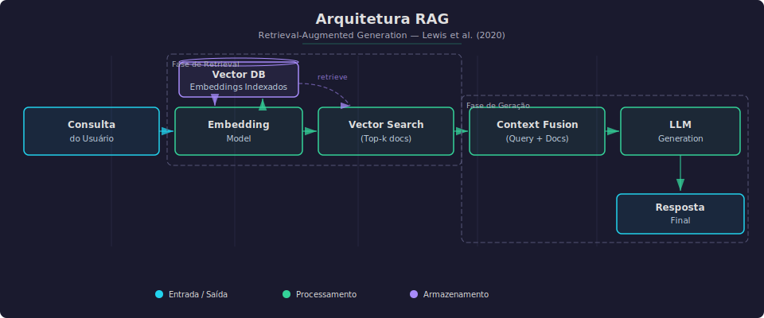
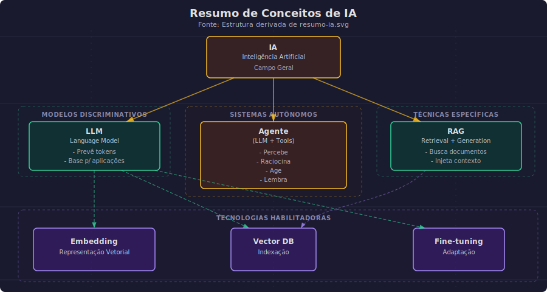
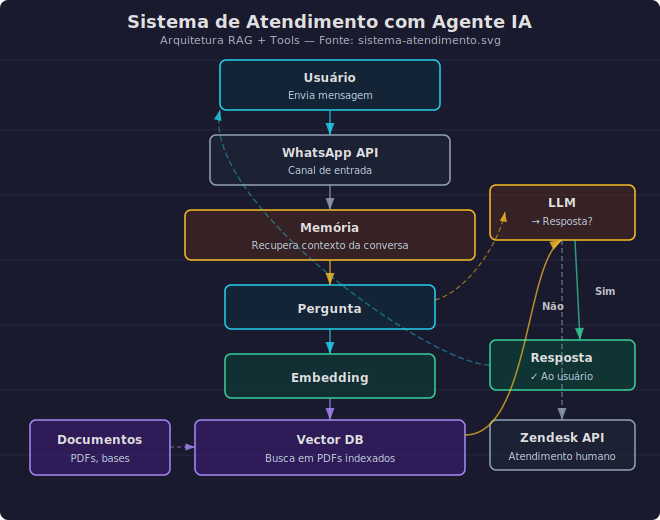

#+TITLE: IA, LLM, RAG, Agentes: Entendendo as Nomenclaturas
# Semana 01 - 17/04/2026
#+DESCRIPTION: Semana 01 - Guilda de IA: Entendendo as nomenclaturas fundamentais de IA
#+SETUPFILE: ./setupfile.org
#+LANGUAGE: pt_BR
#+STARTUP: inlineimages showall latexpreview
#+DATE: 17/04/2026

* O Problema

Muita gente usa esses termos como se fossem a mesma coisa. Não são. Neste artigo, vamos definir formalmente cada conceito e entender as diferenças fundamentais entre eles.

* IA (Inteligência Artificial)

** Definição formal

Inteligência Artificial é um campo da ciência da computação dedicado a criar sistemas capazes de executar tarefas que normalmente requerem inteligência humana, como percepção, raciocínio, aprendizado e tomada de decisão.

** Base teórica

O termo foi cunhado por John McCarthy em 1956, na Conferência de Dartmouth, considerada o marco fundador do campo. Mas a história começa antes[fn:hist].

O *prelúdio* veio com a **Cibernética** (1940s): Warren McCulloch, Walter Pitts e Norbert Wiener investigando "mente como circuito" — sistemas de feedback, auto-organização, e a ideia de que processos cognitivos poderiam ser realizados por máquinas.

*** Alan Turing e os fundamentos

Em 1936, antes mesmo do termo "inteligência artificial", Alan Turing publicou "On Computable Numbers", demonstrando que existe uma sequência finita de passos (algoritmo) para qualquer processo computacional — incluindo, hipoteticamente, processos cognitivos.

A **Tese de Church-Turing** sugere: se um ser pensante opera uma sequência finita de passos para realizar um processo cognitivo, então tal processo pode ser realizado por uma Máquina de Turing.

Isso estabelece a base filosófica: *computação e IA são indissociáveis*. Sempre houve a pretensão de criar tecnologias que simulem ou se assemelhem a mentes artificiais.

#+begin_quote
*Nota:* Esta classificação acompanha a evolução acadêmica da ciência cognitiva — ver Carvalho, Pereira & Coelho (2015) para a genealogia completa das escolas.
#+end_quote

Desde Dartmouth, a IA evoluiu através de vários paradigmas:

1. *IA Simbólica (1950s-1980s):* Sistemas baseados em regras explícitas e representação de conhecimento
2. *IA Conexionista (1980s-presente):* Redes neurais artificiais inspiradas no cérebro
3. *IA Estatística (1990s-2010s):* Métodos probabilísticos e aprendizado de máquina
4. *IA Generativa (2017-presente):* Modelos que criam novo conteúdo

** Classificação por capacidades (para construtores)

Ao escolher um modelo, o que importa são as **capacidades**, não o marketing:

| Capacidade | O que faz | Modelos com essa capacidade |
|------------|-----------|-----------------------------|
| *Geração de texto* | Completa prompts | Todos os LLMs |
| *Contexto longo* | Janela de contexto grande (100K+) | Gemini 3 Flash/3.1 Flash-Lite (1M), Claude 4.7 (1M), Qwen 3.6 Plus (1M), Kimi K2.5 (128K), GLM-5.1 (~200K) |
| *Tool calling* | Consegue chamar ferramentas externas | Gemini 3 Flash, Claude 4.7, GPT-5.4, Qwen 3.6 Plus, GLM-5.1, Gemma 4 31B |
| *Raciocínio* | Pensamento passo a passo explícito | DeepSeek R1, o1, Gemini 3 Flash Thinking, Gemma 4 31B, Qwen 3.6 Plus (always-on CoT) |
| *Multimodalidade* | Imagem, áudio, vídeo | Gemini 3 Flash, Qwen 3.6 Plus, Gemma 4, Kimi K2.5, Qwen 3.6-35B-A3B |
| *Vision* | Processa imagens | Gemini 3 Flash, Claude 4.7, Qwen 3.6 Plus, Gemma 4, Kimi K2.5 |

#+begin_quote
*Dica:* Para construir agentes, o essencial é **tool calling** e **estabilidade**. Modelos densos (não-MoE) tendem a ser mais estáveis nisso.
#+end_quote

** Sobre o termo "AGI"

#+begin_quote
*"AGI virou termo de hype" — Andrew Ng (Google Brain) e Yann LeCun (Meta AI)*

Andrew Ng, fundador do Google Brain e professor de Stanford, afirma que "AGI virou um termo de hype, não um termo com significado preciso". Yann LeCun, Chief AI Scientist da Meta e vencedor do Turing Award, complementa: "O hype de IA é ridículo em todas as direções."

O problema: não existe definição rigorosa. Empresas usam para criar FOMO[fn:fomo] e justificar valuations.

Para quem constrói, o que importa são **capacidades mensuráveis**: o modelo X faz tool calling? Tem contexto suficiente? É estável? Foco no que você pode testar.
#+end_quote

* LLM (Large Language Model)

** Definição formal

Large Language Model é um tipo de modelo de linguagem neural baseado na arquitetura Transformer, treinado em grandes corpus de texto (bilhões a trilhões de tokens) para prever a próxima palavra em uma sequência, desenvolvendo capacidades emergentes de compreensão e geração de linguagem natural.

** Base teórica

Os LLMs fundamentam-se na arquitetura Transformer proposta por Vaswani et al. (2017). O mecanismo de *self-attention* permite que o modelo pondere a importância de diferentes partes do input de forma dinâmica.

** Como funciona (detalhado)

** Escala de Modelos (2019-2026)

A evolução de LLMs foi exponencial em duas dimensões: tamanho e eficiência.

#+begin_quote
*Paradoxo da eficiência:* Em 2023, GPT-4 foi o estado da arte com ~1.8T parâmetros. Em 2026, Gemma 4 E4B (4B parâmetros) alcança desempenho comparable em muitos benchmarks. Modelos modernos são ~450x menores e igualmente capazes.
#+end_quote

*** Como a eficiência aumentou

Alguns fatores que permitiram modelos menores e mais capazes:

1. *Treino com mais dados* - Mais tokens de treino compensam menos parâmetros
2. *Distilação* - Modelos pequenos aprendem com modelos grandes
3. *Arquiteturas eficientes* - MoE (Mixture of Experts), atenção eficiente
4. *Pós-treino* - Fine-tuning focado em tarefas específicas

A tabela abaixo mostra o progresso:

| Modelo | Parâmetros | Tokens de Treino | Ano | Status |
|--------+------------+-------------------+------+--------|
| GPT-2 | 1.5B | ~40B | 2019 | Histórico |
| GPT-3 | 175B | ~300B | 2020 | Histórico |
| GPT-4 | ~1.8T | ~13T | 2023 | Proprietário |
| Llama 3.1 405B | 405B | ~15T | 2024 | Open Weights |
| [[https://huggingface.co/deepseek-ai/DeepSeek-V3.2][DeepSeek V3.2]] | 671B MoE | ~14.8T | 2025 | Open Weights |
| *[[https://huggingface.co/zai-org/GLM-5][GLM-5]]* | 744B MoE (40B ativos) | ~28.5T | 2026 | Open Weights (MIT) |
| *[[https://huggingface.co/zai-org/GLM-5.1][GLM-5.1]]* | 754B MoE (40B ativos) | ~28.5T | 2026 | Open Weights (MIT) |
| *Qwen3.5* (série) | 0.5B-397B MoE | ~36T | 2026 | Open Weights (Apache 2.0) |
| *[[https://huggingface.co/google/gemma-4-31b][Gemma 4 31B]]* | 31B denso | Não divulgado | 2026 | Open Weights (Apache 2.0) |

#+begin_quote
*Nota:* Os parâmetros "ativos" em MoE indicam quantos parâmetros são usados por inferência. GLM-5.1 tem 754B totais, mas só 40B ativos por token. Modelos densos (Gemma 4 31B) usam todos os parâmetros. Google não divulgou os tokens de treino do Gemma 4 — prática comum em modelos proprietários. Os dados de treino do Qwen3.5 vêm do paper do Qwen3 (~36T tokens). GLM-5 e 5.1 compartilham o mesmo corpus de 28.5T tokens (fonte: Z.ai blog e arXiv). Os dados históricos (GPT-2, GPT-3, GPT-4) são estimativas de papers oficiais e reports de terceiros — GPT-4 não teve o valor confirmado pela OpenAI (~13T por Semafor/leaked info).
#+end_quote

*** Gráfico: Explosão de parâmetros e a revolução da eficiência

#+begin_quote
*Tendência:* A escalada de parâmetros atingiu pico em 2023 (GPT-4). Depois, open weights e arquiteturas eficientes (MoE, distilação) permitiram modelos cada vez menores com performance similar ou superior.
#+end_quote

#+begin_quote
*Nota:* DeepSeek V3.2 tem 671B parâmetros totais, mas só usa ~37B por inferência (MoE). Gemma 4 31B é denso — todos os parâmetros são usados.
#+end_quote

** Estado da Arte (Abril 2026)

Top modelos por benchmark (MMLU Pro):

| Modelo | Tipo | MMLU Pro | Contexto | Preço/M tokens |
|--------|------|----------|----------|----------------|
| *[[https://huggingface.co/deepseek-ai/DeepSeek-V3.2][DeepSeek V3.2]]* | Open Weights | 82.3% | 128K | USD 0.30 (~BRL 1.65) |
| *[[https://huggingface.co/moonshotai/Kimi-K2.5][Kimi K2.5]]* | Open Weights | ~83% | 128K | Local (grátis) |
| *[[https://huggingface.co/Qwen/Qwen3.5-397B-A17B][Qwen3.5-397B-A17B]]* | Open Weights | 81.5% | 128K | Local (grátis) |
| *[[https://huggingface.co/MiniMaxAI/MiniMax-M2.5][MiniMax M2.5]]* | Open Weights (MIT mod.) | 80.1% | ~200K | USD 0.15/1.20 (~BRL 0.83/6.60) |
| *[[https://huggingface.co/MiniMaxAI/MiniMax-M2.7][MiniMax M2.7]]* | Open Weights (MIT mod.) | ~84% | 204K | USD 0.30 (~BRL 1.65) |
| *Gemini 3 Flash* | Proprietário | 88.0% | 1M tokens | USD 0.50/3.00 (~BRL 2.75/16.50) |
| *Gemini 3.1 Flash-Lite* | Proprietário | 88.9% | 256K tokens | Gratuito* |
| *[[https://huggingface.co/zai-org/GLM-5][GLM-5]]* | Open Weights (MIT) | ~85% | 128K | USD 2.10 (~BRL 11.55) / Local |
| *[[https://huggingface.co/zai-org/GLM-5.1][GLM-5.1]]* | Open Weights (MIT) | ~86% | ~200K | ~USD 0.95/3.15 (~BRL 5.23/17.33) / Local |
| *Qwen 3.6 Plus* | Proprietário | 88.5% | 1M tokens | API only |
| *GPT-5.4* | Proprietário | ~88% | 1M tokens | USD 5.00 (~BRL 27.50) |
| *Claude Opus 4.7* | Proprietário | ~90% | 1M tokens | USD 5.00 (~BRL 27.50) |
| *[[https://huggingface.co/Qwen/Qwen3.6-35B-A3B][Qwen 3.6-35B-A3B]]* | Open Weights (Apache 2.0) | 85.2% | 262K | Local (grátis) |

#+begin_quote
*Nota:* Qwen 3.6 Plus NÃO é open weights (diferente da maioria dos Qwen), tem 1M de contexto e reasoning always-on. Qwen 3.6-35B-A3B é open weights (Apache 2.0), 35B/3B MoE, supera o Qwen3.5-27B em coding. GPT-4o foi aposentado em Fevereiro/2026. GPT-5.4 (março/2026) substituiu o GPT-5.2 com computer use nativo e 1M de contexto. Gemini 3.1 Flash-Lite tem tier gratuito na API (500 RPD). Gemini 3 Flash (SWE-bench 78%, τ²-bench 90.2%) é pago: USD 0.50/3.00 por M tokens. Não existe "Gemini 3.1 Flash" — os modelos de texto da série 3 são: 3 Flash (agentic, pago), 3.1 Flash-Lite (leve, gratuito), 3.1 Pro (top, pago). Gemini 2.5 Flash (gratuito, 1.500 RPD) ainda é a opção free mais generosa para Colab/API. GLM-5.1 (MIT License) é o modelo open weights mais forte em coding — SWE-bench Pro 58.4%, execução autônoma de até 8 horas. MiniMax M2.5 é mais barato que M2.7 (USD 0.15 vs USD 0.30/M input) e melhor pra batch processing; M2.7 tem self-evolution e é melhor pra coding interativo. Atenção: M2.7 tem licença MIT modificada que proíbe uso comercial. Câmbio: USD 1 = BRL 5.50.
#+end_quote

*** Destaque: MiniMax M2.7 e Self-Evolution

MiniMax M2.7 é o **primeiro modelo com auto-evolução real**:

- **56.22% SWE-Bench Pro** — entre os melhores open para coding
- **ELO 1495 GDPval-AA** — topo entre open-source
- **97% skill adherence** — consistência em tool calling
- **Self-optimization loop:** analisa próprias falhas, modifica o harness, itera
- **Pesos NÃO mudam** — o que evolui é o sistema ao redor (skills, memory, tools)

#+begin_quote
*Self-evolution:* M2.7 analisa falhas em tasks anteriores, gera código para melhorar seu próprio harness (tools, prompts, memória), e itera. Os pesos permanecem fixos — o que evolui é o sistema ao redor. É um passo em direção à auto-melhoria de agentes.
#+end_quote

*** Destaque: MiniMax M2.5 — Irmão Mais Barato

MiniMax M2.5 é o modelo "prático" da família:

- **SWE-bench Verified 80.2%** — próximo do Opus 4.6
- **MMLU Pro 80.1%** — competitivo entre open
- **Preço: USD 0.15/M input** — metade do M2.7
- **229B total / 10B ativos** — MoE eficiente
- **~200K contexto**

#+begin_quote
*M2.5 vs M2.7:* M2.5 é melhor para batch processing e tarefas onde custo importa mais que velocidade. M2.7 é melhor para coding interativo (self-evolution, mais estável em loops de agente). Atenção: ambos usam licença MIT modificada que proíbe uso comercial — diferente de GLM-5 (MIT puro) e Qwen (Apache 2.0).
#+end_quote

**Comparação: Modelos Flagship Recentes**

| Modelo | Open Weights | Treinamento | Destaque |
|--------|--------------|-------------|----------|
| [[https://huggingface.co/zai-org/GLM-5][GLM-5]] | Sim (MIT) | Standard | Agente open robusto |
| [[https://huggingface.co/zai-org/GLM-5.1][GLM-5.1]] | Sim (MIT) | Long-horizon | SWE-bench Pro 58.4%, 8h autônomo, 94.6% do Opus 4.6 em coding |
| [[https://huggingface.co/MiniMaxAI/MiniMax-M2.7][MiniMax M2.7]] | Sim (MIT mod.) | Self-evolution | Primeiro com auto-otimização |
| [[https://huggingface.co/MiniMaxAI/MiniMax-M2.5][MiniMax M2.5]] | Sim (MIT mod.) | Standard | USD 0.15/M input, melhor pra batch, SWE 80.2% |
| Qwen 3.6 Plus | **Não** | Standard | 1M contexto, agentic coding, reasoning always-on |
| [[https://huggingface.co/Qwen/Qwen3.6-35B-A3B][Qwen 3.6-35B-A3B]] | Sim (Apache 2.0) | Standard | 3B ativos, supera Qwen3.5-27B em coding |
| Claude Opus 4.7 | **Não** | Standard | SWE-bench Verified 87.6%, GPQA 94.2% |

#+begin_quote
*Tendência:* A disputa entre modelos proprietários e open weights está cada vez mais acirrada. GLM-5.1 (MIT, 754B MoE) empata com GPT-5.4 e Opus 4.6 em SWE-bench Pro, custando uma fração do preço. Qwen 3.6-35B-A3B (3B ativos, Apache 2.0) roda em hardware modesto e supera modelos 10x maiores em coding.
#+end_quote

*** Modelos de Acesso Restrito (Abril 2026)

Em abril/2026, Anthropic e OpenAI anunciaram modelos de acesso controlado para cybersecurity:

| Modelo | Empresa | Acesso | Destaque |
|--------|---------|--------|----------|
| Claude Mythos | Anthropic | Governo EUA + empresas selecionadas | SWE-bench 93.9%, exploração autônoma de vulnerabilidades |
| GPT-5.4-Cyber | OpenAI | Programa Trusted Access for Cyber | Cybersecurity defensiva, 3000+ vulnerabilidades corrigidas |

#+begin_quote
*Por que acesso restrito?* Esses modelos têm capacidade avançada de encontrar e explorar falhas de segurança em software. Por isso, não estão disponíveis publicamente. Mythos foi o primeiro a demonstrar exploração autônoma de sistemas com segurança robusta, gerando debate sobre a responsabilidade de liberar capacidades ofensivas. GPT-5.4-Cyber é a resposta da OpenAI, focada em defesa. O GPT-5.4-Cyber NÃO é equivalente ao Mythos — é defensivo, não ofensivo.

Para quem constrói agentes, o que importa: esses modelos **não estão disponíveis via API pública** e não impactam o dia a dia de desenvolvimento. Mas são um marco no debate sobre limites de capacidade de IA.
#+end_quote

** Modelos Pequenos (Edge/Local)

Para rodar localmente em CPU/GPU modesta:

| Modelo | Parâmetros | Destaque | Licença |
|--------|------------|----------|---------|
| *[[https://huggingface.co/google/gemma-4-E2B][Gemma 4 E2B]]* | ~2B efetivos | Roda em celular, multimodal | Apache 2.0 |
| *[[https://huggingface.co/google/gemma-4-E4B][Gemma 4 E4B]]* | ~4B efetivos | Vision + áudio nativo | Apache 2.0 |
| *[[https://huggingface.co/google/gemma-4-26b-a4b-it][Gemma 4 26B A4B]]* | 26B (4B ativos) | MoE eficiente, reasoning forte | Apache 2.0 |
| *[[https://huggingface.co/Qwen/Qwen3.5-4B][Qwen3.5-4B]]* | 4B | Vision + thinking integrados | Apache 2.0 |
| *[[https://huggingface.co/Qwen/Qwen3.5-9B][Qwen3.5-9B]]* | 9B | Melhor custo-benefício | Apache 2.0 |
| *[[https://huggingface.co/Qwen/Qwen3.6-35B-A3B][Qwen 3.6-35B-A3B]]* | 35B (3B ativos) | Agentic coding, supera 27B densos, multimodal | Apache 2.0 |
| *[[https://huggingface.co/Qwen/Qwen3.5-27B][Qwen3.5-27B]]* | 27B denso | Referência para agentes, estável | Apache 2.0 |
| *[[https://huggingface.co/google/gemma-4-31b][Gemma 4 31B]]* | 31B denso | #3 open model, coding (80% LiveCodeBench) | Apache 2.0 |

#+begin_quote
*Dica:* Para agentes locais, Gemma 4 31B e Qwen3.5-27B são as escolhas mais robustas. Ambos densos, ambos com tool calling estável. Gemma 4 vence em coding, Qwen3.5 vence em multilingual. Prefira modelos densos (não-MoE) para tool calling estável. Qwen 3.6-35B-A3B é exceção: sendo MoE de 3B ativos, roda em hardware modesto e ainda supera o 27B denso em coding — boa opção para quem tem GPU limitada.
#+end_quote

** Google AI Edge Gallery

Aplicativo Android (beta) para rodar modelos localmente:

- Roda Gemma 4 E2B e E4B no celular
- Funciona **offline**, sem API, sem custo
- Suporta texto, imagem e áudio
- Disponível na Google Play Store

#+begin_quote
*Para iniciantes:* O AI Edge Gallery é a forma mais fácil de experimentar IA local sem configurar nada. Instala e usa.
#+end_quote

** Referências

- Vaswani, A. et al. (2017). "Attention Is All You Need". [[https://arxiv.org/abs/1706.03762][arXiv:1706.03762]]
- Kaplan, J. et al. (2020). "Scaling Laws for Neural Language Models". [[https://arxiv.org/abs/2001.08361][arXiv:2001.08361]]
- Brown, T. et al. (2020). "Language Models are Few-Shot Learners". [[https://arxiv.org/abs/2005.14165][arXiv:2005.14165]]

* RAG (Retrieval Augmented Generation)

** Definição formal

Retrieval Augmented Generation é uma arquitetura de sistema que combina recuperação de informação (retrieval) com geração de texto (generation), permitindo que LLMs acessem conhecimento externo não presente em seus parâmetros de treinamento.

** Base teórica

Proposto por Lewis et al. (2020), o RAG endereça a limitação de LLMs de não conseguirem acessar informação privada ou atualizada após o cutoff de treinamento.

** Arquitetura detalhada

** Referências

- Lewis, P. et al. (2020). "Retrieval-Augmented Generation for Knowledge-Intensive NLP Tasks". [[https://arxiv.org/abs/2005.11401][arXiv:2005.11401]]
- Gao, Y. et al. (2023). "Retrieval-Augmented Generation for Large Language Models: A Survey". [[https://arxiv.org/abs/2312.10997][arXiv:2312.10997]]

* Agente (AI Agent)

** Definição formal

Agente de IA é um sistema autônomo que utiliza um LLM como controlador central para perceber o ambiente, raciocinar sobre objetivos, e executar ações através de ferramentas externas, mantendo memória e estado ao longo de interações.

** Framework ReAct (Reasoning + Acting)

Proposto por Yao et al. (2022), o framework ReAct intercala passos de raciocínio (Thought) com passos de ação (Action):

#+BEGIN_SRC text
Thought: Preciso saber a população atual do Brasil
Action: Search[população Brasil 2024]
Observation: Brasil tem aproximadamente 215 milhões de habitantes
Thought: Agora tenho a informação necessária
Action: Finish[A população do Brasil em 2024 é de aproximadamente 215 milhões]
#+END_SRC

** Referências

- Yao, S. et al. (2022). "ReAct: Synergizing Reasoning and Acting in Language Models". [[https://arxiv.org/abs/2210.03629][arXiv:2210.03629]]

* Fine-tuning (Ajuste Fino)

** Definição formal

Fine-tuning é o processo de treinamento adicional de um modelo pré-treinado em um dataset específico para adaptar seu comportamento a uma tarefa ou domínio particular.

** Tipos de Fine-tuning

*** Supervised Fine-Tuning (SFT)

Treina o modelo com pares prompt-resposta:

#+begin_src python
from trl import SFTTrainer

trainer = SFTTrainer(
    model="Qwen/Qwen2.5-0.5B",
    train_dataset=dataset,  # Prompt + resposta esperada
)
trainer.train()
#+end_src

Casos de uso:
- Instruction tuning (seguir instruções)
- Domain adaptation (adaptar para domínio específico)
- Style transfer (estilo de escrita)

*** LoRA e QLoRA

*LoRA (Low-Rank Adaptation)* adiciona matrizes de baixa dimensão, mantendo pesos originais congelados:

- Treina apenas ~1% dos parâmetros
- Preserva conhecimento original
- Permite múltiplos adapters para diferentes tarefas

*QLoRA* combina LoRA com quantização:

- 4-bit quantização do modelo base
- Treina em GPUs pequenas (8GB+)
- ~50% menos memória que LoRA

*** Alinhamento com Preferências

Modelos pré-treinados aprendem a prever texto, não necessariamente a ser úteis ou seguros. Alinhamento adapta o modelo para seguir preferências humanas.

#+begin_quote
*Por que alinhamento?*
Um modelo pode completar "Como fazer uma bomba..." de várias formas. Alinhamento ensina qual completão é preferível (recusar, redirecionar, etc.).
#+end_quote

**** DPO (Direct Preference Optimization)

Método simples que não precisa de reward model:

#+begin_src python
from trl import DPOTrainer, DPOConfig

config = DPOConfig(output_dir="model-dpo", beta=0.1)
trainer = DPOTrainer(
    model=model,
    args=config,
    train_dataset=preference_dataset,  # pares chosen/rejected
)
trainer.train()
#+end_src

*Dados necessários:* Pares de preferência (prompt, chosen_response, rejected_response)

**** PPO (Proximal Policy Optimization)

Pipeline completo de RLHF:

1. Treina reward model com preferências humanas
2. Usa RL para maximizar reward sem driftar do modelo original

#+begin_src python
from trl import PPOTrainer

# Requer: policy model + reward model + reference model
trainer = PPOTrainer(
    model=policy_model,
    reward_model=reward_model,
    train_dataset=prompts,
)
trainer.train()
#+end_src

*Vantagem:* Controle fino sobre comportamento
*Desvantagem:* Complexo, requer 3 modelos em memória

**** GRPO (Group Relative Policy Optimization)

Alternativa mais eficiente ao PPO:

- Não precisa de reward model separado (usa reward function)
- Mais estável que PPO
- Usa menos memória

#+begin_src python
from trl import GRPOTrainer, GRPOConfig

config = GRPOConfig(output_dir="model-grpo", num_generations=4)
trainer = GRPOTrainer(
    model="Qwen/Qwen2-0.5B-Instruct",
    reward_funcs=reward_function,  # Função de recompensa customizada
    train_dataset=prompts,
)
trainer.train()
#+end_src

*** Comparação de Métodos

| Método | Dados Necessários | Complexidade |Quando Usar |
|--------|-------------------|--------------|-------------|
| SFT | Prompt + resposta | Baixa | Instruction tuning, domain adaptation |
| LoRA/QLoRA | Prompt + resposta | Baixa | Quando memória é limitada |
| DPO | Preferências (chosen/rejected) | Média | Alinhamento simples |
| PPO | Reward model + prompts | Alta | Controle máximo, RLHF completo |
| GRPO | Reward function + prompts | Média | RL eficiente, sem reward model |

** Ferramentas Recomendadas

*** Unsloth (SFT + LoRA)

Melhor para fine-tuning supervisionado:

- **Site:** https://unsloth.ai
- **Guias:** Tutoriais para Llama, Qwen, Mistral
- **Vantagens:** 2-5x mais rápido, 50-80% menos memória
- **Casos de uso:** Instruction tuning, domain adaptation

*** TRL (RLHF + DPO + GRPO)

Biblioteca do HuggingFace para alinhamento:

#+begin_src bash
pip install trl transformers datasets peft accelerate
#+end_src

- **Site:** https://huggingface.co/docs/trl/
- **Métodos:** SFT, DPO, PPO, GRPO, Reward Models
- **Integração:** Funciona com modelos HuggingFace

#+begin_quote
*Dica:* Use Unsloth para SFT/LoRA (mais rápido). Use TRL para DPO/PPO/GRPO (alinhamento com preferências).
#+end_quote

** Referências

- Hu, E. J. et al. (2021). "LoRA: Low-Rank Adaptation of Large Language Models". [[https://arxiv.org/abs/2106.09685][arXiv:2106.09685]]
- Ouyang, L. et al. (2022). "Training language models to follow instructions with human feedback". [[https://arxiv.org/abs/2203.02155][arXiv:2203.02155]]
- Rafailov, R. et al. (2023). "Direct Preference Optimization: Your Language Model is Secretly a Reward Model". [[https://arxiv.org/abs/2305.18290][arXiv:2305.18290]]

* Arquiteturas de Modelo

** Modelos Densos vs MoE (Mixture of Experts)

Modelos de linguagem podem ter diferentes arquiteturas:

*** Modelos Densos

- *Definição:* Todos os parâmetros são ativados a cada token
- *Exemplos:* Qwen3.5:27B, Llama 3.1 405B
- *Vantagens:* Estáveis, previsíveis, bons para tool calling
- *Desvantagens:* Mais custosos para rodar

*** MoE (Mixture of Experts)

- *Definição:* Apenas um subconjunto de "experts" é ativado por token
- *Exemplos:* DeepSeek V3.2 (671B total, ~37B ativos), Qwen3.5-397B-MoE, Qwen 3.6-35B-A3B (35B total, 3B ativos), GLM-5.1 (754B total, 40B ativos)
- *Vantagens:* Mais eficientes, melhor custo-benefício
- *Desvantagens:* Podem ser instáveis para agentes

#+begin_quote
*Dica:* Para agentes com tool calling, prefira modelos densos (Qwen3.5:27B). MoE pode ter comportamento inconsistente.
#+end_quote

** Recursos de Computação

| Arquitetura | Parâmetros Totais | Parâmetros Ativos | VRAM |
|-------------|------------------|-------------------|------|
| Denso 7B | 7B | 7B | ~16GB |
| MoE 35B/3B | 35B | 3B | ~8GB |
| Denso 27B | 27B | 27B | ~48GB |
| MoE 671B | 671B | ~37B | ~80GB |

* Parâmetros de Inferência

** Configurando Modelos Locais

Ao rodar modelos localmente (Ollama, LM Studio, llama.cpp), você pode ajustar parâmetros que afetam a geração de texto.

*** Parâmetros Principais

| Parâmetro | Descrição | Quando ajustar |
|-----------+-----------+----------------|
| *temperature* (0.0-2.0) | Controla criatividade. Baixa = mais determinístico | 0.0 para código, 0.7 para chat |
| *top_k* (1-100) | Limita tokens às top-k mais prováveis | 10 para conservador, 40 para variado |
| *top_p* (0.0-1.0) | Nucleus sampling - probabilidade cumulativa | 0.9 para balanceado |
| *min_p* (0.0-1.0) | Probabilidade mínima relativa ao mais provável | 0.05 para filtrar tokens ruins |
| *num_ctx* (int) | Tamanho da janela de contexto | Maior para documentos longos |
| *num_predict* (int) | Máximo de tokens a gerar | -1 para ilimitado |
| *repeat_penalty* (1.0-2.0) | Penaliza repetições | 1.1 para evitar loops |
| *seed* (int) | Semente para reprodutibilidade | Fixo para resultados consistentes |

*** Exemplo: Modelfile do Ollama

#+BEGIN_SRC
# Modelfile para criar modelo personalizado
FROM qwen3.5:27b

# Temperatura mais baixa para agentes
PARAMETER temperature 0.3

# Contexto maior para RAG
PARAMETER num_ctx 32768

# Evitar repetições
PARAMETER repeat_penalty 1.15

# System prompt
SYSTEM """Você é um assistente útil que responde em português."""
#+END_SRC

*** Comandos Úteis

#+BEGIN_SRC bash
# Ver modelfile de um modelo
ollama show --modelfile qwen3.5:27b

# Criar modelo personalizado
ollama create meu-modelo -f Modelfile

# Ver parâmetros atuais
ollama run qwen3.5:27b
/set parameter
#+END_SRC

** Ferramenta Recomendada: Unsloth

[[https://unsloth.ai][Unsloth]] oferece guias para:
- Fine-tuning de LLMs com LoRA/QLoRA
- Deploy local de modelos
- Otimização de parâmetros de inferência
- Tutoriais para Qwen, Llama, Mistral

** Embedding

** Definição formal

Embedding é uma representação vetorial densa de um objeto (palavra, frase, documento, imagem) em um espaço contínuo de dimensão d, onde a proximidade vetorial indica similaridade semântica.

** Base teórica

Embeddings word2vec (Mikolov et al., 2013) revolucionaram NLP ao mostrar que relações semânticas podem ser capturadas geometricamente:

#+BEGIN_SRC text
rei - homem + mulher ≈ rainha
vetor("rei") - vetor("homem") + vetor("mulher") ≈ vetor("rainha")
#+END_SRC

** Referência

Mikolov, T. et al. (2013). "Efficient Estimation of Word Representations in Vector Space". [[https://arxiv.org/abs/1301.3781][arXiv:1301.3781]]

* Vector Database (Banco de Dados Vetorial)

** Definição formal

Vector Database é um sistema de armazenamento otimizado para embeddings, fornecendo indexação e busca de similaridade eficiente (ANN - Approximate Nearest Neighbor) em escala.

** Ferramentas Populares

| Ferramenta | Tipo             | Escala   |
|------------+------------------+----------|
| FAISS      | Biblioteca       | Milhões  |
| Pinecone   | Serviço gerenciado | Bilhões |
| Weaviate   | Open source      | Milhões  |
| Chroma     | Open source      | Milhões  |
| Milvus     | Open source      | Bilhões  |
| Qdrant     | Open source      | Milhões  |

* Resumo Visual Completo

* Confusões Comuns

| Frase que ouvimos              | O que a pessoa quer dizer | Termo correto        |
|--------------------------------+---------------------------+----------------------|
| "Vou usar IA para responder"   | Vai usar um chatbot       | LLM ou Agente        |
| "Meu RAG responde perguntas"   | Sistema com busca + LLM  | Agente com RAG       |
| "O agente alucina"             | O LLM dentro do agente errou | LLM alucina      |
| "Preciso treinar minha IA"     | Quer fazer fine-tune do LLM | LLM fine-tuning  |
| "Vou criar um embedding"      | Vai criar representação vetorial | Correto!       |
| "Meu vector database aprende" | O banco armazena, não aprende | Vector DB só indexa |

* Leituras Sugeridas

** Papers Fundamentais

1. *"Attention Is All You Need"* (Vaswani et al., 2017)
   - Link: [[https://arxiv.org/abs/1706.03762][arXiv:1706.03762]]
   - Por que ler: Arquitetura Transformer, base de todos os LLMs modernos

2. *"Language Models are Few-Shot Learners"* (Brown et al., 2020)
   - Link: [[https://arxiv.org/abs/2005.14165][arXiv:2005.14165]]
   - Por que ler: Introduz GPT-3 e demonstra capacidades emergentes

3. *"Retrieval-Augmented Generation for Knowledge-Intensive NLP Tasks"* (Lewis et al., 2020)
   - Link: [[https://arxiv.org/abs/2005.11401][arXiv:2005.11401]]
   - Por que ler: Paper original do RAG

4. *"ReAct: Synergizing Reasoning and Acting in Language Models"* (Yao et al., 2022)
   - Link: [[https://arxiv.org/abs/2210.03629][arXiv:2210.03629]]
   - Por que ler: Framework fundamental para agentes

** Sobre Eficiência de Modelos

5. *"Scaling Laws for Neural Language Models"* (Kaplan et al., 2020)
   - Link: [[https://arxiv.org/abs/2001.08361][arXiv:2001.08361]]
   - Por que ler: Mostra como performance escala com parâmetros e dados - a base teórica do "maior é melhor"

6. *"Training Compute-Optimal Large Language Models"* (Hoffmann et al., 2022)
   - Link: [[https://arxiv.org/abs/2203.15556][arXiv:2203.15556]]
   - Por que ler: Chinchilla scaling laws - modelos menores com mais dados podem superar modelos maiores

7. *"Distilling the Knowledge in a Neural Network"* (Hinton et al., 2015)
   - Link: [[https://arxiv.org/abs/1503.02531][arXiv:1503.02531]]
   - Por que ler: Base teórica da distilação - como modelos pequenos aprendem com grandes

** Sobre História e Filosofia da IA

8. *"Origins and Evolution of Enactive Cognitive Science"* (Carvalho, Pereira & Coelho, 2015)
   - Link: [[https://doi.org/10.1016/j.plrev.2015.08.001][doi:10.1016/j.plrev.2015.08.001]]
   - Por que ler: Genealogia das escolas de ciência cognitiva — da Cibernética ao Enativismo

* Exercícios Práticos

** Exercício 1: Identificação de Conceitos

Para cada cenário abaixo, identifique qual tecnologia está sendo usada (IA, LLM, RAG, Agente, Embedding, VectorDB, Fine-tuning):

*Cenário A:* Você faz uma pergunta sobre documentos internos da sua empresa. O sistema busca os documentos relevantes e passa para um modelo gerar a resposta.

*Cenário B:* Um sistema classifica automaticamente emails como spam ou não spam.

*Cenário C:* Você usa o ChatGPT para traduzir um texto do português para inglês.

*Cenário D:* Um assistente converte moedas em tempo real, faz buscas na web e lembra suas preferências.

*Cenário E:* Uma empresa treina um modelo para responder no tom específico da sua marca.

#+BEGIN_DETAILS
📝 Respostas

- Cenário A: *RAG* - combina retrieval com generation
- Cenário B: *IA* (modelo discriminativo, não LLM) - classificação tradicional
- Cenário C: *LLM* - uso direto do modelo sem ferramentas
- Cenário D: *Agente* - tem ferramentas, memória e ações
- Cenário E: *Fine-tuning* - adaptação do modelo para estilo específico

#+END_DETAILS

** Exercício 2: Análise de Arquitetura

Dado o seguinte sistema, desenhe a arquitetura e identifique os componentes:

#+BEGIN_SRC text
"Sistema de atendimento ao cliente da empresa X:
1. Recebe pergunta do usuário via WhatsApp
2. Busca em 5000 PDFs de manuais técnicos
3. Usa um modelo para gerar resposta
4. Se não encontrar resposta, abre ticket no Zendesk
5. Mantém histórico das últimas 10 conversas por usuário"
#+END_SRC

Tarefas:
a) Quais componentes de RAG estão presentes?
b) Quais componentes de Agente estão presentes?
c) Desenhe o fluxo de dados.

#+BEGIN_DETAILS
📝 Resposta

*a) Componentes RAG:*
- Vector DB (para indexar 5000 PDFs)
- Embedding Model (para vetorizar perguntas e documentos)
- Retrieval (busca de documentos relevantes)
- LLM (para gerar resposta)

*b) Componentes de Agente:*
- Memória (histórico de 10 conversas)
- Ferramenta externa (Zendesk)
- Decisão (quando abrir ticket vs responder)

*c) Fluxo:*

#+END_DETAILS

* Footnotes

[fn:hist] O material histórico desta seção acompanha Carvalho, Pereira & Coelho (2015), "Origins and Evolution of Enactive Cognitive Science", que traça a genealogia das escolas de ciência cognitiva — Cibernética, Cognitivismo, Conexionismo, Enativismo.

[fn:fomo] *FOMO* = "Fear Of Missing Out" (medo de ficar de fora). Termo usado em marketing para descrever a ansiedade de perder oportunidades, frequentemente explorado em campanhas de venda.