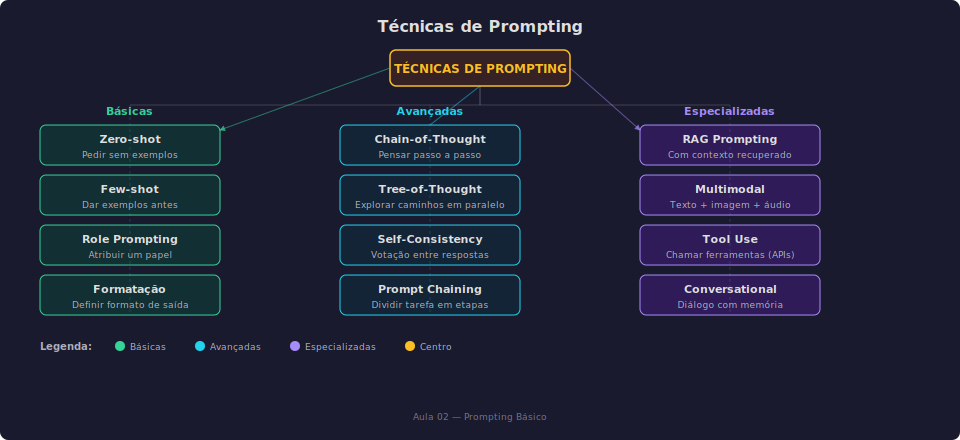

#+TITLE: Prompt Engineering: Como Falar com IA
# Semana 3 - 24/04/2026
#+DESCRIPTION: Semana 3 - Guilda de IA: Aprendendo Prompt Engineering
#+SETUPFILE: ./setupfile.org
#+LANGUAGE: pt_BR
#+STARTUP: inlineimages showall latexpreview
#+DATE: 24/04/2026

* O Problema

Você já deve ter notado: a mesma pergunta pode gerar respostas completamente diferentes dependendo de como você a formula.

** Exemplo:

- "Me fale sobre gatos" → resposta genérica
- "Quais as 3 raças de gatos mais populares no Brasil e por quê?" → resposta específica

A diferença? *O prompt.*

Mas há muito mais por trás de "perguntar melhor". Este artigo vamos explorar a ciência e a arte do Prompt Engineering, com fundamentação teórica e técnicas avançadas validadas por pesquisa.

* Fundamentos Teóricos

** O que é Prompt Engineering?

*Definição formal:* Prompt Engineering é a prática de projetar e otimizar inputs (prompts) para modelos de linguagem com o objetivo de maximizar a qualidade, relevância e utilidade das respostas geradas.

*Base teórica:* O Prompt Engineering emerge da descoberta de que modelos de linguagem grandes (LLMs) exibem capacidades emergentes que não foram explicitamente programadas (Wei et al., 2022). A forma como instruímos o modelo - o prompt - ativa diferentes regiões do espaço de parâmetros, resultando em comportamentos distintos.

*Por que funciona:*

Os LLMs são treinados em dados de alta qualidade (artigos, código, documentação). Quando damos um prompt bem estruturado, estamos:

1. *Localizando conhecimento:* Ativando representações relevantes no espaço de parâmetros
2. *Definindo contexto:* Estabelecendo o "modo de operação" do modelo
3. *Fornecendo padrão:* Demonstrando o formato esperado da resposta

*Referência:* Wei, J. et al. (2022). "Chain-of-Thought Prompting Elicits Reasoning in Large Language Models". [[https://arxiv.org/abs/2201.11903][arXiv:2201.11903]]

** Taxonomia de Técnicas de Prompting

As técnicas de prompting se dividem em três categorias: *Básicas* (zero-shot, few-shot, role, formatação), *Avançadas* (Chain-of-Thought, Tree-of-Thought, Self-Consistency, Prompt Chaining) e *Especializadas* (RAG, Multimodal, Tool Use, Conversacional).

* Técnicas Básicas

** 1. Zero-shot Prompting

*Definição:* Pedir ao modelo para executar uma tarefa sem fornecer exemplos prévios.

*Quando usar:*
- Tarefas simples e diretas
- Quando você não tem exemplos disponíveis
- Para testar a capacidade "natural" do modelo

*Exemplos:*

#+BEGIN_SRC text
Traduza para inglês: "Bom dia"
#+END_SRC

#+BEGIN_SRC text
Resuma o seguinte texto em uma frase:
[texto longo aqui]
#+END_SRC

*Referência:* Brown et al. (2020) demonstraram que modelos suficientemente grandes podem executar tarefas sem exemplos (few-shot learning de verdade), sugerindo que o conhecimento necessário já está nos parâmetros. [[https://arxiv.org/abs/2005.14165][arXiv:2005.14165]]

** 2. Few-shot Prompting

*Definição:* Fornecer exemplos de input-output antes de pedir ao modelo para executar a tarefa.

*Exemplo:*

#+BEGIN_SRC text
Traduza para inglês:
"Gato" → "Cat"
"Cachorro" → "Dog"
"Pássaro" → "Bird"
"Peixe" → ?
#+END_SRC

*Número ideal de exemplos:*

| # Exemplos | Vantagens          | Desvantagens                      |
|------------+--------------------+-----------------------------------|
| 1-2        | Econômico em tokens| Pode ser pouco para padrões complexos |
| 3-5        | Bom equilíbrio     | Padrão comum na literatura        |
| 6+         | Melhor para tarefas difíceis | Custo alto de tokens; diminishing returns |

** 3. Role Prompting (System/Role Prompting)

*Definição:* Atribuir um papel ou persona ao modelo para contextualizar suas respostas.

*Exemplo:*

#+BEGIN_SRC text
Você é um professor de matemática do ensino médio, especializado em 
explicar conceitos complexos de forma simples. Seu aluno está 
tentando entender derivadas pela primeira vez.
#+END_SRC

* Técnicas Avançadas

** 4. Chain-of-Thought (CoT) Prompting

*Definição:* Instruir o modelo a "pensar passo a passo" explicitando o raciocínio antes de dar a resposta final.

*Base teórica:* Wei et al. (2022) descobriram que pedir ao modelo para explicitar o raciocínio melhora drasticamente a performance em tarefas que requerem múltiplos passos lógicos, aritmética e raciocínio causal.

*Como funciona:*

#+BEGIN_SRC text
SEM CoT:
Pergunta: Roger tem 5 bolas de tênis. Ele compra mais 2 latas de 
3 bolas cada. Quantas bolas ele tem agora?
Resposta: 11

COM CoT:
Pergunta: Roger tem 5 bolas de tênis. Ele compra mais 2 latas de 
3 bolas cada. Quantas bolas ele tem agora?
Resposta: Roger começou com 5 bolas. Ele comprou 2 latas de 3 bolas, 
então adquiriu 2 × 3 = 6 bolas. No total, ele tem 5 + 6 = 11 bolas.
#+END_SRC

*Referências:*
- Wei, J. et al. (2022). "Chain-of-Thought Prompting Elicits Reasoning in Large Language Models". [[https://arxiv.org/abs/2201.11903][arXiv:2201.11903]]
- Kojima, T. et al. (2022). "Large Language Models are Zero-Shot Reasoners". [[https://arxiv.org/abs/2205.11916][arXiv:2205.11916]]

** 5. Self-Consistency

*Definição:* Gerar múltiplos caminhos de raciocínio e escolher a resposta mais frequente (votação).

*Quando usar:*
- Tarefas com resposta concreta (matemática, factual)
- Quando disponibilidade de tokens não é limitante
- Aplicações que requerem alta confiança

*Trade-offs:*
- *Vantagem:* Maior precisão
- *Desvantagem:* 3-10x mais tokens e tempo

*Referência:* Wang, X. et al. (2022). "Self-Consistency Improves Chain of Thought Reasoning in Large Language Models". [[https://arxiv.org/abs/2203.11171][arXiv:2203.11171]]

** 6. Tree-of-Thought (ToT)

*Definição:* Explorar múltiplos caminhos de raciocínio em paralelo, avaliando cada um e escolhendo o melhor.

*Base teórica:* Yao et al. (2023) propuseram ToT como uma generalização do CoT que permite exploração de candidatos de pensamento em vez de apenas seguir um caminho linear.

*Referência:* Yao, S. et al. (2023). "Tree of Thoughts: Deliberate Problem Solving with Large Language Models". [[https://arxiv.org/abs/2305.10601][arXiv:2305.10601]]

** 7. Prompt Chaining

*Definição:* Dividir uma tarefa complexa em múltiplos prompts sequenciais, onde cada um usa o output do anterior.

*Exemplo: Sistema de Escrita de Artigos*

#+BEGIN_SRC text
CHAIN 1: Research
Prompt: "Gere 5 pontos principais sobre [tópico]"
Output: Lista de 5 pontos

CHAIN 2: Outline
Prompt: "Usando os pontos: [lista], crie um outline estruturado"
Input: Output do Chain 1
Output: Outline completo

CHAIN 3: Write
Prompt: "Escreva a seção [X] usando o outline: [outline]"
Input: Output do Chain 2
Output: Texto da seção
#+END_SRC

* Framework R-C-E-F Expandido

O framework R-C-E-F organiza os elementos essenciais de um prompt eficaz:

| Letra | Elemento    | Descrição                      | Exemplo                                    |
|-------+-------------+--------------------------------+--------------------------------------------|
| R     | Role        | Papel/identidade              | "Você é um arquiteto de software sênior"   |
| C     | Context     | Situação/Informação           | "O sistema precisa processar 1000 req/s"   |
| E     | Examples    | Exemplos (few-shot)           | "Exemplo: Input → Output"                  |
| F     | Format      | Formato de saída              | "Responda em JSON com campos: X, Y, Z"     |
| T     | Task        | Tarefa explícita              | "Sugira 3 alternativas de arquitetura"     |
| C     | Constraints | Restrições                    | "Máximo 200 palavras por alternativa"      |

* Template RCEF-TC

#+BEGIN_SRC markdown
# ROLE
Você é [papel/identidade].

# CONTEXT
[Informação de fundo relevante]

# TASK
[Tarefa explícita a ser executada]

# EXAMPLES
[Exemplos de input/output, se necessário]

# FORMAT
[Formato esperado da resposta]

# CONSTRAINTS
[Restrições e limitações]

# INPUT
[Dados específicos para esta tarefa]
#+END_SRC

* Prompting para Código

Na prática, uma das aplicações mais poderosas de LLMs é *geração e revisão de código*. Um prompt bem estruturado pode transformar a produtividade.

** Prompt vago vs. estruturado

*Vago:*
#+BEGIN_SRC text
"Escreve uma função pra mim"
#+END_SRC

*Com RCEF-TC:*
#+BEGIN_SRC text
R: Você é um desenvolvedor Python especialista em API design.
T: Crie uma função que valida CPF brasileiro.
C: A função será usada num form de cadastro.
E: Input: "123.456.789-09" → Output: True
F: Retorne bool + mensagem de erro se inválido.
C: Sem bibliotecas externas, máximo 20 linhas.
#+END_SRC

** Técnicas que funcionam bem para código

1. *Role Prompting* — "Você é um especialista em Python" melhora a qualidade do código gerado
2. *Few-shot* — Dar exemplos de entrada/saída esperada é muito eficaz para funções
3. *CoT* — "Pense passo a passo antes de escrever o código" reduz erros lógicos
4. *Formatação explícita* — Pedir JSON, tipo de retorno, ou docstring especificada

** Modelos e ferramentas para código

| Modelo | Onde testar | Vantagem |
|--------+-------------+----------|
| Gemini 2.5 Flash | [[https://aistudio.google.com/][AI Studio]] | Grátis, 1.500 req/dia |
| Mistral Le Chat | [[https://chat.mistral.ai][chat.mistral.ai]] | Grátis, rápido |
| DeepSeek V4 Pro | [[https://chat.deepseek.com][chat.deepseek.com]] | Grátis, open weights |
| Qwen3.5:4b | Ollama local | Leve, roda em notebook |

* Prompting para Ferramentas (Preview)

Quando construímos agentes, precisamos *descrever ferramentas* para o modelo usar. Isso é, essencialmente, prompt engineering aplicado.

** O que é uma ferramenta (tool)?

Uma ferramenta é uma função que o agente pode chamar. Para o modelo saber quando e como usar, precisamos descrevê-la.

#+BEGIN_SRC python
{
    "name": "buscar_cpf",
    "description": "Busca dados de uma pessoa pelo CPF. "
                  "Use para validar cadastros e consultar "
                  "informações públicas de contribuintes.",
    "parameters": {
        "type": "object",
        "properties": {
            "cpf": {
                "type": "string",
                "description": "CPF com 11 dígitos, "
                             "com ou sem formatação."
            }
        },
        "required": ["cpf"]
    }
}
#+END_SRC

** A descrição é um prompt

Note que o =description= segue os mesmos princípios de RCEF-TC:

- *Role:* implícito — o modelo age como assistente que decide quando usar a ferramenta
- *Context:* "Use para validar cadastros e consultar informações públicas"
- *Task:* implícito — a função =buscar_cpf= faz uma busca
- *Format:* o schema JSON define o formato de entrada
- *Constraints:* "com ou sem formatação" reduz erros de formato

#+ATTR_REVEAL: :frag (appear)
💡 Isso vai ser fundamental nas aulas 06-08 (Ferramentas e Agentes).

* Modelos em Destaque (Abril 2026)

** Fofoca da Semana

Abril de 2026 foi intenso para IA:

- *Kimi K2.6* (20/04) — 1T params, 32B ativos, 256K contexto, open weights (Modified MIT)
- *DeepSeek V4 Pro* (24/04) — 1.6T params, 49B ativos, 1M contexto, open weights (MIT)
- *Claude Code no Pro* (21/04) — Anthropic removeu Claude Code do plano Pro ($20/mês) e repôs em 12h após backlash

** DeepSeek V4 Pro — Lançado em 24/04/2026

O modelo mais recente da série DeepSeek, com dois variantes:

| Propriedade | V4 Pro | V4 Flash |
|-------------+--------+----------|
| Parâmetros | 1.6T | 284B |
| Ativos (MoE) | 49B | 13B |
| Contexto | 1M tokens | 1M tokens |
| Licença | MIT | MIT |
| MMLU | 90.1% | 88.7% |
| HumanEval | 76.8% | 69.5% |

Destaque para o *contexto de 1M tokens* — cabe um livro inteiro no prompt!

Onde testar: [[https://chat.deepseek.com][chat.deepseek.com]] (grátis) ou HuggingFace para download dos pesos.

** Kimi K2.6 — Lançado em 20/04/2026

Modelo open weights da Moonshot AI (China):

| Propriedade | Valor |
|-------------+-------|
| Parâmetros | 1T total, 32B ativos (MoE) |
| Contexto | 256K tokens |
| Licença | Modified MIT |
| SWE-bench Verified | 80.2% |
| SWE-bench Pro | 58.6% |
| Alucinação (AA-Omniscience) | 39% (reduzido de 65% do K2.5) |
| Vision | Sim (imagem e vídeo) |
| Tool calling | 96% τ²-Bench Telecom |
| Swarm | Até 300 sub-agentes, 4.000 passos coordenados |

Destaques:
- *Long-horizon coding:* generaliza entre linguagens (Rust, Go, Python)
- *Coding-driven design:* gera interfaces e workflows a partir de prompts + inputs visuais
- *Baixa taxa de alucinação:* 39%, comparável ao Claude Opus 4.7 (36%)

Onde testar: [[https://kimi.com][kimi.com]] (chat gratuito) ou =ollama run kimi-k2.6:cloud= (Ollama Cloud)

⚠ *Atenção:* Estes modelos rodam em nuvem, não localmente. Para rodar localmente, use:
- =qwen3.5:4b= — leve, bom para chat (4B parâmetros)
- =qwen3.5:9b= — balanceado (9B parâmetros)

** Mistral Le Chat

Chat gratuito da Mistral AI — bom para demonstrações:

| Propriedade | Valor |
|-------------+-------|
| Modelos | Mistral Medium, Small, Pixtral |
| Acesso | [[https://chat.mistral.ai][chat.mistral.ai]] (grátis) |
| Destaques | Flash Answers, voz, canvas, busca web |

** Gemini 3 Flash via Ollama

O Ollama agora suporta modelos de cloud, incluindo Gemini 3 Flash e DeepSeek V4:

#+BEGIN_SRC shell
# Gemini 3 Flash (cloud — roda nos servidores do Google)
ollama run gemini-3-flash-preview

# Kimi K2.6 (cloud)
ollama run kimi-k2.6:cloud

# DeepSeek V4 Flash (cloud)
ollama run deepseek-v4-flash:cloud
#+END_SRC

⚠ *Atenção:* Estes modelos rodam em nuvem, não localmente. Para rodar localmente, use:
- =qwen3.5:4b= — leve, bom para chat (4B parâmetros)
- =qwen3.5:9b= — balanceado (9B parâmetros)

** ask-ai: Seu assistente no terminal

O [[https://github.com/luksamuk/ask-ai-rs][ask-ai]] é um CLI que conversa com modelos locais via Ollama:

#+BEGIN_SRC shell
# Chat interativo
ask-ai chat -m qwen3.5:4b

# Pergunta direta
ask-ai "Traduza para inglês: Bom dia"

# Com system prompt (role prompting!)
ask-ai -p tool_user "Como formato um JSON?"
#+END_SRC

Os modos de prompt (=default=, =tool_user=) são *role prompting aplicado* — mudam o comportamento do modelo sem que você precise digitar o role manualmente.

* Exercícios Práticos

** Exercício 1: Refatoração de Prompt

Transforme o seguinte prompt ruim em um prompt eficaz usando R-C-E-F:

*Prompt ruim:* "Me ajude com código."

#+BEGIN_DETAILS
📝 Resposta

#+BEGIN_SRC markdown
# ROLE
Você é um desenvolvedor Python sênior com expertise em código limpo 
e boas práticas.

# CONTEXT
Estou escrevendo uma função que processa dados de usuários de uma 
API externa. A função recebe uma lista de IDs e precisa buscar 
dados para cada um.

# TASK
Analise minha função atual e sugira melhorias de:
1. Legibilidade
2. Performance
3. Tratamento de erros

# FORMAT
Para cada melhoria, forneça:
- Descrição do problema
- Código antes/depois
- Justificativa

# CONSTRAINTS
- Mantenha compatibilidade com Python 3.9+
- Priorize soluções simples sobre complexas

# INPUT
[Código atual aqui]
#+END_SRC

#+END_DETAILS

** Exercício 2: Chain-of-Thought

Melhore o seguinte prompt usando Chain-of-Thought:

*Prompt original:* "Quantos anos um brasileiro nascido em 1990 terá em 2035?"

#+BEGIN_DETAILS
📝 Resposta com CoT

#+BEGIN_SRC text
Pergunta: Quantos anos um brasileiro nascido em 1990 terá em 2035?

Vamos pensar passo a passo.

1. Primeiro, identifico o ano de nascimento: 1990
2. Identifico o ano alvo: 2035
3. Calculo a diferença: 2035 - 1990 = 45
4. Verifico: Se nasceu em 1990, em 2035 terá completado ou estará 
   completando 45 anos

Resposta: 45 anos.
#+END_SRC

#+END_DETAILS