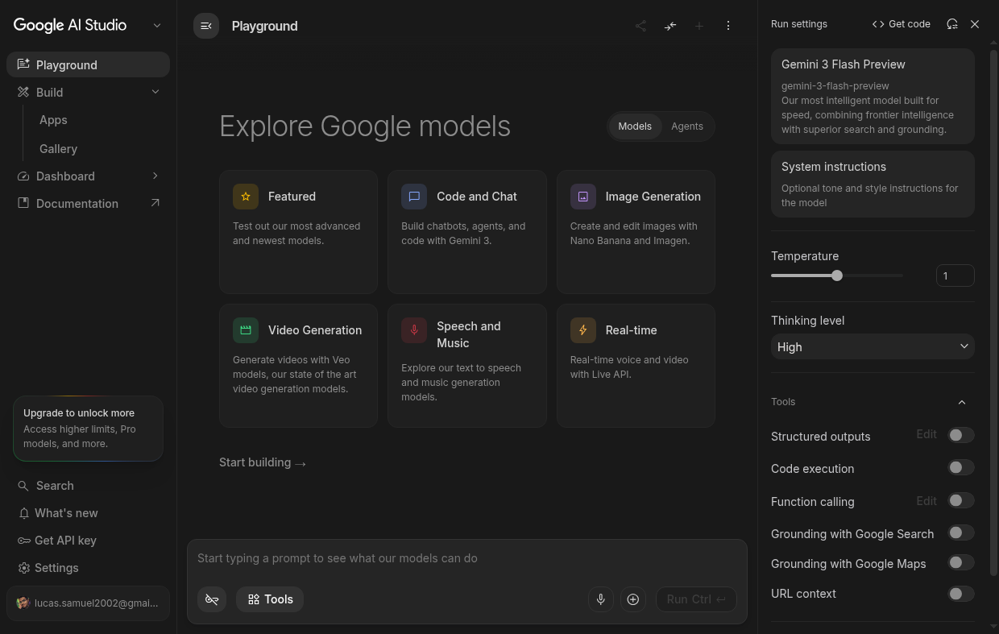
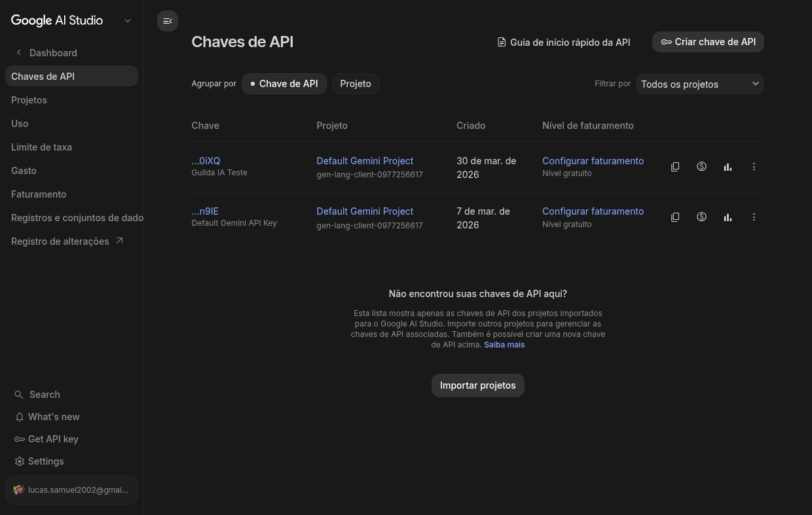
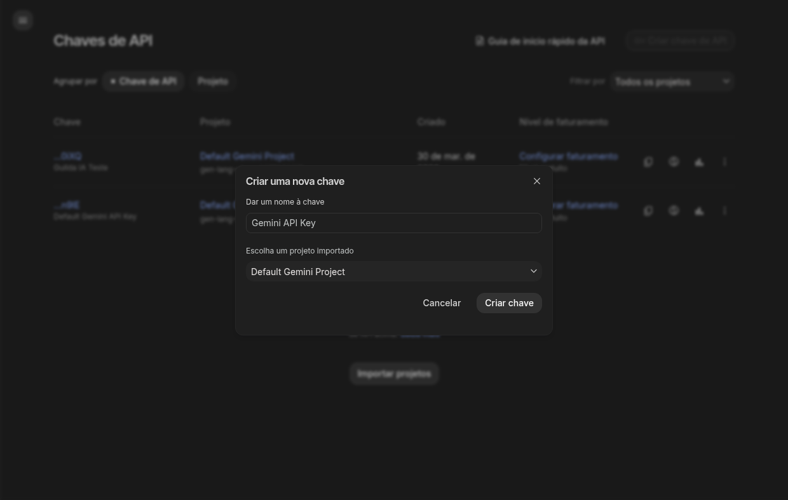
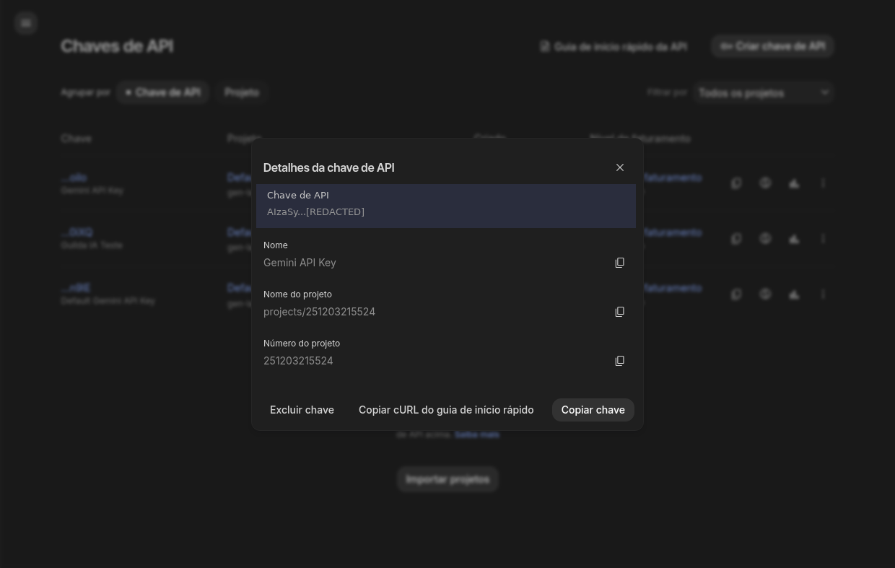

#+TITLE: Python e APIs: Ferramentas do Ofício
# Semana 4
#+DESCRIPTION: Semana 4 - Guilda de IA: APIs de LLM com Python
#+SETUPFILE: ./setupfile.org
#+LANGUAGE: pt_BR
#+STARTUP: inlineimages showall latexpreview
#+DATE: 15/05/2026

* Continuação: Python e APIs

Na semana passada ([[./03-python-minimo.org][Python Mínimo]]), aprendemos os fundamentos de Python: variáveis, listas, dicionários, funções e tratamento de erros. Também vimos conceitos de API e arquitetura cliente-servidor.

Agora vamos colocar a mão na massa: conectar nosso código Python a modelos de linguagem reais usando APIs.

* Preparação e Setup

Antes de escrever qualquer código, precisamos preparar o ambiente. O conceito-chave desta aula é:

#+begin_quote
*Toda API de LLM funciona com o mesmo padrão:* você manda um JSON via HTTP e recebe um JSON de volta. Muda a URL, muda o formato, mas o conceito é universal. Entender HTTP = entender todas as APIs de LLM.
#+end_quote

** O que você precisa ter

| Item | Cloud (Gemini) | Local (Ollama) |
|------+-----------------+-----------------|
| Conta Google | ✅ Obrigatório | ❌ Não precisa |
| GPU | ❌ Não precisa | ✅ Recomendado (T4 ou superior) |
| Internet | ✅ Sempre | ⚠️ Só pra baixar o modelo |
| API key | ✅ Sim (grátis) | ❌ Não precisa |
| Python 3.10+ | ✅ Sim | ✅ Sim |
| Biblioteca =requests= | ✅ Sim | ✅ Sim |

#+begin_quote
*Recomendação:* Comece pelo Gemini (setup rápido, sem GPU). Depois experimente o Ollama no Colab para entender como funciona localmente.
#+end_quote

** Conta Google e API key do Gemini

#+CAPTION: Google AI Studio — Playground principal

1. Acesse o Google AI Studio: https://aistudio.google.com
2. Faça login com sua conta Google
3. No menu lateral, clique em *"Get API Key"*

#+CAPTION: Página de gerenciamento de chaves de API

4. Clique em *"Criar chave de API"*

#+CAPTION: Dialog para criar uma nova chave

5. Escolha um projeto do Google Cloud (ou crie um novo)
6. *Copie a chave e guarde bem!*

#+CAPTION: Chave criada — copie e armazene em local seguro!

#+begin_quote
⚠️ API key é **SECRETA**. Nunca compartilhe, nunca publique no GitHub, nunca cole em chat público.
#+end_quote

** Google Colab

O Colab é um ambiente Python gratuito no navegador que vamos usar durante a aula.

- Acesse: https://colab.research.google.com
- Crie um novo notebook (=Arquivo → Novo notebook=)
- Para usar GPU: =Runtime → Change runtime type → T4 GPU= (necessário para Ollama)
- Para guardar a API key com segurança: use o *Secrets* do Colab (=🔑 ícone na barra lateral=)

#+begin_quote
*Onde guardar a API key no Colab:* No painel lateral, clique no ícone 🔑 (Secrets). Adicione uma chave chamada =GEMINI_API_KEY= com o valor da sua API key. Nunca escreva a chave diretamente no código!
#+end_quote

** Instalando dependências

No Colab ou local, você vai precisar de:

#+BEGIN_SRC python
# Cloud (Gemini) — SDK oficial do Google
pip install google-genai

# Local (Ollama) — apenas requests, que já vem com Python
pip install requests
#+END_SRC

#+begin_quote
*No Colab:* Use =!pip install= (com exclamação) no início da célula. Locally, use o terminal normalmente.
#+end_quote

** Outras opções (referência)

Além de Gemini e Ollama, existem outros provedores que usam o mesmo padrão HTTP:

| Provedor | Gratuito? | API key | Observação |
|----------+-----------+---------+------------|
| HuggingFace | Rate limit | Sim (HF Token) | Vários modelos, bom para experimentar |
| OpenRouter | Crédito inicial | Sim | Agregador de modelos, tem modelos =:free= |
| Nous Portal | Rate limit | Sim | Acesso a modelos da Nous Research |
| OpenCode Go | — | Sim | CLI/SDK para múltiplos provedores |
| OpenAI | ❌ Pago | Sim | Referência de mercado, custo por uso |
| LM Studio | Ilimitado | Não (local) | Interface gráfica, mesma API do Ollama |

#+begin_quote
Esses provedores são *opções extras para quem quiser explorar depois*. Na aula, vamos focar em **Gemini** (cloud) e **Ollama** (local).
#+end_quote

* Opção 1: Google Gemini (Cloud)

** Por que Gemini?

- **1 milhão de tokens/dia gratuito**
- Funciona direto no Google Colab, sem GPU
- Modelos rápidos e capazes
- API key gratuita

** Modelos disponíveis

| Modelo | Contexto | Uso | Gratuito? |
|--------+----------+-----+-----------|
| gemini-2.5-flash-preview | 1M tokens | Rápido, custo-benefício | Sim (limitado) |
| gemini-2.0-flash | 1M tokens | Equilibrado, recomendado | Sim (limitado) |
| gemini-2.0-flash-lite | 1M tokens | Mais rápido, menor | Sim (limitado) |
| gemini-1.5-pro | 2M tokens | Complexo, contexto longo | Sim (limitado) |
| gemini-1.5-flash | 1M tokens | Rápido, multimodal | Sim (limitado) |

#+begin_quote
*Limite gratuito:* ~1 milhão de tokens/dia para muitos modelos. Verifique em ai.google.dev/pricing
#+end_quote

** Como escolher o modelo

#+ATTR_REVEAL: :frag (appear)
- *gemini-2.0-flash:* Recomendado para maioria dos casos
- *gemini-2.5-flash-preview:* Mais recente, mais inteligente
- *gemini-1.5-pro:* Para contexto muito longo (documentos grandes)

** Configuração no Colab

#+BEGIN_SRC python
# Instalar SDK
!pip install google-genai

from google import genai
from google.genai import types
import os

# Configurar API key (novo SDK: usar Client)
from google.colab import userdata
client = genai.Client(api_key=userdata.get('GEMINI_API_KEY'))
#+END_SRC

** Chamada básica

#+BEGIN_SRC python
# Mensagem simples (novo SDK)
response = client.models.generate_content(
    model="gemini-2.0-flash",
    contents="Olá! Qual é a capital do Brasil?"
)
print(response.text)

# Com histórico de conversa (chat)
chat = client.chats.create(model="gemini-2.0-flash")
response1 = chat.send_message("Olá!")
print(response1.text)

response2 = chat.send_message("Qual é a capital do Brasil?")
print(response2.text)
#+END_SRC

** Estrutura da mensagem completa

#+BEGIN_SRC python
# Com instruções de sistema (novo SDK)
response = client.models.generate_content(
    model="gemini-2.0-flash",
    contents="O que é uma lista?",
    config=types.GenerateContentConfig(
        system_instruction="Você é um tutor de Python. Responda de forma didática."
    )
)
print(response.text)
#+END_SRC

** Parâmetros importantes

#+BEGIN_SRC python
# Novo SDK: usar types.GenerateContentConfig
response = client.models.generate_content(
    model="gemini-2.0-flash",
    contents="Conte uma piada",
    config=types.GenerateContentConfig(
        temperature=0.7,        # 0.0 (determinístico) a 2.0 (criativo)
        max_output_tokens=100,  # Limite de tokens na resposta
        top_p=0.95,             # Nucleus sampling
        top_k=40                # Top-k sampling
    )
)
print(response.text)
#+END_SRC

** Tratamento de erros

#+BEGIN_SRC python
from google.api_core.exceptions import NotFound, PermissionDenied, ResourceExhausted

try:
    response = client.models.generate_content(
        model="gemini-2.0-flash",
        contents="Olá!"
    )
    print(response.text)
except PermissionDenied:
    print("❌ API key inválida ou sem permissão")
except ResourceExhausted:
    print("⚠️ Limite de tokens excedido. Aguarde.")
except NotFound:
    print("❌ Modelo não encontrado")
except Exception as e:
    print(f"Erro: {e}")
#+END_SRC

** Exemplo completo no Colab

#+BEGIN_SRC python
# Instalar SDK
!pip install google-genai

from google import genai
from google.genai import types
from google.colab import userdata

# Configurar (novo SDK)
client = genai.Client(api_key=userdata.get('GEMINI_API_KEY'))

# Criar chat
chat = client.chats.create(model="gemini-2.0-flash")

while True:
    pergunta = input("Você: ")
    if pergunta.lower() in ['sair', 'exit', 'quit']:
        break
    
    resposta = chat.send_message(pergunta)
    print(f"IA: {resposta.text}\n")
#+END_SRC

* Opção 2: Ollama no Google Colab (Local)

** Por que Ollama?

- **Gratuito e ilimitado** — sem API key, sem limite de tokens
- **Privacidade** — dados não saem da máquina
- **API REST HTTP** — usa =requests.post()=, o mesmo padrão que qualquer API
- **OpenAI-compatible** — =/v1/chat/completions= funciona como a API da OpenAI

#+begin_quote
*Ponto pedagógico:* Tanto Gemini quanto Ollama usam o mesmo padrão HTTP (request/response). A URL muda, o JSON muda um pouco, mas o conceito é universal. Entender HTTP = entender todas as APIs de LLM.
#+end_quote

** O que é Ollama?

Ollama é um servidor que roda modelos de linguagem localmente. Na prática:

1. Você instala o Ollama
2. Baixa um modelo (=ollama pull gemma4:e2b=)
3. O Ollama fica servindo na porta 11434
4. Qualquer programa pode fazer =requests.post()= para conversar com o modelo

** Setup no Google Colab

Essas 3 células preparam o ambiente. Execute na ordem:

#+BEGIN_SRC python
# Célula 1: Verificar GPU
# Vá em Runtime → Change runtime type → T4 GPU
!nvidia-smi
#+END_SRC

#+BEGIN_SRC python
# Célula 2: Instalar Ollama + dependências
!apt-get install -y zstd pciutils lshw > /dev/null 2>&1
!curl -fsSL https://ollama.com/install.sh | sh

import os
os.environ["LD_LIBRARY_PATH"] = "/usr/lib64-nvidia:" + os.environ.get("LD_LIBRARY_PATH", "")

print("✅ Ollama instalado!")
#+END_SRC

#+BEGIN_SRC python
# Célula 3: Iniciar servidor + baixar modelo
import subprocess, time, requests

subprocess.run(["pkill", "-f", "ollama"], capture_output=True)
time.sleep(1)

# Manter modelo carregado indefinidamente (sem isso, descarrega após 5 min)
os.environ["OLLAMA_KEEP_ALIVE"] = "-1"

subprocess.Popen(
    ["ollama", "serve"],
    stdout=subprocess.DEVNULL, stderr=subprocess.DEVNULL,
    env={**os.environ}
)

print("⏳ Aguardando Ollama iniciar...")
for i in range(30):
    try:
        r = requests.get("http://localhost:11434/api/tags", timeout=2)
        if r.status_code == 200:
            print("✅ Ollama rodando!")
            break
    except:
        time.sleep(1)

# Baixar modelo (~7.2 GB para gemma4:e2b, ~2.7 GB para qwen3.5:4b)
!ollama pull gemma4:e2b
#+END_SRC

#+begin_quote
⚠️ *Warm up:* A primeira inferência demora ~2-3 minutos (o modelo carrega na GPU). Depois disso, as respostas são rápidas (~70 tokens/s). Configuramos =OLLAMA_KEEP_ALIVE=-1= para o modelo ficar na VRAM e não precisar recarregar.
#+end_quote

** Modelos recomendados (benchmarks na T4)

| Modelo | Download | VRAM | Warm up | Velocidade | Qualidade |
|--------+----------+------+---------+------------+-----------|
| qwen3.5:4b | ~2.7 GB | ~3 GB | 141s | ~80 tok/s | Boa |
| gemma4:e2b | ~7.2 GB | ~5-6 GB | 161s | ~70 tok/s | Boa (estável) |
| qwen3.5:9b | ~5.8 GB | ~7.7 GB | 153s | ~25 tok/s | Boa (maior) |
| gemma4:e4b | ~14 GB | ~9.4 GB | 199s | ~18 tok/s | Alta (lento) |

#+begin_quote
*Nota sobre modelos:* O =qwen3.5:4b= é o mais rápido e leve — ideal para aula. O =gemma4:e2b= é mais estável nas respostas. Modelos maiores (9B, E4B) cabem na T4 mas são significativamente mais lentos. Os tempos de warm up são reais, medidos em POC no Colab T4.
#+end_quote

** Chamada básica com =requests.post()=

Aqui está o **coração da aula**: usamos =requests= puro, sem SDK.

#+BEGIN_SRC python
import requests
import json

OLLAMA_URL = "http://localhost:11434/api/chat"
MODEL = "gemma4:e2b"

def chat(messages, model=None, stream=False):
    """Envia mensagens pro Ollama e retorna a resposta.

    Args:
        messages: lista [{"role": "...", "content": "..."}]
        model: nome do modelo (padrão: gemma4:e2b)
        stream: se True, retorna response object para iterar

    Returns:
        dict com a resposta (ou response se stream=True)
    """
    if model is None:
        model = MODEL
    payload = {"model": model, "messages": messages, "stream": stream, "keep_alive": -1}
    response = requests.post(OLLAMA_URL, json=payload, timeout=300)
    if response.status_code != 200:
        raise Exception(f"Erro {response.status_code}: {response.text}")
    return response if stream else response.json()

# Teste
resultado = chat([
    {"role": "system", "content": "Você é um assistente útil. Responda em português."},
    {"role": "user", "content": "Qual é a capital de Minas Gerais?"}
])
print(f"🤖 {resultado['message']['content']}")
print(f"📊 Tokens: prompt={resultado.get('prompt_eval_count', '?')}, "
      f"completion={resultado.get('eval_count', '?')}")
#+END_SRC

#+begin_quote
*Compare com o Gemini:* A estrutura é quase idêntica — mandamos mensagens (system + user), recebemos uma resposta. A diferença é a URL e o formato do JSON. O conceito HTTP é o mesmo.
#+end_quote

** Chat com memória (multi-turno)

Cada chamada envia o histórico completo. O modelo mantém o contexto.

#+BEGIN_SRC python
historico = [
    {"role": "system", "content": "Você é um assistente útil. Responda em português. Seja conciso."}
]

historico.append({"role": "user", "content": "Meu nome é Lucas e eu ense IA."})
r1 = chat(historico)
historico.append({"role": "assistant", "content": r1["message"]["content"]})
print(f"🤖: {r1['message']['content']}")

historico.append({"role": "user", "content": "Qual é o meu nome?"})
r2 = chat(historico)
historico.append({"role": "assistant", "content": r2["message"]["content"]})
print(f"🤖: {r2['message']['content']}")
#+END_SRC

** Modo Thinking (raciocínio interno)

O Gemma 4 suporta thinking mode — o modelo raciocina antes de responder.

#+BEGIN_SRC python
resultado = chat([
    {"role": "system", "content": "Você é um assistente útil. Responda em português."},
    {"role": "user", "content": "Quantos números primos existem entre 1 e 20? /think"}
])

msg = resultado["message"]
thinking = msg.get("thinking", "(sem thinking)")
content = msg.get("content", "")
print(f"💭 Thinking:\n{thinking[:500]}...")
print(f"\n🤖 Resposta: {content}")
#+END_SRC

** Streaming (resposta em tempo real)

#+BEGIN_SRC python
print("🤖 ", end="")
response = chat(
    [
        {"role": "system", "content": "Você é um assistente útil. Responda em português."},
        {"role": "user", "content": "Explique o que é uma API em 3 frases."}
    ],
    stream=True
)
for line in response.iter_lines():
    if line:
        chunk = json.loads(line)
        if "message" in chunk and "content" in chunk["message"]:
            print(chunk["message"]["content"], end="", flush=True)
print()
#+END_SRC

* API Compatível com OpenAI

O Ollama também tem um endpoint compatível com a OpenAI em =/v1/chat/completions=.

Isso significa que **qualquer código que usa a OpenAI SDK pode apontar pro Ollama local** trocando só a =base_url=.

#+BEGIN_SRC python
OPENAI_URL = "http://localhost:11434/v1/chat/completions"

payload = {
    "model": "gemma4:e2b",
    "messages": [
        {"role": "system", "content": "Você é um assistente útil. Responda em português."},
        {"role": "user", "content": "O que é Python em uma frase?"}
    ],
    "temperature": 0.7,
    "max_tokens": 64,
    "keep_alive": -1
}

response = requests.post(OPENAI_URL, json=payload, timeout=300)
data = response.json()
print(f"🤖 {data['choices'][0]['message']['content']}")
print(f"📊 Model: {data['model']}, Usage: {data['usage']}")
#+END_SRC

#+begin_quote
*Ponto-chave:* O formato é **idêntico** ao da OpenAI. A única diferença é a URL (=localhost= em vez de =api.openai.com=) e o modelo (=gemma4:e2b= em vez de =gpt-4o=). Isso é poderoso: o mesmo código funciona com qualquer provedor.
#+end_quote

* Nota: LM Studio

Se você prefere uma interface gráfica, o **LM Studio** é uma alternativa ao Ollama:

- Disponível em: https://lmstudio.ai
- Interface gráfica para baixar e rodar modelos
- Expõe a **mesma API OpenAI-compatible** em =localhost:1234=
- Não precisa de terminal — tudo é clique e arraste

Para usar com =requests=, basta trocar a URL:

#+BEGIN_SRC python
# LM Studio em vez de Ollama — só muda a URL!
LMSTUDIO_URL = "http://localhost:1234/v1/chat/completions"

# O resto é idêntico
payload = {
    "model": "model-name-here",  # nome do modelo carregado no LM Studio
    "messages": [{"role": "user", "content": "Olá!"}],
    "temperature": 0.7
}
response = requests.post(LMSTUDIO_URL, json=payload, timeout=120)
#+END_SRC

#+begin_quote
*Dica:* No LM Studio, vá em *Local Server → Start Server* antes de rodar o código. Escolha o modelo desejado na interface. A API key pode ser qualquer string (ex: ="not-needed"=).
#+end_quote

* Comparação: Cloud vs Local

| Aspecto | Gemini (Cloud) | Ollama (Local) |
|----------+---------------+----------------|
| Setup | API key (2 min) | Install + download (~5-7 min) |
| Warm up | Instantâneo | 141-199s (primeira req, depende do modelo) |
| Velocidade | ~100+ tok/s | 18-80 tok/s (depende do modelo) |
| Custos | Grátis com limites | 100% grátis |
| Privacidade | Dados vão pro Google | Fica na máquina |
| Qualidade | Muito alta | Boa a alta |
| Internet | Necessária | Não (após setup) |
| API key | Sim | Não |

#+begin_quote
*Recomendação:* Use Gemini para desenvolvimento (rápido, sem setup) e Ollama para demonstrar privacidade e independência de cloud. O padrão HTTP é o mesmo nos dois.
#+end_quote

* Tratamento de Erros

Erros são iguais com qualquer API — o padrão é =try/except= com =requests=.

#+BEGIN_SRC python
import requests

def chamar_api(url, payload, timeout=30, tentativas=3):
    """Faz request com retry automático."""
    for tentativa in range(tentativas):
        try:
            response = requests.post(url, json=payload, timeout=timeout)
            response.raise_for_status()  # Levanta exceção para erros HTTP
            return response.json()
        except requests.exceptions.ConnectionError:
            print(f"⚠️ Sem conexão. Tentativa {tentativa + 1}/{tentativas}...")
            time.sleep(2)
        except requests.exceptions.Timeout:
            print(f"⚠️ Timeout. Tentativa {tentativa + 1}/{tentativas}...")
        except requests.exceptions.HTTPError as e:
            if e.response.status_code == 401:
                raise Exception("❌ API key inválida")
            elif e.response.status_code == 429:
                print(f"⚠️ Rate limit. Aguardando...")
                time.sleep(5)
            else:
                raise Exception(f"❌ Erro HTTP {e.response.status_code}: {e.response.text}")
    raise Exception("❌ Número máximo de tentativas excedido")
#+END_SRC

** Códigos de erro comuns

| Código | Significado | O que fazer |
|--------+-------------+-------------|
| 401 | Não autorizado | Verificar API key |
| 429 | Rate limit | Aguardar e tentar novamente |
| 500 | Erro do servidor | Tentar novamente mais tarde |
| 503 | Serviço indisponível | Servidor sobrecarregado |

* Parâmetros de Geração

| Valor   | Comportamento         | Uso                                    |
|---------+-----------------------+----------------------------------------|
| 0.0-0.3 | Muito determinístico | Código, fatos, análises               |
| 0.4-0.7 | Equilibrado          | Conversa geral                        |
| 0.8-1.0 | Criativo             | Escrita criativa, brainstorming       |
| 1.0+    | Muito criativo        | Arte, experimentação                   |

* Exercícios Práticos

** Exercício 1: Duas APIs, um padrão

Crie uma função =perguntar()= que funciona com **qualquer API** — só mudando a URL:

#+BEGIN_SRC python
def perguntar(mensagem, url, model, api_key=None, system="Você é um assistente útil."):
    """Faz uma pergunta a qualquer API de LLM usando requests.post().

    Args:
        mensagem: pergunta do usuário
        url: URL da API (Gemini ou Ollama)
        model: nome do modelo
        api_key: API key (None para Ollama)
        system: instrução de sistema
    """
    # Implemente aqui
    pass
#+END_SRC

#+BEGIN_DETAILS
📝 Gabarito

#+BEGIN_SRC python
def perguntar(mensagem, url, model, api_key=None, system="Você é um assistente útil."):
    """Faz uma pergunta a qualquer API de LLM usando requests.post()."""
    headers = {"Content-Type": "application/json"}
    if api_key:
        headers["Authorization"] = f"Bearer {api_key}"

    payload = {
        "model": model,
        "messages": [
            {"role": "system", "content": system},
            {"role": "user", "content": mensagem}
        ],
        "temperature": 0.7,
        "keep_alive": -1  # Ollama: manter modelo carregado
    }

    response = requests.post(url, json=payload, headers=headers, timeout=120)
    response.raise_for_status()
    data = response.json()

    # Formato OpenAI/Ollama
    if "choices" in data:
        return data["choices"][0]["message"]["content"]
    # Formato Ollama nativo
    elif "message" in data:
        return data["message"]["content"]
    else:
        return str(data)

# Uso com Ollama (local)
resposta = perguntar(
    "Qual é a capital de Minas Gerais?",
    url="http://localhost:11434/v1/chat/completions",
    model="gemma4:e2b"
)
print(f"Ollama: {resposta}")

# Uso com Gemini (cloud) — via OpenAI-compatible endpoint
# Nota: Gemini não tem endpoint OpenAI-compatible direto,
# mas o padrão é o mesmo!
#+END_SRC

#+END_DETAILS

** Exercício 2: Chat com memória

Implemente um chat com histórico usando dicionários (sem classes!):

#+BEGIN_SRC python
historico = {"mensagens": [{"role": "system", "content": "Você é um assistente útil. Responda em português."}]}

def conversar(mensagem):
    """Adiciona mensagem ao histórico, chama a API, retorna resposta."""
    # Implemente
    pass

def ver_historico():
    """Retorna histórico sem o system prompt."""
    # Implemente
    pass

def limpar_historico():
    """Limpa histórico mantendo system prompt."""
    # Implemente
    pass
#+END_SRC

#+BEGIN_DETAILS
📝 Gabarito

#+BEGIN_SRC python
historico = {"mensagens": [{"role": "system", "content": "Você é um assistente útil. Responda em português."}]}

def conversar(mensagem):
    """Adiciona mensagem ao histórico, chama a API, retorna resposta."""
    historico["mensagens"].append({"role": "user", "content": mensagem})

    resultado = chat(historico)
    resposta = resultado["message"]["content"]

    historico["mensagens"].append({"role": "assistant", "content": resposta})
    return resposta

def ver_historico():
    """Retorna histórico sem o system prompt."""
    return historico["mensagens"][1:]

def limpar_historico():
    """Limpa histórico mantendo system prompt."""
    sistema = historico["mensagens"][0]
    historico["mensagens"] = [sistema]

# Uso
print(conversar("Meu nome é Lucas e eu ensino IA."))
print(conversar("Qual é o meu nome?"))  # Deve lembrar!
print(ver_historico())
#+END_SRC

#+END_DETAILS

** Exercício 3: Trocar de provedor

Modifique o Exercício 1 para aceitar tanto Ollama quanto Gemini. Dica: use um parâmetro =provedor= com valores ="ollama"= ou ="gemini"=.

** Exercício 4: Tratamento de erros

Adicione =try/except= ao Exercício 2 para tratar:
- API key inválida (401)
- Rate limit (429)
- Servidor offline (ConnectionError)

* Para ir mais longe

- **HuggingFace:** Gratuito com rate limit, vários modelos. Acesso: https://huggingface.co
- **OpenRouter:** Agregador de modelos, crédito inicial gratuito. Acesso: https://openrouter.ai
- **OpenAI:** Pago, mas referência de mercado. Documentação: https://platform.openai.com/docs
- **LangChain:** Framework que abstrai diferenças entre provedores — veremos na Semana 06!

#+begin_quote
*Dica:* Comece com Gemini (gratuito e sem setup) ou Ollama no Colab (gratuito e sem API key). Depois explore outros provedores na Semana 06 quando falarmos de LangChain.
#+end_quote