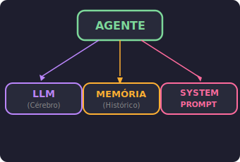
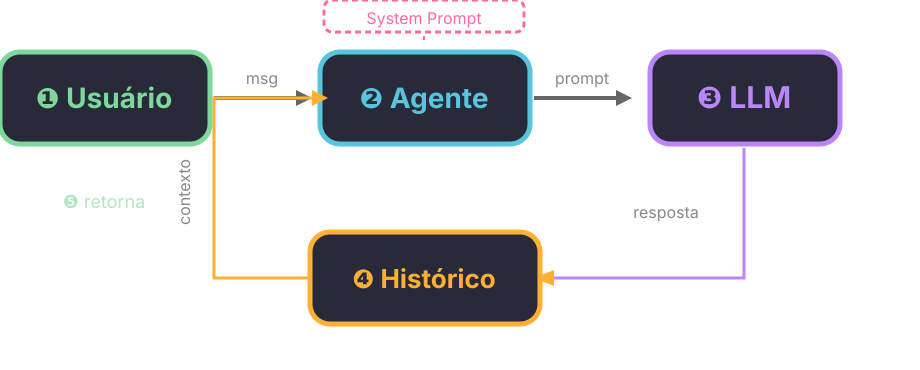

#+TITLE: Estrutura de Agente: Onde Tudo Começa
# Semana 5 - 29/05/2026
#+DESCRIPTION: Semana 5 - Guilda de IA: Estrutura de um agente de IA
#+SETUPFILE: ./setupfile.org
#+LANGUAGE: pt_BR
#+STARTUP: inlineimages showall latexpreview
#+DATE: 29/05/2026

* Continuação: De APIs para Agentes

Nas semanas passadas, aprendemos Python básico ([[./03-python-minimo.org][Python Mínimo]]) e como chamar APIs de LLM ([[./04-python-api.org][Python + API de LLM]]). Vimos que um modelo de linguagem responde a uma pergunta — e nada mais.

Mas um *agente* é mais que isso. Um agente:

- *Lembra* da conversa (memória)
- *Tem personalidade* (instruções de sistema)
- *Pode usar ferramentas* (extensões — veremos na S06)

Nesta aula, vamos construir um agente do zero: primeiro "na mão" com =requests=, depois com LangChain.

* O que é um Agente?

#+begin_quote
Agente = LLM + *harness*. O LLM é o cérebro; o /harness/ é a estrutura em volta que dá contexto e continuidade — memória, instruções, e (mais tarde) ferramentas.
#+end_quote

Um LLM puro responde uma pergunta e esquece. Um agente mantém um /histórico de conversa/ e segue /instruções de sistema/ que definem seu comportamento.

O termo /harness/ (armação, arreio) é usado na indústria pra descrever o código que envolve o LLM: system prompt, gerenciamento de memória, parsing de ferramentas, loop de execução. É o que transforma um modelo que só responde num sistema que /conversa e age/.

** Componentes de um Agente

1. *System Prompt* — define quem o agente é, como age, suas regras
2. *Memória (Histórico)* — as mensagens trocadas até agora
3. *Input* — a pergunta atual do usuário
4. *Output* — a resposta do modelo

#+ATTR_HTML: :alt Componentes de um agente :class dark-diagram

* Paradigma ReAct: Pensar e Agir

Até agora, nosso código faz uma pergunta e recebe uma resposta. Mas agentes reais /pensam e agem/ em ciclos.

O paradigma /ReAct/ (Reasoning + Acting), proposto por Yao et al. (2022), intercala *raciocínio* com *ação*:

#+BEGIN_SRC text
Input → Thought → Action → Observation → Thought → Answer
#+END_SRC

** Exemplo de trace ReAct:

#+BEGIN_SRC text
Pergunta: Quanto é 234 × 987 + 100?

Thought: Preciso multiplicar 234 por 987 primeiro.
Action: calculadora[234 * 987]
Observation: 230958

Thought: Agora somo 100 ao resultado.
Action: calculadora[230958 + 100]
Observation: 231058

Thought: Tenho a resposta final.
Answer: O resultado é 231058.
#+END_SRC

*Vantagens:*

- *Interpretabilidade:* vemos o raciocínio passo a passo
- *Debug facilitado:* conseguimos identificar onde o agente errou
- *Comporabilidade:* ações podem ser encadeadas

#+begin_quote
Nesta aula, vamos implementar a *estrutura* do agente (memória + instruções). Na S06, vamos adicionar *ferramentas* — e então o ciclo ReAct vai ficar completo.
#+end_quote

** Para saber mais

- Yao, S. et al. (2022). "ReAct: Synergizing Reasoning and Acting in Language Models". [[https://arxiv.org/abs/2210.03629][arXiv:2210.03629]]
- Liu, N.F. et al. (2023). "Lost in the Middle: How Language Models Use Long Contexts". [[https://arxiv.org/abs/2307.03172][arXiv:2307.03172]]
- Weng, L. (2023). "LLM Powered Autonomous Agents". [[https://lilianweng.github.io/posts/2023-06-23-agent/][lilianweng.github.io]]
- Wang et al. (2023). "Plan-and-Solve Prompting". [[https://arxiv.org/abs/2305.16969][arXiv:2305.16969]]

* Agente na Mão: Dicts e Funções

Começamos com o que já sabemos: =requests.post()= para chamar o Ollama, e dicionários para guardar o estado.

** Criando o agente

#+BEGIN_SRC python
def criar_agente(instrucoes, max_historico=20):
    return {
        "instrucoes": instrucoes,
        "historico": [],
        "max_historico": max_historico
    }
#+END_SRC

Um dicionário simples. Sem classes, sem objetos — só funções e dicts.

** Conversando com o agente

#+BEGIN_SRC python
import requests

def conversar(agente, mensagem):
    # Monta a lista de mensagens
    messages = [{"role": "system", "content": agente["instrucoes"]}]

    # Adiciona o histórico
    for msg in agente["historico"]:
        messages.append(msg)

    # Adiciona a mensagem atual
    messages.append({"role": "user", "content": mensagem})

    # Chama o Ollama via endpoint OpenAI-compatible
    response = requests.post(
        "http://localhost:11434/v1/chat/completions",
        json={
            "model": "gemma4:e2b",
            "messages": messages,
            "stream": False
        }
    )

    resposta = response.json()["choices"][0]["message"]["content"]

    # Salva no histórico
    agente["historico"].append({"role": "user", "content": mensagem})
    agente["historico"].append({"role": "assistant", "content": resposta})

    return resposta
#+END_SRC

** Testando

#+BEGIN_SRC python
agente = criar_agente("Você é um assistente amigável que responde em português.")

print(conversar(agente, "Oi! Meu nome é Ana."))
print(conversar(agente, "Qual é o meu nome?"))  # Lembra!
#+END_SRC

O agente lembra do nome porque guardamos o histórico.

* O Problema do Histórico Infinito

Se a conversa crescer demais, o prompt fica gigante — e isso custa tokens e fica lento.

** Solução: limitar o histórico

#+BEGIN_SRC python
def conversar(agente, mensagem):
    # Monta a lista de mensagens
    messages = [{"role": "system", "content": agente["instrucoes"]}]

    # Pega só as últimas N mensagens do histórico
    limite = agente["max_historico"]
    historico_cortado = agente["historico"][-limite:]

    for msg in historico_cortado:
        messages.append(msg)

    messages.append({"role": "user", "content": mensagem})

    # Chama o Ollama via endpoint OpenAI-compatible
    response = requests.post(
        "http://localhost:11434/v1/chat/completions",
        json={
            "model": "gemma4:e2b",
            "messages": messages,
            "stream": False
        }
    )

    resposta = response.json()["choices"][0]["message"]["content"]

    # Salva no histórico
    agente["historico"].append({"role": "user", "content": mensagem})
    agente["historico"].append({"role": "assistant", "content": resposta})

    return resposta
#+END_SRC

Agora garantimos que o prompt nunca ultrapassa =max_historico= mensagens do passado.

** Mas e compactação?

Truncar funciona, mas joga fora informação. Na prática, a solução mais robusta é /compactação/ — pedir ao próprio LLM pra resumir o histórico antes de enviar. Isso também mitiga o problema /lost in the middle/: LLMs têm dificuldade em recuperar informação que está no meio de um contexto longo ([[https://arxiv.org/abs/2307.03172][Liu et al., 2023 — "Lost in the Middle: How Language Models Use Long Contexts"]]).

Compactação precisa de ferramentas (que ainda não cobrimos no curso). Por ora, truncar resolve o problema imediato.

* De Requests para LangChain

Montar mensagens na mão funciona, mas é repetitivo. *LangChain* é uma biblioteca que abstrai esse trabalho:

| O que fazemos na mão | O que LangChain faz |
|-----------------------+---------------------|
| Montar lista de =messages= | =ChatPromptTemplate= organiza tudo |
| Adicionar histórico manualmente | =InMemoryChatMessageHistory= (tipado, mesma lógica) |
| Chamar API e parsear JSON | =ChatOpenAI= via endpoint OpenAI-compatible |
| Limitar histórico | Configurável em =max_historico= |

O padrão fundamental do LangChain moderno é o *pipe* (=|=):

#+BEGIN_SRC python
cadeia = prompt | llm
resultado = cadeia.invoke({"pergunta": "..."})
#+END_SRC

Prompt entra, LLM sai. Simples assim.

** ChatOpenAI: endpoint OpenAI-compatible

O Ollama fornece um endpoint compatível com a API da OpenAI em =/v1/chat/completions=.
Com =ChatOpenAI= do =langchain-openai=, a gente usa esse endpoint *direto* —
mesmo modelo local, sem enviar nada pra nuvem.

#+begin_quote
*Por que =ChatOpenAI= e não =ChatOllama=?*
O =ChatOllama= existe, mas o endpoint OpenAI-compatible é mais universal: funciona
com Ollama, com qualquer servidor vLLM/TGI, e com APIs comerciais (Gemini,
OpenAI). É o padrão da indústria — aprender assim te prepara pra trocar de
provedor mudando uma linha.
#+end_quote

#+BEGIN_SRC python
from langchain_openai import ChatOpenAI

llm = ChatOpenAI(
    model="gemma4:e2b",
    base_url="http://localhost:11434/v1",
    api_key="nao_precisa",  # Ollama local não usa chave
    temperature=0.7
)
#+END_SRC

Mesma infra do Ollama que já conhecemos — mas agora com interface do LangChain.

** Chat com Memória

O LLM não lembra de nada sozinho — cada chamada é independente. Para ter memória, guardamos o histórico de mensagens e enviamos junto a cada chamada.

#+begin_quote
A LangChain oferecia =RunnableWithMessageHistory= (deprecated no v0.3). A abordagem recomendada agora? Gerenciar o histórico explicitamente — que é exatamente o que fizemos na seção "Agente na Mão", só que com objetos tipados do LangChain.
#+end_quote

#+BEGIN_SRC python
from langchain_core.chat_history import InMemoryChatMessageHistory
from langchain_core.messages import HumanMessage, AIMessage
from langchain_core.prompts import ChatPromptTemplate

# Sessão com histórico (sem gerenciamento de sessões — uma variável simples)
session = InMemoryChatMessageHistory()

# Prompt com placeholder para o histórico
prompt_mem = ChatPromptTemplate.from_messages([
    ("system", "Você é um assistente amigável que responde em português."),
    ("placeholder", "{history}"),
    ("human", "{pergunta}")
])

cadeia_mem = prompt_mem | llm

# Primeira mensagem — histórico vazio
r1 = cadeia_mem.invoke({
    "pergunta": "Meu nome é Ana e eu estudo engenharia.",
    "history": session.messages
})
print(f"🤖 {r1.content}")

# Salva no histórico
session.add_message(HumanMessage(content="Meu nome é Ana e eu estudo engenharia."))
session.add_message(AIMessage(content=r1.content))

# Segunda mensagem — o modelo lembra do nome!
r2 = cadeia_mem.invoke({
    "pergunta": "Qual é o meu nome e o que eu estudo?",
    "history": session.messages
})
print(f"🤖 {r2.content}")

session.add_message(HumanMessage(content="Qual é o meu nome e o que eu estudo?"))
session.add_message(AIMessage(content=r2.content))

# Sessão zerada = sem memória
session_nova = InMemoryChatMessageHistory()
r3 = cadeia_mem.invoke({
    "pergunta": "Qual é o meu nome?",
    "history": session_nova.messages  # histórico vazio!
})
print(f"🤖 {r3.content}")
print("👉 Na sessão nova o modelo não sabe nosso nome!")
#+END_SRC

* Comparação: Na Mão vs LangChain

| Aspecto | Com =requests= | Com LangChain |
|---------+---------------+---------------|
| Setup | 15+ linhas | 5 linhas |
| System prompt | Montar dict manual | =ChatPromptTemplate= organiza tudo |
| Memória | Gerenciar lista manual | =InMemoryChatMessageHistory= + =session.messages= |
| Trocar modelo | Mudar URL e payload | Trocar =base_url= / =model= em =ChatOpenAI= |
| Limitar histórico | =[-N:]= manual | Configurável |

#+begin_quote
LangChain não é mágica — por baixo, ela faz o que fazemos na mão. Mas abstrair isso facilita, surtout quando adicionamos *ferramentas* (na S06).
#+end_quote

* Diagrama do Ciclo

#+ATTR_HTML: :alt Ciclo de um agente :class dark-diagram

1. Usuário envia mensagem
2. Agente monta prompt com histórico + instruções
3. LLM processa
4. Resposta salva no histórico
5. Retorna ao usuário
6. Na próxima rodada, o histórico cresce

* Pitfalls Comuns

** 1. Histórico que cresce para sempre

Se não limitar, o prompt fica gigante e custa caro.

#+BEGIN_SRC python
# ERRADO — histórico cresce sem limite
historico.append(mensagem)

# CERTO — limite definido
if len(historico) > MAX:
    historico = historico[-MAX:]
#+END_SRC

** 2. Memória não persistida

O histórico fica na memória RAM. Se reiniciar o programa, perde tudo. Solução futura: salvar em arquivo ou banco de dados.

** 3. System prompt vago

#+BEGIN_SRC python
# ERRADO — vago demais
instrucoes = "Responda perguntas."

# MELHOR — específico
instrucoes = """Você é um tutor de Python para iniciantes.
REGRAS:
- Responda em português
- Use exemplos de código
- Se não souber, diga que não sabe
- Nunca invente informações
"""
#+END_SRC

* Para Lembrar

#+begin_quote
"Agente = LLM com memória e personalidade. O ReAct completa o ciclo: pensar e agir."
#+end_quote

Na S06, vamos dar *ferramentas* para o agente — e o ciclo ReAct (input → thought → action → observation → answer) vai ganhar vida.

-----
* Exercícios

** Exercício 1: Agente com Personalidade

Crie um agente com uma personalidade específica (professor de Python, assistente de receitas, guia de viagem):

#+BEGIN_SRC python
agente = criar_agente("""Você é um professor de Python paciente e didático.

SOBRE VOCÊ:
- Ensina Python para iniciantes
- Usa exemplos práticos
- Explica conceitos de forma simples
- Nunca julga perguntas "burras"

SEU PÚBLICO:
- Pessoas começando a programar
- Precisam de explicações passo a passo
""")

print(conversar(agente, "O que é uma variável?"))
print(conversar(agente, "Como declaro uma lista?"))
#+END_SRC

** Exercício 2: Memória com Limite

Modifique =criar_agente= para aceitar um =max_historico= e teste o que acontece quando o histórico ultrapassa o limite. O agente "esquece" as mensagens mais antigas?

** Exercício 3: Dois Agentes, Duas Personalidades

Crie dois agentes com personalidades diferentes e compare as respostas:

#+BEGIN_SRC python
agente_formal = criar_agente("Você é um assistente formal e objetivo.")
agente_criativo = criar_agente("Você é um assistente criativo e divertido.")

pergunta = "Me conte uma piada sobre programação."

print("FORMAL:", conversar(agente_formal, pergunta))
print("CRIATIVO:", conversar(agente_criativo, pergunta))
#+END_SRC

* Próxima Aula

Semana 06: *Primeira Ferramenta* — vamos dar ao agente a capacidade de usar ferramentas externas (calculadora, busca, etc.). É aí que o ciclo ReAct se completa: /pensar, agir, observar, responder/.