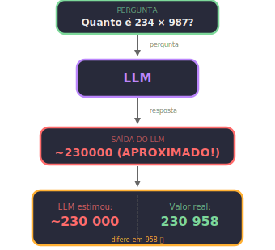
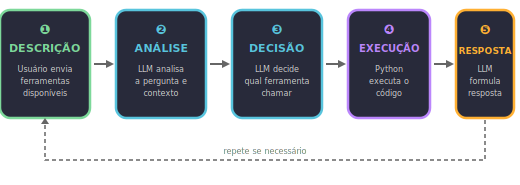
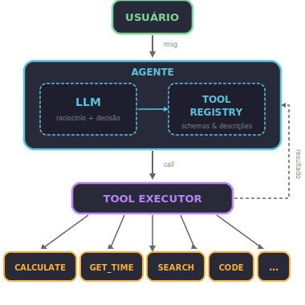

#+TITLE: Primeira Ferramenta: O Agente Faz Algo
# Semana 6 - 05/06/2026
#+DESCRIPTION: Semana 6 - Guilda de IA: Criando a primeira ferramenta para o agente
#+SETUPFILE: ./setupfile.org
#+LANGUAGE: pt_BR
#+STARTUP: inlineimages showall latexpreview
#+DATE: 05/06/2026

* O problema do LLM puro

LLMs são modelos de linguagem. Eles *preveem* texto, não calculam.

Pergunta: "Quanto é 234 × 987?"

O modelo não calcula. Ele prevê a resposta baseado em padrões do treinamento. Pode acertar (se viu esse cálculo antes), mas geralmente erra em números grandes.

#+ATTR_HTML: :alt O problema do LLM puro :style width: 100%; max-width: 400px;

* A solução: ferramentas (Tools)

Ferramenta = função Python que o agente pode chamar.

** Como funciona o ciclo:

#+ATTR_HTML: :alt Ciclo de uso de ferramenta :style width: 100%; max-width: 550px;

* Arquitetura de Ferramentas

** Diagrama de Componentes

#+ATTR_HTML: :alt Arquitetura de ferramentas :style width: 100%; max-width: 400px;

* Referências Importantes

** Paper: Toolformer

*Título:* "Toolformer: Language Models Can Teach Themselves to Use Tools"  
*Autores:* Timo Schick, Jane Dwivedi-Yu, Roberto Dessì, et al.  
*Ano:* 2023  
*Link:* [[https://arxiv.org/abs/2302.04761][arXiv:2302.04761]]

** Paper: ReAct

*Título:* "ReAct: Synergistic Reasoning and Acting in Language Models"  
*Autores:* Shunyu Yao, et al.  
*Ano:* 2022  

* O segredo: descrição clara

O modelo decide baseado na descrição.

** Descrição RUIM:

#+BEGIN_SRC text
Nome: calculate
Descrição: Calculator.
#+END_SRC

→ Modelo não sabe QUANDO usar.

** Descrição BOA:

#+BEGIN_SRC text
Nome: calculate
Descrição: Performs a mathematical operation between two numbers and returns the exact result.
           Use when you need to perform numeric calculations.
           Parameters:
             - a: first number (float)
             - b: second number (float)
             - operation: one of 'add', 'subtract', 'multiply', 'divide'
           Output: float with the result
#+END_SRC

→ Modelo entende quando E como usar.

* Implementação: Calculadora Estruturada

Em vez de aceitar uma expressão string e tentar fazer parse (inseguro com eval, complexo com AST), usamos *parâmetros nomeados*. O LLM escolhe a operação por nome — sem risco de injeção de código.

** Código: Funções de Ferramenta

#+BEGIN_SRC python
"""
Ferramentas para o agente: calculadora e horário.
Parâmetros nomeados = seguro e simples.
"""

def calculate(a, b, operation):
    """
    Performs a mathematical operation between two numbers.
    
    Args:
        a: First number
        b: Second number
        operation: One of 'add', 'subtract', 'multiply', 'divide'
    
    Returns:
        Result of the operation (float)
    
    Examples:
        >>> calculate(234, 987, 'multiply')
        230958.0
        >>> calculate(10, 3, 'divide')
        3.3333333333333335
    """
    if operation == 'add':
        return a + b
    elif operation == 'subtract':
        return a - b
    elif operation == 'multiply':
        return a * b
    elif operation == 'divide':
        if b == 0:
            return "Erro: divisão por zero"
        return a / b
    else:
        return f"Erro: operação '{operation}' não suportada"

def get_time():
    """
    Returns the current date and time.
    Takes no arguments — this is a query tool.
    
    Returns:
        String with current date/time (dd/mm/yyyy HH:MM:SS)
    
    Examples:
        >>> get_time()
        "05/06/2026 19:30:00"
    """
    from datetime import datetime
    return datetime.now().strftime("%d/%m/%Y %H:%M:%S")

# Testes
if __name__ == "__main__":
    print(calculate(234, 987, 'multiply'))  # 230958.0
    print(calculate(10, 5, 'add'))               # 15
    print(calculate(10, 0, 'divide'))            # Erro: divisão por zero
    print(calculate(100, 7, 'divide'))           # 14.285714285714286
    print(get_time())                        # data/hora atual
#+END_SRC

** Por que parâmetros nomeados são melhores?

- *eval("expressão")* :: Executa código arbitrário. Chamada como =calculate("2**100")= pode executar qualquer coisa.
- *AST parse* :: Complexo e quebra fácil. Chamada como =calculate("(5+3)/2")= requer um parser inteiro.
- *Parâmetros nomeados* :: Seguro e previsível. Chamada como =calculate(5, 3, 'divide')= não tem superfície de ataque.

Com parâmetros nomeados:
- O LLM passa valores explícitos (a, b, operation)
- Não há parsing de expressão — a lógica é direta
- A operação é uma string fixa, não código Python

* O decorator @tool do LangChain

O LangChain oferece o decorator =@tool= que transforma uma função Python em ferramenta automaticamente. O segredo: **Pydantic faz o parsing e validação** — sem necessidade de código manual.

** Como funciona

1. Você escreve a função normalmente com type hints e docstring
2. O =@tool= extrai o schema automaticamente (parâmetros, tipos, descrições)
3. Quando o LLM chama a ferramenta, Pydantic valida e converte os argumentos

#+BEGIN_SRC python
from langchain_core.tools import tool

@tool
def calculate(a: float, b: float, operation: str) -> float:
    """Performs a mathematical operation between two numbers.
    Use when you need to perform numeric calculations.
    
    Args:
        a: First number
        b: Second number
        operation: One of 'add', 'subtract', 'multiply', 'divide'
    """
    if operation == 'add':
        return a + b
    elif operation == 'subtract':
        return a - b
    elif operation == 'multiply':
        return a * b
    elif operation == 'divide':
        if b == 0:
            return "Erro: divisão por zero"
        return a / b
    else:
        return f"Erro: operação '{operation}' não suportada"

@tool
def get_time() -> str:
    """Returns the current date and time.
    Use when the user asks about the current date, time, or 'what time is it'.
    """
    from datetime import datetime
    return datetime.now().strftime("%d/%m/%Y %H:%M:%S")

@tool
def get_word_length(word: str) -> int:
    """Returns the number of characters in a word.
    Use when the user asks about the length of a word or how many letters it has.
    """
    return len(word)
#+END_SRC

** O que o @tool faz por você

Não precisa de:
- Parsing manual de JSON
- Conversão manual de tipos (string → float)
- Validação manual de argumentos
- Construção manual do schema JSON para o LLM

#+BEGIN_SRC python
# ❌ SEM @tool — parsing manual
tool_call = llm_response.tool_calls[0]
args = tool_call["args"]
a = float(args["a"])          # manual!
b = float(args["b"])          # manual!
operation = args["operation"]  # manual!
resultado = calculate(a, b, operation)

# ✅ COM @tool — Pydantic faz tudo
tool_call = llm_response.tool_calls[0]
resultado = calculate.invoke(tool_call["args"])
# Pydantic converte string "234" → float 234.0 automaticamente
#+END_SRC

** Conversão automática de tipos

Pydantic converte tipos automaticamente. Se o LLM envia =a="234"= (string), vira =a=234.0= (float):

#+BEGIN_SRC python
# O LLM pode enviar: {"a": "234", "b": "987", "operation": "multiply"}
# Pydantic converte automaticamente:
#   "234" → 234.0
#   "987" → 987.0
resultado = calculate.invoke({"a": "234", "b": "987", "operation": "multiply"})
# → 230958.0  ✓

# Se o LLM manda algo inválido:
# {"a": "abc", "b": 10, "operation": "add"}
# → ValidationError com contexto claro:
#   "Input should be a valid number, unable to parse string as a number"
#+END_SRC

** Schema JSON gerado automaticamente

O decorator extrai do docstring e type hints:

#+BEGIN_SRC python
# Ver o schema gerado
print(calculate.args_schema.schema())

# Resultado:
# {
#   "title": "calculate",
#   "description": "Performs a mathematical operation between two numbers...",
#   "type": "object",
#   "properties": {
#     "a": {"title": "A", "type": "number"},
#     "b": {"title": "B", "type": "number"},
#     "operation": {
#       "title": "Operation",
#       "description": "One of 'add', 'subtract', 'multiply', 'divide'",
#       "type": "string"
#     }
#   },
#   "required": ["a", "b", "operation"]
# }
#+END_SRC

Obs.: para a ferramenta =get_time=, o schema é minimal — =properties= vazio e =required= vazio, pois não há argumentos.

* Conectando ao LLM: Ollama + gemma4:e2b

O setup completo do Ollama no Colab está no *notebook da Semana 4* — incluindo instalação e =ollama pull=. Aqui focamos em como conectar as ferramentas ao LLM.

** Conexão via ChatOpenAI

O modelo =gemma4:e2b= expõe endpoint OpenAI-compatible (=/v1/chat/completions=), então usamos =ChatOpenAI= do =langchain-openai=:

#+BEGIN_SRC python
from langchain_openai import ChatOpenAI

llm = ChatOpenAI(
    model="gemma4:e2b",
    base_url="http://localhost:11434/v1",
    api_key="ollama",  # Ollama não precisa de key real
    temperature=0,
)
#+END_SRC

* O ciclo manual: bind_tools

A forma mais básica de usar ferramentas no LangChain é com =bind_tools=. O LLM *decide* qual ferramenta chamar, mas **não executa** — isso fica por sua conta.

#+BEGIN_SRC python
from pprint import pprint
from langchain_openai import ChatOpenAI
from langchain_core.tools import tool

@tool
def calculate(a: float, b: float, operation: str) -> float:
    """Performs a mathematical operation between two numbers.
    Use when you need to perform numeric calculations.
    
    Args:
        a: First number
        b: Second number
        operation: One of 'add', 'subtract', 'multiply', 'divide'
    """
    if operation == 'add': return a + b
    elif operation == 'subtract': return a - b
    elif operation == 'multiply': return a * b
    elif operation == 'divide':
        if b == 0: return "Erro: divisão por zero"
        return a / b
    else: return f"Erro: operação '{operation}' não suportada"

@tool
def get_time() -> str:
    """Returns the current date and time.
    Use when the user asks about the current date, time, or 'what time is it'.
    """
    from datetime import datetime
    return datetime.now().strftime("%d/%m/%Y %H:%M:%S")

@tool
def get_word_length(word: str) -> int:
    """Returns the number of characters in a word.
    Use when the user asks about the length of a word or how many letters it has.
    """
    return len(word)

llm = ChatOpenAI(
    model="gemma4:e2b",
    base_url="http://localhost:11434/v1",
    api_key="ollama",
    temperature=0,
)

# Bind: registra as ferramentas no LLM
llm_com_ferramentas = llm.bind_tools([calculate, get_time, get_word_length])
#+END_SRC

** Passo 1: O LLM decide, mas não executa

#+BEGIN_SRC python
resposta = llm_com_ferramentas.invoke("Quanto é 234 vezes 987?")
pprint(resposta.tool_calls)
# [{'args': {'a': 234, 'b': 987, 'operation': 'multiply'},
#   'id': 'call_abc123',
#   'name': 'calculate',
#   'type': 'tool_call'}]
#+END_SRC

Repare: =resposta.content= é *string vazia*. O LLM não calculou — só disse "use =calculate= com estes argumentos". A execução é tua.

** Passo 2: Você executa a ferramenta

#+BEGIN_SRC python
# Extrair a primeira tool_call
tc = resposta.tool_calls[0]

# Executar a ferramenta
if tc['name'] == 'calculate':
    resultado = calculate.invoke(tc['args'])
elif tc['name'] == 'get_time':
    resultado = get_time.invoke(tc['args'])
elif tc['name'] == 'get_word_length':
    resultado = get_word_length.invoke(tc['args'])

print(resultado)  # 230958.0
#+END_SRC

** Passo 3: Resultado volta pro LLM

Agora você manda o resultado de volta pro LLM com =ToolMessage=, e ele formula a resposta final:

#+BEGIN_SRC python
from langchain_core.messages import HumanMessage, ToolMessage

mensagens = [
    HumanMessage(content="Quanto é 234 vezes 987?"),
    resposta,  # AIMessage com tool_call
    ToolMessage(content=str(resultado), tool_call_id=tc['id']),
]

resposta_final = llm_com_ferramentas.invoke(mensagens)
print(resposta_final.content)
# "O resultado de 234 vezes 987 é 230.958."
#+END_SRC

** Resumo do ciclo manual

1. /invoke/ → LLM decide (retorna =tool_calls=, não executa)
2. /você executa/ a ferramenta com os argumentos
3. /invoke de novo/ com =ToolMessage= → LLM formula a resposta final

É ReAct em ação: *Thought* (LLM raciocina) → *Action* (chama ferramenta) → *Observation* (vê o resultado) → *Answer* (responde) ([[https://arxiv.org/abs/2210.03629][Yao et al., 2022]]).

* O ciclo automático: create_agent

O ciclo manual é importante pra entender o que acontece por baixo. Mas na prática, você não quer gerenciar =ToolMessage= e múltiplas chamadas na mão. O LangChain resolve isso com =create_agent=:

#+BEGIN_SRC python
from langchain.agents import create_agent

ferramentas = [calculate, get_time, get_word_length]
agente = create_agent(llm, ferramentas)

# Uma linha — o agente faz o ciclo inteiro
resultado = agente.invoke({"messages": "Quanto é 234 vezes 987?"})
print(resultado["messages"][-1].content)
# "O resultado de 234 vezes 987 é 230.958."
#+END_SRC

O =create_agent= faz automaticamente:
- Decide se precisa de ferramenta
- Executa a ferramenta
- Manda o resultado de volta pro LLM
- Repete se necessário (várias ferramentas em sequência)
- Retorna a resposta final

** Manual vs Automático

- *Manual* (=bind_tools=) :: Você controla cada passo. Bom pra aprender e debugar.
- *Automático* (=create_agent=) :: Uma linha. Bom pra produzir.

* Um gostinho de async

Todas as chamadas que fizemos usam =invoke()= — síncrono, o código espera a resposta. Mas em Python existe outro jeito:

#+BEGIN_SRC python
import asyncio

async def conversar():
    future = agente.ainvoke({"messages": "Quanto é 234 vezes 987?"})
    print("Processando...")  # roda imediatamente
    resultado = await future  # agora espera
    print(resultado["messages"][-1].content)

asyncio.run(conversar())
#+END_SRC

Em notebooks Jupyter/Google Colab, o loop de eventos já está rodando, então =asyncio.run()= falha. Use =nest_asyncio= como workaround:

#+BEGIN_SRC python
import nest_asyncio
nest_asyncio.apply()

# Agora asyncio.run() funciona no Jupyter/Colab
#+END_SRC

A diferença: =ainvoke= (com *a* de /async/) deixa o programa fazer outras coisas enquanto espera o LLM responder. Não parece muito com um agente só — mas quando você tem /vários/ agentes ou /várias/ ferramentas rodando ao mesmo tempo, faz toda a diferença.

Vamos usar isso na próxima aula.

-----

** Exercício 1: Ferramenta de Contagem de Palavras

Implemente uma ferramenta que conta palavras, caracteres e frases de um texto usando o decorator =@tool=.

#+BEGIN_DETAILS
📝 Gabarito

#+BEGIN_SRC python
from langchain_core.tools import tool

@tool
def count_text(text: str) -> dict:
    """Analyzes a text and returns statistics.
    Use when the user wants to know the size of a text.
    
    Args:
        text: Text to be analyzed
    """
    if not text:
        return {"words": 0, "characters": 0, "sentences": 0}
    
    words = len(text.split())
    characters = len(text)
    sentences = len([s for s in text.split('.') if s.strip()])
    
    return {
        "words": words,
        "characters": characters,
        "sentences": sentences
    }

# Teste
print(count_text.invoke({"text": "Olá mundo. Como vai?"}))
# {"words": 4, "characters": 18, "sentences": 2}
#+END_SRC

#+END_DETAILS

** Exercício 2: Testar Conversão Automática

Crie um agente com =calculate= e =get_word_length=. Envie mensagens que testem:
1. Cálculo simples: "Quanto é 100 + 200?"
2. Divisão: "Divida 1000 por 7"
3. Comprimento de palavra: "Quantas letras tem a palavra 'Python'?"
4. Erro: "Calcule 5 dividido por 0"

#+BEGIN_DETAILS
📝 Gabarito

#+BEGIN_SRC python
from langchain_openai import ChatOpenAI
from langchain_core.tools import tool

@tool
def calculate(a: float, b: float, operation: str) -> float:
    """Performs a mathematical operation between two numbers.
    Use when you need to perform numeric calculations.
    Args:
        a: First number
        b: Second number
        operation: One of 'add', 'subtract', 'multiply', 'divide'
    """
    if operation == 'add': return a + b
    elif operation == 'subtract': return a - b
    elif operation == 'multiply': return a * b
    elif operation == 'divide':
        if b == 0: return "Erro: divisão por zero"
        return a / b
    else: return f"Erro: operação '{operation}' não suportada"

@tool
def get_word_length(word: str) -> int:
    """Returns the number of characters in a word.
    Use when the user asks about the length of a word or how many letters it has.
    """
    return len(word)

llm = ChatOpenAI(
    model="gemma4:e2b",
    base_url="http://localhost:11434/v1",
    api_key="ollama",
    temperature=0,
)

llm_com_ferramentas = llm.bind_tools([calculate, get_word_length])

perguntas = [
    "Quanto é 100 + 200?",
    "Divida 1000 por 7",
    "Quantas letras tem a palavra 'Python'?",
    "Calcule 5 dividido por 0",
]

for pergunta in perguntas:
    print(f"\n--- {pergunta} ---")
    resposta = llm_com_ferramentas.invoke(pergunta)
    if resposta.tool_calls:
        for tc in resposta.tool_calls:
            if tc['name'] == 'calculate':
                resultado = calculate.invoke(tc['args'])
            elif tc['name'] == 'get_word_length':
                resultado = get_word_length.invoke(tc['args'])
            print(f"  {tc['name']}({tc['args']}) -> {resultado}")
    else:
        print(f"  {resposta.content}")
#+END_SRC

#+END_DETAILS

** Exercício 3: Nova Ferramenta

Crie uma ferramenta =convert_temperature(value: float, from_unit: str, to_unit: str)= com =@tool=, onde =from_unit= e =to_unit= são 'celsius', 'fahrenheit', 'kelvin'. Adicione ao agente e teste.

#+BEGIN_DETAILS
📝 Gabarito

#+BEGIN_SRC python
from langchain_core.tools import tool

@tool
def convert_temperature(value: float, from_unit: str, to_unit: str) -> float:
    """Converts temperature between Celsius, Fahrenheit and Kelvin.
    Args:
        value: Temperature to convert
        from_unit: Source scale ('celsius', 'fahrenheit', 'kelvin')
        to_unit: Target scale ('celsius', 'fahrenheit', 'kelvin')
    """
    # Converter para Celsius primeiro
    if from_unit == 'celsius':
        c = value
    elif from_unit == 'fahrenheit':
        c = (value - 32) * 5 / 9
    elif from_unit == 'kelvin':
        c = value - 273.15
    else:
        return f"Erro: escala '{from_unit}' não suportada"
    
    # Converter de Celsius para destino
    if to_unit == 'celsius':
        return c
    elif to_unit == 'fahrenheit':
        return c * 9 / 5 + 32
    elif to_unit == 'kelvin':
        return c + 273.15
    else:
        return f"Erro: escala '{to_unit}' não suportada"

# Teste
print(convert_temperature.invoke({"value": 100, "from_unit": "celsius", "to_unit": "fahrenheit"}))
# 212.0
#+END_SRC

#+END_DETAILS