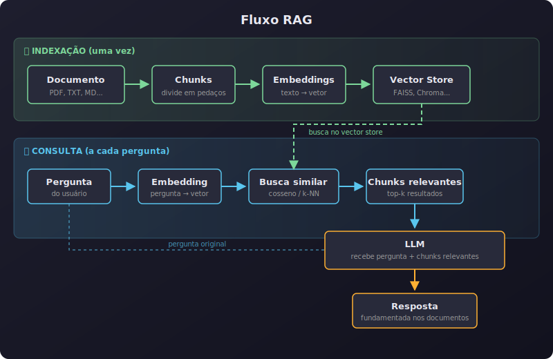
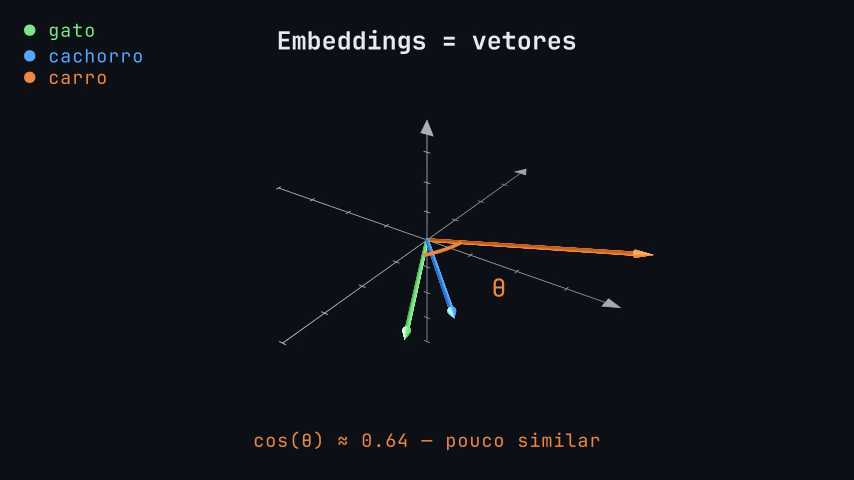

#+TITLE: Embeddings, Similaridade e RAG - Texto como números, busca e geração
# Semana 8 - 26/06/2026
#+SETUPFILE: ./setupfile.org
#+DESCRIPTION: Semana 8 - Guilda de IA: RAG, BM25, embeddings, similaridade por cosseno, busca híbrida, FAISS e engenharia de memória
#+LANGUAGE: pt_BR
#+STARTUP: inlineimages showall latexpreview
#+DATE: 26/06/2026

* Semana 8 - Embeddings, Similaridade e RAG

Esta semana juntamos dois temas que são duas faces da mesma moeda: como fazer um agente "ler" documentos (RAG) e como representar texto como números (embeddings). Começamos pelo problema, passamos pela busca lexical (BM25), pela busca semântica (embeddings), pela busca híbrida, e terminamos com engenharia real.

* O problema: LLMs não sabem tudo

LLMs não conhecem seus documentos pessoais, PDFs da empresa, notas privadas, nem informações recentes (pós-treinamento).

Precisamos de uma forma de *buscar* informações relevantes e entregá-las ao LLM *antes* de ele gerar a resposta.

* RAG: o agente que lê documentos

RAG (*Retrieval Augmented Generation*) resolve isso: buscar informações relevantes antes de gerar a resposta.

#+begin_quote
"RAG = buscar antes de responder."
#+end_quote

** Analogia

- *Sem RAG:* aluno fazendo prova de *memória*
- *Com RAG:* aluno fazendo prova com *livro aberto*

** Fluxo RAG

1. *Chunking* → divide documentos em pedaços menores
2. *Embeddings* → transforma cada pedaço em vetor
3. *Vector Store* → guarda os vetores num banco de dados
4. *Retrieval* → busca os pedaços mais relevantes
5. *Generation* → LLM recebe a pergunta + os pedaços encontrados e responde

#+begin_center

#+end_center

O *retrieval* é o coração do RAG. E a busca tem duas abordagens que se complementam: busca lexical e busca semântica.

* Busca Lexical: BM25

"Como o Google buscava antes de IA."

BM25 (=Best Matching 25=) é o algoritmo de busca lexical mais usado. Está no Elasticsearch, no Lucene, no Sphinx — e é mais inteligente do que parece.

** A fórmula

$$\text{score}(q, D) = \sum_{i} \text{IDF}(q_i) \cdot \frac{f(q_i, D) \cdot (k_1 + 1)}{f(q_i, D) + k_1 \cdot \left(1 - b + b \cdot \frac{\text{fieldLen}}{\text{avgFieldLen}}\right)}$$

Parece assustador, mas cada parte é bom senso. Vamos decompor:

** IDF — Inverse Document Frequency

$$\text{IDF}(q_i) = \log\left(1 + \frac{\text{docCount} - \text{docFreq} + 0.5}{\text{docFreq} + 0.5}\right)$$

- =docCount= = total de documentos que têm valor no campo
- =docFreq= = quantos documentos contêm o termo de busca

O IDF "penaliza" termos comuns. Se você busca "the elephant", "elephant" é muito mais informativo que "the" — porque "the" aparece em quase todo documento em inglês.

#+begin_quote
Termos raros são mais informativos.
#+end_quote

** f(q_i, D) — Frequência do termo no documento

Quantas vezes o termo de busca aparece no documento. Mais aparições = provavelmente mais relevante. Um documento que menciona "gato" 3 vezes provavelmente tem mais a ver com gatos que um que menciona uma vez.

** k₁ — Saturação da frequência

Controla como a frequência do termo *satura*. A 1ª menção vale muito, a 2ª vale um pouco menos, a 10ª vale quase nada extra.

Um documento que diz "gato" 100 vezes não é 100× mais relevante que um que diz 1 vez — a contribuição se aproxima de uma assíntota.

Default no Elasticsearch: =k₁ = 1.2=.

- =k₁ = 0= → só IDF importa, frequência é ignorada
- =k₁ alto= → cada ocorrência adicional continua somando bastante

Documentos longos e diversos (livros) pedem =k₁= maior. Documentos curtos (notícias) pedem =k₁= menor.

** b — Normalização por tamanho do documento

Controla quanto o *tamanho* do documento afeta o score.

- =b = 0= → tamanho não importa
- =b = 1= → tamanho importa muito
- Default: =b = 0.75=

#+begin_quote
Um tweet que menciona "gato" uma vez é mais relevante que um livro de 300 páginas que menciona "gato" uma vez.
#+end_quote

** fieldLen / avgFieldLen — Tamanho relativo

Tamanho do documento dividido pela média de tamanho dos documentos. Se um documento é maior que a média, o score diminui; se é menor, aumenta.

Isso é o "bom senso codificado em matemática."

** Resumo do BM25

- *IDF*: termos raros valem mais
- *f(q,D)*: mais aparições = mais relevante
- *k₁*: saturação (a 100ª menção não vale 100× mais)
- *b*: tamanho do doc importa (ou não)
- *fieldLen/avgFieldLen*: normalização por tamanho

BM25 é bom pra: nomes, termos técnicos, códigos, IDs. Mas não entende sinônimos ou paráfrases.

** Referências

- [[https://www.elastic.co/blog/practical-bm25-part-1-how-shards-affect-relevance-scoring-in-elasticsearch][Practical BM25 — Parte 1: How Shards Affect Relevance Scoring (Elastic Blog)]]
- [[https://www.elastic.co/pt/blog/practical-bm25-part-2-the-bm25-algorithm-and-its-variables][Practical BM25 — Parte 2: The BM25 Algorithm and its Variables (Elastic Blog, em português)]]
- [[https://www.elastic.co/blog/practical-bm25-part-3-considerations-for-picking-b-and-k1-in-elasticsearch][Practical BM25 — Part 3: Considerations for Picking b and k1 (Elastic Blog)]]

* Busca Semântica: Embeddings

E se a pessoa busca por "animal que faz miau" mas o documento diz "gato"? BM25 não acha. Mas embeddings sim.

Cada texto vira um *vetor* — uma lista de números que captura o *significado* do texto. Textos com significado parecido ficam próximos no "espaço vetorial".

** Exemplo visual

#+ATTR_HTML: :alt Visualização 3D de embeddings :style width: 100%; max-width: 500px;

Três palavras como vetores no espaço:

- 🟢 *gato* e 🔵 *cachorro* apontam em direções muito parecidas — ângulo pequeno, cos(θ) ≈ 0.97 = *muito similar*
- 🟠 *carro* aponta em outra direção — ângulo maior, cos(θ) ≈ 0.64 = *pouco similar*

Quanto menor o ângulo entre os vetores, mais parecidos são os significados.

** Espaço vetorial

- Textos com significado parecido = setas na *mesma direção*
- Textos com significado diferente = setas em *direções diferentes*
- "Mesma direção" = *ângulo pequeno* entre elas

** Similaridade por Cosseno

*Conexão com Geometria Analítica!*

$$\cos(\theta) = \frac{\vec{A} \cdot \vec{B}}{|\vec{A}| \cdot |\vec{B}|}$$

- ângulo = 0° → cosseno = 1 → *idênticos* (mesma direção)
- ângulo = 90° → cosseno = 0 → *independentes* (sem relação)
- ângulo = 180° → cosseno = -1 → *opostos* (rei/rainha, sim/não)

** Matryoshka Embeddings

Embeddings que podem ser *truncados*.

- Normal: 768 dimensões fixas
- Matryoshka: 768, 512, 256, 128... (flexível)

*Vantagem:* economiza espaço e tempo. Analogia: bonecas russas — cada uma contém a próxima, mas qualquer tamanho já funciona.

** Como escolher um modelo de embedding?

*Critérios práticos:*
- *Dimensões:* mais dimensões = mais informação, mas mais lento
- *Tamanho do modelo:* menores = mais rápido, menos preciso
- *Linguagem:* modelos específicos vs multilinguais
- *Licença:* MIT/Apache = livre pra usar
- *Matryoshka:* flexível pra diferentes tamanhos

*Exemplos:*
- =all-MiniLM-L6-v2= — 384 dim, leve, multilingue
- =bge-m3= — 1024 dim, multilingue, open-weight
- =nomic-embed-text= — 768 dim, longo contexto, open-weight, Matryoshka
- =gte-Qwen2= — variedade de tamanhos, Matryoshka

#+begin_quote
O melhor modelo é o que *funciona pra o seu caso*. Teste antes de otimizar.
#+end_quote

* Busca Híbrida: o melhor dos dois mundos

- *BM25* acha termos exatos (nomes, códigos, IDs)
- *Embeddings* acham significados (paráfrases, sinônimos, conceitos)

*Por que não usar os dois?*

*RRF (Reciprocal Rank Fusion)* junta os rankings das duas buscas:

$$\text{RRF}(d) = \sum_{m \in \text{métodos}} \frac{1}{k + \text{rank}_m(d)}$$

Cada método ordena os documentos. O RRF combina as posições — documentos que aparecem bem em ambos sobem.

#+begin_quote
Cada método vê um lado. Juntos, veem mais.
#+end_quote

* Demo prática: FAISS

Vamos ver isso funcionando de verdade no Colab!

- Modelo: =nomic-embed-text-v2-moe= (256 dim, Matryoshka)
- Vector store: *FAISS* (Facebook AI Similarity Search)
- Agente: =gemma4:e2b-it-qat= com ferramenta de busca

O notebook carrega ~20 fatos sobre filosofia e computação, gera embeddings, indexa com FAISS, e mostra:

1. *Busca semântica:* pergunta → embedding → FAISS → resultados formatados
2. *Agente RAG:* agente com ferramenta de busca → LLM busca e combina fatos

[[https://colab.research.google.com/github/luksamuk/guilda-ia/blob/main/notebooks/aula08_embeddings_rag_colab.ipynb][📓 Abrir no Colab]]

** Sobre o FAISS

FAISS (Facebook AI Similarity Search) é uma biblioteca da Meta para busca de similaridade em vetores densos. É rápida, simples, e funciona bem em memória.

#+begin_src python
import faiss
from sentence_transformers import SentenceTransformer

model = SentenceTransformer('nomic-ai/nomic-embed-text-v2-moe')
vetores = model.encode(documentos, truncate_dim=256)  # 256 dim (Matryoshka!)

index = faiss.IndexFlatL2(256)  # cria índice
index.add(vetores)              # adiciona vetores

query = model.encode(["animal que faz miau"], truncate_dim=256)
distancias, indices = index.search(query, k=3)  # busca os 3 mais próximos
#+end_src

FAISS não é um banco de dados de verdade — não persiste, não tem metadata, não tem busca híbrida nativa. Mas para uma *demo conceitual* de "embeddings → vector store → retrieval", é ideal.

* Engenharia na prática: Sprachspiel

Como essas ideias aparecem num projeto real?

*Sprachspiel* — harness de interação cognitiva com LLMs.

** Memória persistente

- Fatos, notas, documentos com *busca semântica*
- *Decay Ebbinghaus:* memórias "esquecem" com o tempo
  - Relembrar = reforçar a memória
  - Esquecer = natural, não é bug

** SOUL.md — personalidade do agente

- Arquivo que define *quem o agente é*
- Tom de voz, valores, estilo de resposta
- Não é só system prompt — é *identidade persistente*

** Busca híbrida real

- BM25 (lexical) + vetores (semântica) + RRF (fusão)
- O agente não escolhe uma — usa as *duas juntas*

#+begin_quote
É exatamente o que vimos: BM25 + embeddings + RRF. Sem mágica — só engenharia.
#+end_quote

* 🔥 Pontos Extras (para reflexão)

** 1. Similaridade não é 1.0 nem aleatória — é interpretável

No Teste 2 do notebook, a busca por Church-Turing retornou similarity = 0.82, enquanto a busca por Spinoza retornou 0.64. O que isso significa?

- 0.82 = o embedding da query está muito próximo do embedding do fato (conceitos específicos, nomes técnicos)
- 0.64 = o embedding está moderadamente próximo (termos mais abstratos, filosóficos)

Embeddings não são busca exata nem adivinhação — a similaridade por cosseno dá um *número* que pode ser usado como threshold (ex: "só mostre resultados acima de 0.7").

*Pergunta extra:* Em qual situação uma similarity baixa (ex: 0.4) poderia ser útil?

** 2. O agente busca em inglês e responde em português

Os fatos estão em inglês, mas o system prompt obriga o agente a responder em português. O agente:
1. Lê a pergunta em português
2. *Traduz mentalmente* a query para inglês ao chamar a ferramenta
3. Recupera fatos em inglês
4. *Reformula* a resposta em português

Isso mostra que embeddings são *cross-linguais* — o significado transcende o idioma. E prova que o LLM está compreendendo, não copiando.

*Pergunta extra:* O que aconteceria se os fatos estivessem em português e o agente fosse instruído a responder em inglês? Funcionaria igual?

** 3. O system prompt força a busca — sem ele, o LLM responde de memória

No notebook, o system prompt diz explicitamente: *"NEVER answer from your own knowledge"* e *"ALWAYS use search_facts before answering"*. Sem isso, o Gemma 4 pode simplesmente responder direto, sem buscar nada.

Isso é o coração do RAG: o LLM tem conhecimento nos pesos, mas *não confiamos nele*. O RAG substitui a confiança nos pesos por confiança no *retrieval*.

*Pergunta extra:* Por que "confiar nos pesos" é problemático? Dê um exemplo de quando o LLM poderia alucinar sem buscar.

** 4. O agente faz múltiplas buscas e combina resultados

No Teste 2, o agente chamou a ferramenta *duas vezes* — uma para Church-Turing, outra para Spinoza — e depois *sintetizou* uma análise comparativa. Isso é o ciclo Thought → Action → Observation repetido, automaticamente, pelo =create_agent=.

O agente não recebeu instrução de "busque duas vezes". Ele decidiu sozinho, com base na pergunta, que precisava de duas buscas.

*Pergunta extra:* Como o agente decidiu que precisava de duas buscas em vez de uma? O que na pergunta sugeriu isso?

** 5. RCEF-TC no system prompt: quando cortar E e F

O system prompt do agente usa R (Role) e C (Context), mas corta E (Examples) e F (Format). Por quê? Porque o Gemma 4 E2B é um modelo *pequeno* — um system prompt muito longo reduz a qualidade das respostas. Num modelo maior (30B+), valeria a pena adicionar exemplos de buscas boas vs ruins e definir o formato de saída.

Isso é engenharia de prompt aplicada: o framework RCEF-TC é um guia, não uma checklist rígida. Cada decisão de corte tem um *porquê*.

*Pergunta extra:* Se você fosse usar um modelo de 70B+ para o mesmo RAG, quais elementos do RCEF-TC você adicionaria de volta?

* Resumo

1. *RAG* = buscar antes de responder (chunking → embeddings → retrieval → generation)
2. *BM25* = busca lexical (IDF, frequência, saturação k₁, normalização b, tamanho relativo)
3. *Embeddings* = texto como vetores (similaridade por cosseno)
4. *Matryoshka* = embeddings flexíveis em tamanho
5. *Busca híbrida* = BM25 + embeddings + RRF
6. *FAISS* = vector store rápido e simples para demo
7. *Sprachspiel* = tudo isso junto num projeto real

* Próxima semana

**Semana 9 - Apresentação final:** hora de mostrar os projetos!