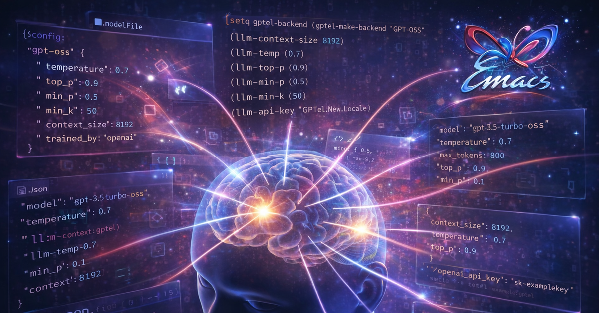

#+TITLE:     Configurando LLMs para uso pessoal: O Retorno
#+SETUPFILE: setupfile.org
#+LANGUAGE:  pt_BR
#+STARTUP:   inlineimages showall latexpreview
#+DATE:      May, 2026

Oi, pessoal.  Faz um bom  tempo que  não posto nada  aqui. Como sempre,  eu ando
extremamente ocupado.  Mas eu estou  tentando buscar  algum tempo pra  falar com
vocês com  mais frequência, porque  LLMs e IA  generativa em geral  está mudando
absolutamente todo dia! Mesmo no mês de maio teve muito lançamento interessante,
e eu não falei nada no meu blog.

O intuito desse post é falar a respeito de como todo o meu /fleet/ de LLMs que uso
para projetos pessoais  MUDOU, e inclusive eu não necessariamente  uso as mesmas
ferramentas e soluções que falei com vocês no post anterior. Eu disse que traria
mais informações  sobre meu uso, e  isso acabou ficando travado  em rascunhos de
posts que nunca concluí.

A questão  é que as LLMs  que uso no  meu dia-a-dia mudaram RADICALMENTE.  E com
essa atualização, vou  trazer pra vocês as  mudanças e melhorias que  fiz no meu
workflow.

* Tudo mudou

A primeira  coisa que  preciso dizer  a vocês é  que todo  o meu  workflow mudou
completamente.  A  minha  forma  de  usar LLMs  passou  de  ter  Ollama  rodando
localmente  e  um  script  bash  para  um  ecossistema  completamente  diferente
envolvendo  agentes,  orquestração  de   modelos,  inferência  com  meu  modesto
hardware, e... uso  da Cloud da Ollama, que  é paga, mas que agora  faz parte do
meu dia-a-dia.

Além disso,  o script bash  (então chamado  =ask-ai=), hoje, tornou-se  um projeto
bem-delineado de um novo /harness/ para usar LLMs, que estou evoluindo aos poucos.

* Do script bash ao meu próprio agente

# FATO: o ask-ai do post anterior era um script bash de ~10 linhas com
# `ollama run` + `glow` pra renderizar Markdown no terminal, usando
# devstral-small-2 como modelo padrão

# FATO: esse script evoluiu para um projeto de agente próprio com
# propósito específico, escrito em Rust — cujo nome não vou revelar
# aqui porque ainda é segredo

# FATO: por que escrever o próprio agente em vez de usar algo pronto?
# porque entender como agentes funcionam por dentro era um objetivo
# em si. E o processo de desenvolvimento trouxe conhecimento que
# nenhum tutorial ou artigo poderia ter dado

# FATO: o que um agente de verdade faz que um script não faz:
# - Memória persistente entre sessões
# - Contexto acumulado da conversa
# - Ferramentas (tool-calling) — o agente pode executar ações reais
# - RAG — o agente pode buscar informação em documentos locais
# - Embeddings — o agente pode encontrar semelhanças semânticas

# FATO: o desenvolvimento do agente me obrigou a estudar tool-calling,
# embeddings, RAG, verificação de respostas, e orquestração de modelos
# — todos conceitos que antes eram abstratos e passaram a ser
# concretos e práticos

# FATO: conexão com o lema do post anterior: "sou uma pessoa que acredita
# que é responsabilidade das pessoas mais versadas compreenderem as
# ferramentas e não ficarem reféns das soluções de mercado" — escrever
# o próprio agente é a versão extrema desse princípio

** OpenCode — O primeiro salto

# FATO: OpenCode é um agente de código que opera no terminal com
# acesso ao filesystem e execução de comandos

# FATO: modelo de multi-agentes: plan, build, fix, review, research,
# explore, offline, offline-deep — cada papel com modelo e
# temperatura diferentes

# FATO: diferença fundamental entre "chat com IA" e "delegar execução
# pra um agente com ferramentas": no chat, a IA sugere e você copia;
# com agente, a IA executa e você revisa

# FATO: cada papel no OpenCode usa um modelo diferente:
# - plan: glm-5.1:cloud, temp 0.7
# - build: glm-5.1:cloud, temp 0.3
# - fix: qwen3-coder-next:cloud, temp 0.2
# - review: kimi-k2.5:cloud, temp 0.5
# - research: minimax-m2.7:cloud, temp 0.7
# - explore: qwen3.5:cloud, temp 0.9
# - offline: offline-fast (Qwopus 9B local), temp 0.6
# - offline-deep: offline-deep (Qwen3-14B local), temp 0.6

# FATO: a temperatura não é arbitrária: tarefas criativas (explore,
# plan) usam temperatura mais alta; tarefas determinísticas (fix,
# build) usam temperatura mais baixa

# FATO: os modelos offline (Qwopus 9B, Qwen3-14B) rodam
# localmente via llama-swap, permitindo uso sem internet

** Hermes Agent — O guardião do sistema

# FATO: se o OpenCode é o programador, o Hermes é o administrador e
# assistente pessoal — agente que monitora, protege, e cuida do
# ambiente digital

# FATO: o Hermes automatiza tarefas recorrentes (cronjobs),
# monitora processos, gerencia infraestrutura, e atua como ponto de
# contato pra praticamente qualquer tarefa no computador

# FATO: conceito central: em vez de "conversar com IA", a IA se torna
# parte ativa do fluxo de trabalho — ela age, não apenas responde

# FATO: o Hermes opera no meu computador (Navi) e numa Raspberry Pi
# (Sisyphus), orquestrando cronjobs de lembretes, checagens de
# sistema, e outras tarefas automatizadas

** O Pi — Inferência na borda

# FATO: Raspberry Pi (Sisyphus, IP .8) como servidor de inferência
# independente

# FATO: por que rodar modelos em hardware tão modesto? Privacidade,
# disponibilidade (sem internet necessária), e experimentação

# FATO: o Pi roda modelos pequenos e embeddings — ChromaDB para
# memória semântica, modelos pequenos via Ollama

# FATO: a filosofia: descentralizar a inferência. Não depender de
# datacenter pra tarefas que podem rodar localmente

# FATO: o Pi também funciona como backup ecomo nó independente da
# rede Tailscale

* Local + Cloud — E a Ollama Cloud mudou o jogo

# FATO: no post anterior, eu era 100% local e cético sobre pagar por
# modelos. O post terminava dizendo: "não sinto que seja o momento pra
# eu gastar dinheiro com modelos de forma pessoal ainda"

# FATO: a Ollama Cloud mudou isso. Modelo de preços da Ollama Cloud:
# - Free: $0, uso leve, 1 modelo cloud simultâneo
# - Pro: $20/mês (ou $200/ano), 3 modelos simultâneos, 50x mais uso
#   que o Free, modelos maiores e mais potentes
# - Max: $100/mês, 10 modelos simultâneos, 5x mais uso que o Pro

# FATO: diferença crucial: NÃO é cobrança por token. O uso é medido
# por tempo de GPU (quanto mais eficiente o modelo, mais uso você
# ganha). Limites são por sessão (resetam a cada 5h) e semanais
# (resetam a cada 7 dias). Modelos mais eficientes = mais uso pelo
# mesmo preço.

# FATO: comparação com ChatGPT Plus ($20/mês): acesso a UM modelo
# proprietário. Ollama Cloud Pro: acesso a TODOS os modelos open por
# $20/mês, com tool-calling testado e sem cobrança por token.

# FATO: privacidade da Ollama Cloud: prompts nunca são usados pra
# treino, sem log de dados, parceria com NVIDIA Cloud Providers com
# política de zero data retention

# FATO: a transição: não sou mais 100% local. Modelos grandes e
# reasoning pesado rodam na cloud; privacidade e offline ficam local.
# E isso está ok — o preço é justo e a privacidade é respeitada.

# FATO: modelos open na cloud incluem: Qwen3.5, GLM-5.1, Kimi K2.5,
# DevStral, MiniMax M2.7, etc. — todos com tool-calling testado

* A torre de Babel dos modelos (hoje)

# FATO: no post anterior: 5-6 modelos no Ollama. Hoje: uma frota
# organizada com propósito específico, orquestrada pelo llama-swap.

# FATO: llama-swap funciona como proxy na porta 12434, descarregando
# modelos da GPU quando não estão em uso e carregando sob demanda

# FATO: modelos locais hoje (na RTX 3050 6GB):
# - Qwen3.5-0.8B, Qwen3.5-2B (via vLLM, tool-calling)
# - Qwen3.5-9B-ACE (GGUF, coding)
# - Qwen3-14B (GGUF, offline-deep)
# - Qwopus3.5-4B, Qwopus3.5-9B (GGUF, offline rápido)
# - Carnice-9B (GGUF, experimentação)

# FATO: vLLM config exige flags específicas pra tool-calling:
# --enable-auto-tool-choice --tool-call-parser qwen3_coder em TODOS
# os modelos vLLM

# FATO: modelos cloud (via Ollama Cloud):
# - glm-5.1 (plan, build)
# - qwen3-coder-next (fix)
# - kimi-k2.5 (review)
# - minimax-m2.7 (research)
# - qwen3.5 (explore)

# FATO: a lição: não existe "um modelo pra tudo". O marketing tenta
# vender exatamente isso, mas a realidade é que modelos têm pontos
# fortes diferentes, e a orquestração por propósito é mais eficiente
# que usar o mesmo modelo pra tudo.

# FATO: no post anterior, eu usava apenas devstral-small-2 pra
# quase tudo (fallback, código, chat) e deepseek-r1:32b pra resumo.
# Hoje cada modelo tem papel definido.

** A Guilda de IA

# FATO: desde Abril de 2026, estou dando aulas na Guilda de IA — um
# curso de 12 semanas sobre IA generativa numa Liga Acadêmica

# FATO: o currículo cobre: o que é IA hoje, prompting básico, Python
# mínimo, estrutura de agente, ferramentas, múltiplas ferramentas,
# embeddings e similaridade, RAG, desenvolvimento e ajustes,
# apresentação final

# FATO: a Guilda é um exemplo direto do ciclo que descrevo neste
# post: começei cético, estudei por conta, e agora ensino o assunto.
# É a materialização do princípio de que compreensão deve vir antes
# de adoção.

# FATO: aulas usam modelos locais (via Ollama e ask-ai) e modelos
# gratuitos (Gemini via AI Studio, Kimi) pra demonstrações ao vivo

# FATO: material didático inclui slides em Org/Reveal.js, apostilas,
# notebooks do Colab, e videoaulas com animações Manim

* O que continua inflado — e o que surpreendeu de verdade

# FATO: a opinião prometida no post anterior, finalmente entregue

# FATO: O que NÃO vale a hype:
# - Resumos genéricos — LLMs resumem, mas resumos chatos são chatos
#   independente de quem fez
# - Geração de texto genérico — escrita criativa por IA é insossa
# - "Vai substituir programadores" — não vai. Ferramenta de apoio,
#   sim. Substituir raciocínio, não.
# - Marketing de "AGI iminente" — não é
# - Chatbots de atendimento que não entendem contexto — pioram a UX

# FATO: O que surpreendeu positivamente:
# - Tool-calling: a capacidade de um modelo decidir qual ferramenta
#   usar e com quais argumentos. Isso transformou LLMs de chatbots
#   em agentes
# - Agentes com ferramentas reais: o agente que pode executar
#   código, ler arquivos, buscar na web, e orquestrar tudo isso
# - RAG local: buscar informação em documentos próprios sem mandar
#   nada pra nuvem
# - Inferência em hardware modesto: a RTX 3050 6GB roda modelos
#   pequenos bem, e a Raspberry Pi roda embeddings e modelos
#   mínimos
# - Orquestração de modelos: atribuir papéis específicos a modelos
#   específicos é mais eficiente que usar o mesmo modelo pra tudo

# FATO: conclusão honesta de quem começou cético: IA é uma ferramenta
# excelente quando você entende os limites dela. O problema não é a
# ferramenta — é o marketing que inflata as expectativas.

* Epílogo

# FATO: o projeto de agente próprio continua em desenvolvimento ativo

# FATO: a Guilda de IA continua em andamento (semanas 1-12)

# FATO: convite open-ended pra acompanhar o blog e a Guilda

# FATO: a lição que fica: entender as ferramentas > acreditar em
# marketing. De volta ao princípio do post anterior, mas com muito
# mais experiência prática pra fundamentar.
