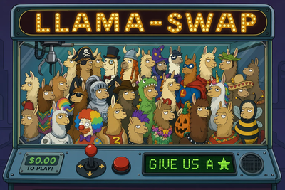
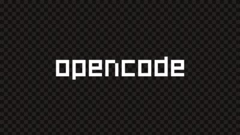
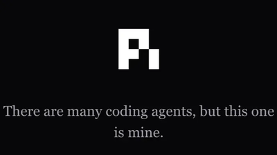
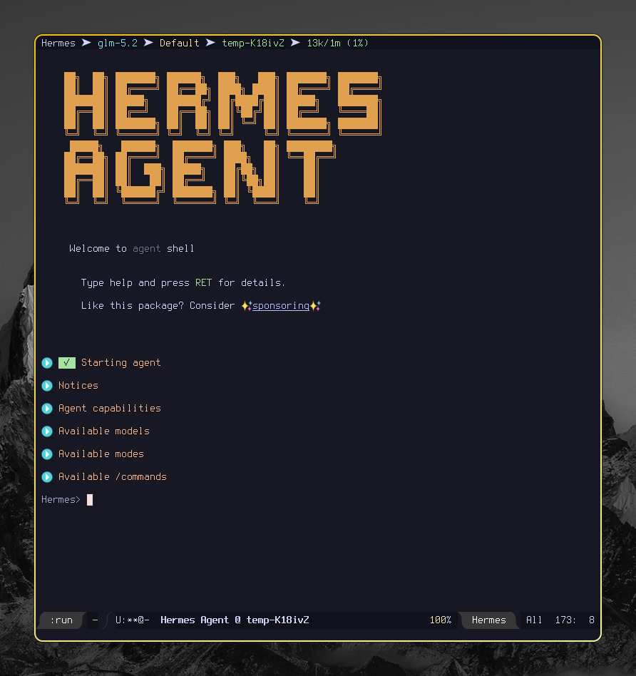

#+TITLE:     Minhas IAs em 2026: Como rodar LLMs com hardware modesto
#+SETUPFILE: setupfile.org
#+LANGUAGE:  pt_BR
#+STARTUP:   inlineimages showall latexpreview
#+OPTIONS:   toc:t
#+DATE:      July 23th, 2026

Oi, pessoal.  Faz um bom  tempo que  não posto nada  aqui. Como sempre,  eu ando
extremamente ocupado.  Mas eu estou  tentando buscar  algum tempo pra  falar com
vocês com  mais frequência, porque  LLMs e IA  generativa em geral  está mudando
absolutamente todo  dia! Mesmo nos meses  de maio e junho  teve muito lançamento
interessante, e eu não falei nada no meu blog.

O intuito desse post é falar a respeito de como todo o meu /fleet/ de LLMs que uso
para projetos pessoais  MUDOU, e inclusive eu não necessariamente  uso as mesmas
ferramentas e soluções que falei com vocês no post anterior. Eu disse que traria
mais informações  sobre meu uso, e  isso acabou ficando travado  em rascunhos de
posts que nunca concluí.

A questão  é que as LLMs  que uso no  meu dia-a-dia mudaram RADICALMENTE.  E com
essa atualização,  vou trazer para  vocês algumas dicas, recomendações  e coisas
interessantes para  que vocês  possam trazer  para os  seus worflows  também, em
especial se vocês tiverem interesse em rodar LLMs localmente.

* LLMs Cloud (para projetos maiores)

Antes de adentrarmos LLMs que rodam  efetivamente em um computador mais modesto,
eu quero  conversar com  vocês sobre  os modelos que  estou usando  atualmente e
onde, especificamente para lidar com  meus projetos pessoais. Eu realmente tenho
a  perspectiva de  que teremos  em breve  modelos que  não vão  exigir tanto  do
hardware e  que vão servir muito  pra programação, mas infelizmente  isso é algo
que fica difícil  porque existe uma barreira diretamente  relacionada ao TAMANHO
do  modelo,  em   termos  de  parâmetros[fn:1],  que  diz   respeito  a  algumas
características como a retenção  de conhecimento dele em uma determinada área.

Isso  significa  que,  pelo  menos   por  enquanto,  as  reais  powerhouses  pra
programação são os  modelos que você paga  e acessa em um  ambiente cloud (estou
desconsiderando outras  áreas aqui,  porque não  tenho domínio  dessa informação
para elas).

Sendo assim,  eu optei por  me envolver  com o uso  de modelos de  fronteira que
sejam necessariamente /open-weights/[fn:2].  O motivo pra isso é que  eu não quero
ter um  gasto absurdo com  IA. O  valor de uma  assinatura, atualmente, já  é um
gasto muito elevado,  e mesmo para opções mais baratas,  pode ser inclusive algo
que vai aumentar (o que pode se manifestar primeiro em redução de limites).

** Ollama Cloud

O que  uso atualmente  é um plano  da Ollama  Cloud. E isso  é algo  que preciso
explicar, porque muita gente me pergunta:  Ollama é, ao mesmo tempo, uma startup
e um  produto que você PODE  instalar DE GRAÇA no  seu computador, especialmente
pensando em rodar  modelos localmente. *Mas poucas pessoas sabem  que eles também
têm uma cloud.* E o  legal da Cloud deles é que eles têm  servidores nos EUA e na
Europa[fn:12] e  têm uma preocupação  grande com privacidade.  Além  disso, eles
praticamente só tem modelos OPEN WEIGHTS pra você usar.

Hoje, *através dos servidores do Ollama Cloud*, eu uso:

- GLM 5.2, da Z.ai;
- MiniMax M3, da MiniMax AI;
- Kimi K2.7 Code, da Moonshot AI;
- Nemotron 3 Ultra, da NVIDIA.

Como você  pode ver, a maioria  dos modelos que uso  são chineses, e eu  sei que
existe uma  certa desconfiança  com relação  a compartilhamento  de dados  com a
China  (como se  os EUA  também não  coletassem, haha...),  mas a  questão aqui,
especialmente  para quem  for residente  nos EUA,  é que  esses modelos  não têm
conexão com  os servidores  dos fabricantes.

Essa é a beleza dos modelos /open  weights/: Se você tiver hardware pra isso, você
baixa, instala e usa. No caso,  esses modelos são realmente muito grandes, então
dificilmente você vai ter como rodar em casa algum desses modelos...

Mesmo assim,  isso significa  que provedores cloud  podem justamente  usar esses
modelos e  hospedá-los. Ou seja,  barateamento do  custo, e portanto  valor mais
justo pra gente[fn:3]. ☺

* LLMs locais

Das  coisas  sobre as  quais  mais  sou perguntado,  figura  o  fato de  que  eu
atualmente  consigo rodar  modelos  relativamente pequenos  ou  médios na  minha
máquina, com uma velocidade MUITO  decente, especialmente para decodificação. Na
verdade, quando  menciono o que eu  consegui de velocidade aqui,  o pessoal acha
até que é mágica.

Eu uso atualmente um laptop Dell G15 5530, com:

- Um processador Intel i7 13650HX, 20 núcleos, 4.90GHz, 13ª geração;
- Uma placa de vídeo NVIDIA GeForce RTX 3050 Laptop, com  apenas 6GB de VRAM;
- Um SSD de meros 500GB;
- 32GB de memória RAM DDR5.

Como sistema  operacional, uso Arch Linux  e Hyprland como ambiente  de desktop,
que  é   muito  bonito  e   leve.   Interessante  ressaltar  também   que,  como
historicamente  drivers da  NVIDIA têm  seus  problemas no  Linux, eu  desativei
completamente os gráficos integrados do processador  e uso apenas a placa NVIDIA
para offload total de renderização. Nesse ponto, o ambiente mais leve na GPU faz
muita diferença.

Aliás, deixa  eu ser claro  com relação a  *velocidade de execução*,  porque vamos
falar agora dos modelos que rodo localmente:

- O momento de  *prefill* é o momento em  que o modelo vai processar  o prompt que
  você enviou, e calcular  a *atenção* sobre o contexto (a  conversa até agora, as
  instruções inicialmente recebidas  e também o que você está  promptando). É um
  passo antes de emitir qualquer token, em que ele vai realizar cálculos em cima
  de uma estrutura chamada *cache chave-valor* (KV cache).
- O momento  de *decode* é  o momento  em que a  LLM está "respondendo",  ou seja,
  emitindo tokens. Ela vai tomar o  cálculo de atenção realizado anteriormente e
  vai começar a trabalhar em cima dele gerando um token após o outro com base em
  probabilidade.

Esses dois momentos são importantes para você medir a performance da sua LLM, em
especial se  você ainda não  tiver "interagido" com ela  na sessão atual  (o que
significa que seu cache KV estaria limpo).

O motivo para eu falar disso é porque  nós temos uma *velocidade de prefill* e uma
*velocidade  de decode*.  No meu  setup, eu  consegui alcançar  uma velocidade  de
*decode* bem  aceitável de *30  tokens por  segundo*, e um  prefill que chega  a ser
lento mas não tanto assim.

Em definitivo, vou  falar do utilitário que uso para  alternar entre modelos sob
demanda,  dos /backends/  para  executar  modelos, dos  modelos  que  uso hoje,  e
explicar algumas dicas para conseguir boa performance em hardware tão limitado.

** =llama-swap=

O primeiro componente  é o [[https://github.com/mostlygeek/llama-swap][llama-swap]], um projeto muito  legal que permite rodar
vários  tipos de  modelos de  IA generativa  sob um  único guarda-chuva.  O mais
importante desse  componente é que ele  permite que você faça  alternância entre
modelos de forma simples.

Recentemente o =llama.cpp= em si adicionou  uma implementação que permite que você
faça algo similar, mas o interessante  do =llama-swap= é que você pode integrá-lo,
inclusive, com outros /backends/ como vLLM, e também com *forks do llama.cpp*, o que
é especialmente importante  em um ambiente como  o meu, algo que já  vou falar a
seguir.

A configuração  do =llama-swap= envolve você  declarar um arquivo YAML  com várias
especificações  de  como   lançar  o  binário  =llama-server=,   e  também  outras
ferramentas  que  você vier  a  utilizar.

Abaixo você pode ver  um exemplo de como eu faço o  deploy do Ornith-1.0-35B. A
ideia é o seguinte:  ele é um modelo grande em que  inevitavelmente eu vou fazer
offload para a memória RAM "normal" (por não caber em 6GB de VRAM), então eu vou
rodar ele com =ik_llama.cpp= e dar a  ele um timeout de inatividade de 15 minutos,
o que  economiza dores de  cabeça com tempo  de prefill, dependendo  da situação
(caso o modelo seja descarregado ou usado para, por exemplo, compactação).

Note  que a  configuração  é  basicamente muitos  metadados  e  um comando  para
executar o =llama-server= especificamente do =ik_llama.cpp=.

#+BEGIN_SRC yaml
# --- llama-swap config (fragmento abridged) ---

macros:
  models_dir: ${env.HOME}/.llama-models
  templates_dir: ${env.HOME}/git/ai-dotfiles/llama-swap/templates
  ik_llama_server: ${env.HOME}/git/ik_llama.cpp/build/bin/llama-server
  # ... outras macros (sampler defaults, cache types, etc) ...

models:
  ornith-1.0-35b:
    name: Ornith 1.0 35B
    cmd: |
      ${ik_llama_server} --port ${PORT}
      --model ${models_dir}/ornith-1.0-35b/Ornith-1.0-35B-APEX-I-Compact.gguf
      --fit
      --fit-margin 1024
      --ctx-size 131072
      --temp 1.0
      --top-p 1.0
      --top-k 40
      --min-p 0.02
      --repeat-penalty 1.05
      --reasoning on
      --jinja
      --chat-template-file ${templates_dir}/qwen-fixed-chat-template.jinja
      --parallel 1
      --parallel-tool-calls
      --cache-type-k q4_0
      --cache-type-v q4_0
      --k-cache-hadamard
      --v-cache-hadamard
      --flash-attn auto
      --defer-experts
      --prefetch-experts
      --spec-type ngram-mod:n_max=64,n_min=48,ngram_size_n=24
      --metrics
    filters:
      stripParams: "temperature, top_p"
      setParamsByID:
        ${MODEL_ID}:
          chat_template_kwargs:
            enable_thinking: false
          temperature: 1.0
          top_p: 1.0
        ${MODEL_ID}:think:
          chat_template_kwargs:
            enable_thinking: true
          temperature: 1.0
          top_p: 1.0
    ttl: 900
    capabilities:
      in: [text]
      out: [text]
      tools: true
      context: 131072
    # ... mais metadados (metadata, source, architecture, etc) ...

  # ... outros modelos ...

# ... (config-footer.yaml: hooks, matrix, evict_costs) ...
#+END_SRC

Isso é só um exemplo, mas resolvi pegar especificamente o caso do Ornith 1.0 35B
para que você  possa observar o tipo de  coisa com o qual tento  me preocupar ao
descrever  a  configuração das  /flags/  para  execução  do =llama-server=  de  cada
implementação. Claro, a escolha desses argumentos e /flags/ dizem muito a respeito
da capacidade do meu computador, de como  eu quero que o modelo se comporte, mas
sobretudo, visando  tirar o máximo  de performance sem sacrificar  capacidade de
contexto.

Não se  preocupe demais se não  entender as nomenclaturas; mais  tarde vou falar
de  características  específicas dos  modelos  e  você  vai entender  com  maior
profundidade.

**** =--fit= / =--fit-margin 1024=

A flag =--fit= só existe no =ik_llama.cpp=.  Ela realiza /offload/ inteligente de camadas
da LLM para a  memória RAM normal, mantendo na memória de  vídeo (VRAM) apenas o
que cabe. Uso também  o =--fit-margin= para reservar um espaço de  1024 MB na VRAM
pra que a primeira flag não tente usar  toda a VRAM da placa de vídeo. Assim, eu
pago  um  pouco  de  velocidade  em  prol  de  conseguir  continuar  usando  meu
computador.

Essa  configuração é  o principal  motivo pelo  qual eu  uso =ik_llama.cpp=  aqui,
porque ele consegue  fazer com que esse offload continue  tendo boa performance,
através  de memory  pinning e  /direct-memory access/  (DMA). E  como modelos  MoE
(mixture-of-experts)  não precisam  de todas  as camadas  o tempo  todo (já  que
dividem seus pesos  em /especialistas/ e só ativam alguns  especialistas para cada
token), a velocidade fica  muito boa. Esse é o meu segredo  para fazer um modelo
de 16.5GB rodar relativamente bem enquanto ocupa só 5.1GB de VRAM.

**** =--ctx-size 131072=

LLMs  precisam executar  o /prefill/  e o  algoritmo de  atenção em  uma parte  da
memória, que  obrigatoriamente tem  que ficar  na VRAM, chamada  de KV  Cache. O
tamanho  desse KV  cache  determina  a quantidade  de  tokens  que seu  contexto
suporta. Aqui, eu prezo sempre por  usar 131k. Com o restante das configurações,
isso fica confortável e eu não passo  por problemas que poderiam causar erros de
OOM (/out-of-memory/).

Se você  tiver problemas  com essa  parte, eu  sugiro reduzir  o tamanho  do seu
contexto, mas lembre-se  que se você quer  realmente um /agente/, menos  de 64k de
contexto vai ser um problema sério  para você, em especial dependendo do /harness/
que você estiver utilizando.

**** =--reasoning on= / =--jinja= / =--chat-template-file=

A primeira /flag/  basicamente liga o modo /thinking/ (/reasoning/,  pensamento, o que
você quiser chamar) antes de emitir a  resposta. Veja que isso meramente *ativa o
suporte*, e não necessariamente induz a LLM a emitir esse bloco.

Os demais  parâmetros são indicadores de  como fazer o parsing  das respostas da
LLM. A  forma como uma  LLM emite  texto é através  de criar marcadores  que vão
determinar  onde começa  e  onde termina  o pensamento,  a  resposta básica,  as
chamadas de  ferramentas... e até  marcadores de encerramento da  mensagem sendo
emitida. Pra  gente, isso  se apresenta  como um marcador  qualquer, mas  para o
vocabulário da LLM, geralmente isso se apresenta como um /token/.

Então o  que a gente  faz é  basicamente ativar o  suporte a templates  Jinja, e
geralmente eles vêm  embutidos no arquivo GGUF do modelo.  Mas você pode definir
um *chat  template file*  caso queira  usar um outro  template Jinja  com melhores
ajustes, que é o que eu faço aqui... os modelos da família Qwen (base do Ornith)
tinham  um bug  no  formato  das chamadas  de  ferramentas,  alguém lançou  esse
template corrigido, e eu estou usando.

**** =--cache-type-k q4_0= / =--cache-type-v q4_0= / =--k-cache-hadamard= / =--v-cache-hadamard=

Essa parte aqui  também é muito importante  quando o assunto é o  KV cache. Como
mencionei  antes, seu  contexto  também  usa VRAM,  e  BASTANTE.  Mas você  pode
quantizá-lo. Claro, você  vai perder um pouco da precisão  do seu contexto assim
como também perde precisão em uma  quantização de uma LLM, mas em contrapartida,
vai usar muito menos VRAM.

O KV  cache é um  cache chave/valor (não vou  me aprofundar demais  em conceitos
aqui), então  o =ik_llama.cpp= permite  que você quantize  as chaves e  os valores
separadamente. Aplicando  uma quantização  =Q4_0= em  ambos, você  reduz em  75% o
tamanho do  cache com relação à  quantização original (=F16=). Então  vale muito a
pena.

Adicionalmente, o =ik_llama.cpp= tem flags que te permitem aplicar uma rotação nos
tensores de  cache chamada  Hadamard Rotation[fn:10],  que preserva  a qualidade
deles enquanto permite comprimir o cache de forma ainda mais agressiva.

Esses dois caras  em particular são o  segredo pra ter um modelo  tão grande com
um contexto tão grande rodando na minha máquina.

**** =--flash-attn auto=

Basicamente habilita /Flash Attention/ caso a  sua placa de vídeo suporte. Uma RTX
3050 como a minha e outras placas da NVIDIA suportam isso sem problemas.

Essa  funcionalidade  é importante  porque,  se  fôssemos utilizar  um  processo
"padrão" de atenção,  seria necessário calcular uma matriz quadrada  N*N, onde N
seria a quantidade de tokens no contexto. Se a gente tivesse um contexto de 131k
cheio, a  matriz de  atenção "pura"  dele seria  uma matriz  131k *  131k floats
(F16). Ridiculamente grande, e não caberia na VRAM. E olha que isso é uma matriz
*intermediária* que nem é algo pra ficar salvo em lugar nenhum.

O que o /flash attention/ faz é basicamente não materializar essa matriz completa,
e através  de técnicas como /tiling/,  fusão, e um softmax  (algoritmo de atenção)
incremental, ele permite calcular fragmentos da atenção incrementalmente e muito
rapidamente na SRAM  da GPU, uma memória  pequena porém ainda mais  rápida que a
VRAM. Falando  assim, parece até  mágica. Junte  isso também com  quantização de
contexto e as rotações... e você tem o pacote completo.

**** =--parallel 1= / =--parallel-tool-calls=

Esses parâmetros  tratam de aspectos de  paralelismo no modelo. A  primeira flag
foi  um dos  sacrifícios que  precisei fazer:  eu só  tolero uma  requisição por
vez. O =llama-swap= em  si existe para fazer troca entre  modelos sob demanda, mas
quando  você quer  o mesmo  modelo operando  com até  duas requisições  ao mesmo
tempo, por  exemplo, você  precisa aumentar  o valor de  =--parallel=, e  pra cada
execução paralela, *tem que ter espaço para um KV cache a mais*. Esse é o /tradeoff/
que você tem que fazer. Se eu tivesse mais VRAM pra esbanjar, eu aumentaria esse
número.

A outra  flag é algo  bem mais trivial. Basicamente,  a maioria dos  modelos pra
código e  /agentic coding/ hoje  em dia  tendem a enviar  mensagens intermediárias
pedindo  para  executar  mais  de  uma  ferramenta  ao  mesmo  tempo,  na  mesma
mensagem.  A  flag =--parallel-tool-calls=  basicamente  só  prepara o  parser  da
requisição para esse cenário, para que ele possa agregar e formatar as respostas
usando o template Jinja fornecido.

**** =--defer-experts= / =--prefetch-experts=

Essas  flags aqui  só funcionam  para modelos  MoE (mixture-of-experts),  porque
esses  modelos  operam através  de  operar  com  um  especialista fixo  que  faz
roteamento da atenção  para outros experts que  podem ou não estar na  GPU ou no
offload para  a RAM  normal, e  com esses  outros especialistas  que normalmente
"interpretam" coisas específicas.

Você pode deferir o carregamento de  experts com =--defer-experts= para evitar que
sejam  carregados   os  /experts/  menos   utilizados  para   a  VRAM  e   para  a
RAM. Adicionalmente, você pode pré-carregar  também os experts mais prováveis de
serem ativados no próximo token, usando =--prefetch-experts=.

Essas flags juntas ajudam a aliviar um pouco a pressão do modelo sobre a RAM e a
VRAM.

**** ~--spec-type ngram-mod:n_max=64,n_min=48,ngram_size_n=24~

/Speculative decoding/ (basicamente,  acelerar a emissão de tokens  através de uma
"previsão"  dos  tokens  mais  prováveis   a  seguir),  porém  sem  nenhuma  das
tecnologias mais novas como DFlash ou MTP.  Não vou entrar em tantos detalhes de
como essa flag funciona, mas basta você  saber que é uma boa alternativa se você
não tem VRAM a mais para carregar os  /drafters/ de DFlash e MTP (que são pequenos
modelos extras carregados junto com o modelo-base).

**** =--temp 1.0= / =--top-p 1.0= / =--top-k 40= / =--min-p 0.02= / =--repeat-penalty 1.05=

Esses   parâmetros  são   /samplers/,   também  conhecidos   como  /parâmetros   de
inferência/.  Esses  caras são  bem  importantes  e  são normalmente  alguns  dos
parâmetros que você vai querer ajustar  quando você baixar aquele modelo da moda
que tá todo mundo  falando bem, mas que magicamente só  no seu computador parece
ser uma porcaria e entrar facilmente em  /loop/.

Vou deixar  aqui uma pequena tabela  baseada na [[https://docs.ollama.com/modelfile][documentação do  Ollama]] para que
você possa entender melhor o que cada um é.

| Nome           | Descrição                                                                                                          |
|----------------+--------------------------------------------------------------------------------------------------------------------|
| =temp=           | Temperatura do modelo. Aumentar a temperatura vai tornar o modelo mais criativo, mas mais suscetível a alucinação. |
| =top-p=          | Funciona em conjunto com outros samplers. Alto, próximo de 1.0 = textos mais diversos; baixo = textos mais conservadores.         |
| =top-k=          | Reduz a probabilidade de alucinação. Alto, próximo de 100 = mais diverso. Menor = respostas mais conservadoras.    |
| =min-p=          | Alternativa a =top_p=, manobra o balanço entre qualidade e variedade da saida (probabilidade mínima dos tokens).     |
| =repeat_penalty= | Define a penalização para repetição de tokens. Mais alto (1.5) = mais penalidade; mais baixo (1.0) = leniência.    |

Sempre procure no site da Unsloth e  no /model card/ do fabricante do modelo quais
são os parâmetros  de inferência recomendados, ou, se for  um /fine tune/, procure
pelos parâmetros do modelo-base, no pior dos casos.

E lembre-se: Se o seu modelo estiver entrando em loop e falando abobrinha, antes
de assumir  que é  um modelo  de má-qualidade  (o que  pode até  ocorrer), tente
primeiro ajustar algum parâmetro desses para valores que fazem sentido.

**** =filters: stripParams= / =setParamsByID=

Essas chaves já não estão mais no comando de execução do =llama-server= em si, mas
são /templates/  usados para  alterar a forma  como o modelo  vai se  comportar no
momento da requisição, sem precisar carregar ou descarregar o modelo da memória.

A chave  =stripParams= especifica  que os  valores de  temperatura e  =top-p=, caso
informados na  requisição do cliente, serão  *ignorados*. Isso é porque,  por mais
que a  execução do  =llama-server= seja  feita com valores  padrão, ainda  assim é
possível que o cliente, via requisição, altere esses valores quando o modelo for
responder à requisição. Então estamos explicitamente ignorando-os e confiando só
no nosso deploy.

O outro ponto  *muito importante* é o  =setParamsByID=. O que ele  faz é basicamente
mudar um  ou mais  parâmetros da execução  do modelo, como  se fosse  algo sendo
especificado via requisição. Só que, em vez de esperar que o usuário envie esses
parâmetros de forma  simples, isso é feito  através do acesso a  uma /variante/ do
modelo.

A ideia  é extremamente simples:  A /tag/  do Ornith 1.0  para que eu  possa fazer
requisições nele é  =ornith-1.0-35b=. Porém, se você fizer uma  requisição para um
modelo  chamado  =ornith-1.0-35b:think=,  ele   vai  necessariamente  habilitar  o
parâmetro =enable_thinking=.

Lembra que eu disse  que o =--reasoning= apenas define se  o modelo tem capacidade
ou não de emitir  blocos de pensamento? Pois então, o que  habilita ou não esses
blocos na maioria dos modelos é justamente o =enable_thinking=.

**** =ttl: 900=

Talvez seja  o parâmetro mais  simples: trata-se  do /time-to-live/ do  modelo, ou
seja:  quando o  modelo  ficar  ocioso, ele  ainda  vai  permanecer um  tempinho
ocupando processamento.

Para evitar que  modelos grandes fiquem fazendo /eviction/ toda  hora, eu aumentei
esse tempo para 15 minutos, e o Ornith foi um dos modelos que sofreu essas alterações.

** Backends e ferramentas de inferência

Quando o assunto  é rodar LLMs localmente, existem vários  tipos de /engines/ para
fazer isso, até  mesmo usando diretamente código em Python.  Mas você vai querer
escolher  seu  /backend/ de  inferência  a  dedo porque  cada  um  tem seu  nicho:
performance, compatibilidade, facilidade de uso.

A seguir, vou descrever alguns dos backends que uso na minha máquina.

*** =llama.cpp= (upstream)

O =llama.cpp= é o backend de  referência para hospedar modelos localmente, pensado
para consumidor  final. Implementado em C++,  usa um formato de  arquivo para os
modelos chamado GGUF. Esse backend tem um amplo suporte a várias arquiteturas de
laboratórios variados (=qwen=,  =gemma=, =glm=, =cohere=...), e  implementa pontos muito
importantes como /flash attention/, quantização de cache KV, rotações de Hadamard,
soluções para acelerar a geração  de tokens via /speculative decoding/ (algoritmos
e suporte a decoders DFlash, MTP, n-gram, EAGLE-3...).

O =llama.cpp= também sabe fazer /offload/ de  parte do seu modelo para a memória RAM
normal e portanto você não precisa usar ele só para modelos que cabem totalmente
na  sua VRAM,  mas ele  não  é o  melhor  /backend/ para  ambientes limitados.  De
qualquer forma, ainda assim ele é  um excelente backend para o consumidor final,
como disse anteriormente.

Seria justo  comparar o =llama.cpp=  a outras soluções  como SGLang e  vLLM. Essas
duas outras engines  servem modelos com foco em *alta  concorrência*, sendo ideais
para  cenários  de  múltiplas  GPUs  e requisições  simultâneas,  o  que  requer
otimização de /throughput/. Elas assumem que  o modelo inteiro cabe na VRAM porque
foram otimizadas para diversas requisições  por segundo sendo realizadas para os
modelos, e não para situações em que  um modelo poderia ser grande demais para a
sua GPU. O =llama.cpp= age justamente na  contramão disso, em cenários em que você
tenha  uma  única GPU,  e  que  talvez ela  nem  seja  o suficiente.  Então  ele
implementa ferramentas  para lidar com  isso (/offload/, quantização de  KV cache,
etc).

Curiosamente, eu prefiro usar esse backend justamente quando eu consigo usar uma
quantização  de   modelo  e  um  cache   KV  que  caibam  totalmente   na  minha
VRAM. Geralmente eu prefiro o =ik_llama.cpp= mesmo.

*** =ik_llama.cpp=

O  =ik_llama.cpp= é  um /fork/  do =llama.cpp=  otimizado para  hardware limitado,  em
especial quando  /offload/ para RAM normal  é necessário. Exatamente por  isso, as
/flags/ para usar  o =ik_llama.cpp= podem ser completamente  diferentes do =llama.cpp=
normal. Acredito que a  feature principal dele seja o fato  de que você consegue
fazer o /offload/ para RAM normal usando /memory pinning/[fn:11].

Em  geral, a  não ser  que tenha  alguma exceção,  como por  exemplo no  caso de
incompatibilidade   de  arquitetura,   eu  uso   o  =ik_llama.cpp=   para  modelos
grandes. Especialmente se eles forem /mixture-of-experts/ (MoE).

*** Ollama (local)

O Ollama é o /backend/ para execução local de modelos da mesma empresa homônima, e
inclusive esse  /backend/ pode  servir como  proxy para  os modelos  hospedados na
cloud da mesma  empresa. Ele já foi um  fork maior do =llama.cpp=, mas  hoje ele é
uma espécie de redistribuição e usa o =llama.cpp= diretamente como backend. Possui
um CLI  amigável e  implementa também uma  API REST própria  e outras  APIs para
garantir camada de compatibilidade.

Em geral, o Ollama  decide por si mesmo a maior parte  da configuração de deploy
do  modelo  e  não  te  deixa   customizar  com  a  mesma  granularidade  que  o
=llama.cpp=. Para  configuração fina de  modelos, você precisa criar  um =Modelfile=
(similar a um =Dockerfile= em sintaxe) e então dar um =ollama create= no arquivo com
a  tag  e  o nome  que  quiser.  Isso  ajuda,  mas não  substitui  você  alterar
diretamente as /flags/ de execução do próprio servidor.

Já usei  bastante essas funcionalidades  e até  recomendo como ponto  de entrada
caso você esteja  com dúvida de como configurar modelos,  mas abandonei o Ollama
como backend em  favor de poder realizar  ajustes mais finos e o  controle que o
=llama.cpp= "cru" e seus forks me dão.

O Ollama também é  capaz de orquestrar os modelos de acordo  com a capacidade da
sua máquina, carregando e descarregando modelos sob demanda.

O Ollama também  é interessante com relação  ao suporte a aceleração  via MLX no
Mac  e  também tem  uma  boa  interface GUI  para  Windows.  Macs têm  sido  bem
receptivos ao  uso de IA.  Windows... bom,  se for testar,  boa sorte e  me diga
depois se conseguiu ter bons resultados...

*** LM Studio

O LM Studio é  um projeto muito interessante. Ele é primariamente  um GUI que te
ajuda a pesquisar, instalar e configurar modelos, tanto para chat quanto rodando
como servidor.  Pense nele  como uma interface  e um facilitador  para o  uso do
=llama.cpp=,  e uma  boa porta  de entrada  para esse  backend em  específico, com
algumas coisas  extras. Você  também tem  a oportunidade  de realizar  tweaks na
forma como  o modelo é  deployado com maior  flexibilidade que no  Ollama, mesmo
através  da interface.  E  opcionalmente, ele  tem uma  ferramenta  de linha  de
comando também.

A única coisa  que ele não faz é substituir  a automação de carregar/descarregar
modelos sob  demanda como  o =llama-swap= e  o Ollama fazem.  Mas é  uma excelente
aplicação, recomendo muito utilizar.

** Modelos e quantizações

Depois de falar dos backends, vamos falar um pouco a respeito dos modelos que eu
uso  e  dos meus  critérios  para  selecionar  a  quantização adequada  para  um
deles. Em  geral, eu priorizo modelos  que rodam com velocidade  aceitável e que
aguentam  uma boa  quantidade  de contexto.  Então vou  apresentar  a lista  dos
modelos que  tenho instalados aqui,  e depois vou  falar sobre como  escolher os
quants para cada um.

*** Modelos principais

Os  modelos a  seguir são  alguns dos  que tenho  instalados no  meu /fleet/  (meu
conjunto de  modelos de  linguagem e visão).  São os modelos  que diria  que são
indispensáveis ou que são os meus preferidos.

#+HTML: 

#+HTML: 

#+HTML: 
#+HTML: 

#+HTML: 
Ornith-1.0-35B

#+HTML: 
Quant: APEX I-CompactBackend: <code>ik_llama.cpp</code>Prefill: 114.4 tok/sDecode: 36.5 tok/sHF: <a href="https://huggingface.co/mudler/Ornith-1.0-35B-APEX-GGUF">mudler/Ornith-1.0-35B-APEX-GGUF</a>

#+HTML: 

#+HTML: 

#+HTML: 

O modelo estrela e o principal do meu /fleet/ atualmente. Trata-se de um fine tune
do Qwen3.5-35B-A3B, que  atualmente é o melhor modelo de  código que tenho. Veja
que  seu modelo-base  está  uma geração  "atrás" do  Qwen3.6  (falarei dele  nas
menções honrosas), mas  mesmo assim, consegue ser melhor que  ele nas tarefas de
código.

Esse modelo não  possui capacidade de visão, diferente do  Qwen3.5 base, mas não
faz falta  porque o  foco aqui é  código, e  nisso ele ganhou  em todos  os meus
testes. O  Ornith 1.0 35B  atualmente é  meu modelo principal  para programação,
quando os meus tokens da semana acabam...

De qualquer forma,  o Ornith também tem uma quantização  APEX I-Compact, então o
setup é bem parecido com o  Qwen3.6-35B-A3B. Em geral, essa quantização, modelos
MoE e suporte no backend =ik_llama.cpp= é o que sempre vou considerar para modelos
que exigem offload dessa forma.
#+HTML: 

#+HTML: 

#+HTML: 

#+HTML: 

#+HTML: 
#+HTML: 

#+HTML: 
GLM-4.7-Flash

#+HTML: 
Quant: APEX I-CompactBackend: <code>llama.cpp</code>Prefill: 65.0 tok/sDecode: 33.0 tok/sHF: <a href="https://huggingface.co/mudler/GLM-4.7-Flash-APEX-GGUF">mudler/GLM-4.7-Flash-APEX-GGUF</a>

#+HTML: 

#+HTML: 

#+HTML: 

Eu já tive uma  história de amor e ódio com esse modelo  porque, quando usei ele
pela primeira vez, foi via Ollama, com a quantização que tinha. E ele rodava com
todo o hardware do meu computador no talo, usando muita memória RAM e quase nada
de VRAM, porque eu  não sabia configurar minha infraestrutura, e  eu fazia uns 5
tok/s.  De qualquer  forma,  depois  de uma  madrugada  com  todos os  programas
fechados e esse modelo configurado no OpenCode,  foi esse cara que iniciou o meu
projeto do harness que estou desenvolvendo, o Sprachspiel.

Mas  agora tudo  mudou  aqui!  Com uma  quantização  APEX I-Compact  apropriada,
finalmente consegui rodar  ele de tal forma que tenho  um desempenho aceitável e
ainda assim consigo  usar meu computador normalmente. A Z.ai  manda muito bem, e
depois  desse  modelo,  veio  a  família do  GLM  5.x,  que  é  o  que  mais  uso
atualmente. Recomendo demais esse modelo para  desenvolvimento em geral. É o meu
favorito depois do Ornith 1.0.
#+HTML: 

#+HTML: 

#+HTML: 

#+HTML: 

#+HTML: 
#+HTML: 

#+HTML: 
Qwen3.5-4B

#+HTML: 
Quant: Unsloth Q4_K_MBackend: <code>llama.cpp</code>Prefill: 363.3 tok/sDecode: 46.1 tok/sHF: <a href="https://huggingface.co/unsloth/Qwen3.5-4B-GGUF">unsloth/Qwen3.5-4B-GGUF</a>

#+HTML: 

#+HTML: 

#+HTML: 

A família  de modelos Qwen3.5  foi muito importante  quando lançou nesse  ano de
2026, porque  foi um  dos primeiros  indicativos de  que poderíamos  ter modelos
pequenos realmente  capazes de fazer  coisas. Esse é  um dos menores  modelos da
família, sendo maior  apenas que um de  800 milhões (0.8B) e outro  de 2 bilhões
(2B) de parâmetros. Aqui,  eu uso ele como um modelo muito  capaz e muito rápido
para tarefas mais simples.

Eu arrisco  dizer que,  se você precisa  de um chatbot  com capacidades  de tool
calling mais simples, o  Qwen3.5 4B pode ser uma EXCELENTE  opção.  Caso você já
tenha usado o  GPT-4o, que foi o "xodozinho"  de muita gente, o Qwen3.5  4B é um
*substituto direto* para ele. E isso  é um representativo dos saltos da indústria:
estamos comparando um  modelo grande, rodando em datacenter, de  agosto de 2024,
com um modelo minúsculo, rodando dentro do  seu computador, de março de 2026. Em
um ano e  meio, a mesma capacidade  desceu de centenas de  bilhões de parâmetros
(estima-se que GPT-4o tinha uns 200B) para apenas quatro bilhões.

Ah, todos os modelos da família  Qwen3.5 (sem treinamento extra) suportam visão,
mas  eu *deliberadamente*  desativo a  visão neles  para não  ter que  carregar um
arquivo =mmproj=, economizando VRAM no processo.
#+HTML: 

#+HTML: 

#+HTML: 

#+HTML: 

#+HTML: 
#+HTML: 

#+HTML: 
Qwen3.5-9B

#+HTML: 
Quant: MoQ-3.6Backend: <code>ik_llama.cpp</code>Prefill: 76.4 tok/sDecode: 15.9 tok/sHF: <a href="https://huggingface.co/w-ahmad/Qwen3.5-9B-GGUF-MoQ">w-ahmad/Qwen3.5-9B-GGUF-MoQ</a>

#+HTML: 

#+HTML: 

#+HTML: 

Esse é o irmão  relativamente maior e o último que compõe  a família dos Qwen3.5
realmente pequenos.  O 9B é significativamente  melhor que o 4B  em praticamente
tudo,  especialmente se  você estiver  falando de  matemática e  código (podemos
fazer  comparação direta  entre  ele e  o  GPT-OSS de  120B,  então temos  outra
situação de centenas de bilhões de parâmetros reduzidos a meros bilhões).

O 9B pode ser usado como substituto do 4B quando você precisa que o modelo tenha
um  "raciocínio" mais  apurado  e  mais qualitativo.  Tamanho  também  é um  bom
indicador  de  retenção  de  quantidade  de conhecimento  de  mundo,  e  isso  é
relativamente importante  para ajudar o  modelo a explorar  caminhos diferentes,
coisa que você vai precisar com código e com um agente.

Uso uma  quantização Mixture-of-Quants (MoQ),  o que  é agressivo mas  não perde
tanto desempenho assim. No  meu computador ele é mais lento que o  4B, e meu uso
principal dele é quando preciso tratar algum assunto mais filosófico de pesquisa
ou quando preciso de uma revisão de código em busca de bugs, algo com o qual ele
surpreendentemente se  dá muito bem, até  marginalmente melhor que o  Ornith 1.0
nos  meus testes  (isso  é um  resultado  mais  preliminar,  ainda  estou
trabalhando nesses testes).
#+HTML: 

#+HTML: 

#+HTML: 

#+HTML: 

#+HTML: 
#+HTML: 

#+HTML: 
Gemma-4-E2B-QAT

#+HTML: 
Quant: UD-Q4_K_XLBackend: <code>llama.cpp</code>Prefill: 600.4 tok/sDecode: 89.8 tok/sHF: <a href="https://huggingface.co/google/gemma-4-E2B-it-qat-q4_0-gguf">google/gemma-4-E2B-it-qat-q4_0-gguf</a>

#+HTML: 

#+HTML: 

#+HTML: 

Gemma4 foi  uma excelente surpresa da  Google esse ano, uma  família de pequenos
modelos abertos  e focados justamente  em sistemas mais limitados.   Digamos que
seja a resposta ocidental direta à família Qwen3.5.

Ao contrário do que  o nome sugere, os modelos E2B e E4B  não significam que são
2B parâmetros e  nem 4B parâmetros. Os  "E" vem de parâmetros  EFETIVOS. Não vou
entrar em  nuances aqui,  mas isso  significa que,  na verdade,  o E2B  tem 4.6B
parâmetros, mais especificamente, com 2B efetivos.

Esse modelo foi particularmente importante pra mim nas aulas que ministrei sobre
como  criar  agentes  com  LangChain   porque,  para  pessoas  com  computadores
limitados, era  mais interessante instalar  Ollama em uma  VM do Google  Colab e
rodar esse  modelo de forma  persistente, já que  ele é suficientemente  bom com
tool calling. Além  disso, eu uso uma quantização =Q4_K_XL=  provida pela Unsloth,
mas que  também foi feita em  cima da variante QAT  do Google, que é  um tipo de
treinamento realizado já com o objetivo de o modelo ser quantizado em sequência,
o que significa que  ele compensa já no treinamento a perda  de precisão que vai
sofrer, evitando perda de qualidade.
#+HTML: 

#+HTML: 

#+HTML: 

#+HTML: 

#+HTML: 
#+HTML: 

#+HTML: 
Gemma-4-E4B

#+HTML: 
Quant: Q4_K_MBackend: <code>ik_llama.cpp</code>Prefill: 79.7 tok/sDecode: 22.2 tok/sHF: <a href="https://huggingface.co/unsloth/gemma-4-E4B-it-GGUF">unsloth/gemma-4-E4B-it-GGUF</a>

#+HTML: 

#+HTML: 

#+HTML: 

Essa é a variante "effective" maior do  E2B, sendo ela uma E4B. Portanto ela tem
4B parâmetros  "efetivos", mas  o seu  tamanho real é  7.5B parâmetros.  Uso uma
quantização  =Q4_K_M=  da  Unsloth (veja  que  ela  não  é  =XL=, que  tornaria  ela
incompatível com  =ik_llama.cpp=, o backend que  mais utilizo). O E4B  é um modelo
mais poderoso  e gosto de  pensar nele como uma  resposta direta ao  Qwen3.5 9B,
porém ele ainda peca um pouco com relação ao modelo chinês.

De forma  interessante, eu não  uso a versão QAT  desse modelo porque,  nos meus
testes, uma quantização  =Q4= com QAT (executada no =llama.cpp=  vanilla) não apenas
implicou em  ganho algum  de performance  na minha placa  de vídeo,  como também
perdeu  ligeiramente em  qualidade  da  tarefa que  usei  como  teste (algo  que
potencialmente deve  estar na margem  de erro). Ou seja,  como a versão  QAT não
trouxe benefícios,  optei pela quantização  =Q4_K_M= PTQ  da Unsloth, que  além de
compatível com =ik_llama.cpp=, teve melhor performance nos meus testes.
#+HTML: 

#+HTML: 

#+HTML: 

#+HTML: 

#+HTML: 
#+HTML: 

#+HTML: 
LFM2.5-8B-A1B

#+HTML: 
Quant: APEX I-CompactBackend: <code>llama.cpp</code>Prefill: 256.8 tok/sDecode: 94.9 tok/sHF: <a href="https://huggingface.co/mudler/LFM2.5-8B-A1B-APEX-GGUF">mudler/LFM2.5-8B-A1B-APEX-GGUF</a>

#+HTML: 

#+HTML: 

#+HTML: 

Esse modelo é encantador. A Liquid AI é uma empresa muito voltada para a criação
de modelos  MUITO pequenos e  a incentivar a  comunidade a construir  coisas com
seus modelos, inclusive realizar /fine tuning/  deles. Esse modelo, em especial, é
uma pequena obra prima: 8B de parâmetros  totais, então é um modelo pequeno. Mas
com apenas  1B de  parâmetros ativos.  Ou seja,  é MoE  (então em  extremo caso,
podemos  fazer offload  tranquilamente); é  suportado no  =ik_llama.cpp=; e  ainda
existe quantização APEX I-Compact para ele. É o melhor de todos os mundos.

Preciso  ser sincero  com relação  a  um aspecto  desse modelo:  *não use-o  para
código*. Ele simplesmente não presta para  programar. Ouso dizer que até mesmo um
Qwen3.5 2B poderia  ser melhor. E são dois os  motivos: primeiramente, em apenas
8B, você  não empacota tanto conhecimento  de mundo e programação;  segundo, por
ser um MoE  A1B, na prática ele vai  agir a maior parte do tempo  como um modelo
1B, e isso não é praticamente NADA em termos de parâmetros.

Esse modelo vai brilhar  em qualquer situação em que você precisar  de chat e de
um *agente*  capaz de realizar  tool calls em uma  longa cadeia de  interações. Ou
seja: você  consegue usar ele  como um pequeníssimo  modelo em algo  como Hermes
Agent  ou  OpenClaw,  assumindo  que  você só  queira  algo  que  responda  suas
solicitações, tome decisões relativamente elaboradas sobre certos dados, precise
agir de forma simples em pipelines, etc. Até mesmo para um virtual pet que ainda
seja capaz  de realizar coisas  úteis...  Esse é o  cara que consulta  e remarca
compromissos no  calendário enquanto entende  sua solicitação que foi  feita com
linguagem natural.
#+HTML: 

#+HTML: 

#+HTML: 

#+HTML: 

#+HTML: 
#+HTML: 

#+HTML: 
Qwen3-VL-4B

#+HTML: 
Quant: Q4_K_MBackend: <code>llama.cpp</code>Prefill: 770.3 tok/sDecode: 29.0 tok/sHF: <a href="https://huggingface.co/Qwen/Qwen3-VL-4B-Instruct-GGUF">Qwen/Qwen3-VL-4B-Instruct-GGUF</a>

#+HTML: 

#+HTML: 

#+HTML: 

Como eu disse antes, eu desativei  completamente a capacidade de visão (input de
imagem)  em todos  os meus  modelos maiores,  porque isso  gasta mais  VRAM para
carregar os /encoders/ visuais e a camada de projeção, que efetivamente transforma
a entrada da imagem para o formato que a LLM "entende".

A  forma que  eu uso  para  mitigar isso  é  ter bons  modelos especialistas  em
visão.  São também  LLMs, mas  como são  especialistas em  imagens, costumam  se
referir a elas  como VLMs. É o caso  aqui do Qwen3-VL: trata-se de  um modelo um
pouco mais  velho (anterior  ao Qwen3.5),  mas que é  especialista em  lidar com
imagens, sobretudo muito bom em gerar  /groundings/, ou seja, delimitar e legendar
elementos específicos em imagens.

Essa  versão   do  Qwen3-VL   em  especial,   que  só   tem  4B   parâmetros,  é
excepcionalmente boa em  tudo isso, sendo meu modelo de  visão mais confiável do
fleet para  essa tarefa.  Quando eu preciso  de algo do  tipo, eu  controlo meus
harnesses pra  que eles redirecionem  tarefas de reconhecimento de  elementos via
visão computacional para o Qwen3-VL, e o =llama-swap= trata de descarregar uma LLM
pra colocar ele no lugar e responder à requisição, e vice-versa. Obviamente você
pode perceber que isso  tem um impacto em performance e  acaba causando um /cache
miss/, mas bem, quem não tem cão, caça como gato...
#+HTML: 

#+HTML: 

#+HTML: 

#+HTML: 

#+HTML: 
#+HTML: 

#+HTML: 
GLM-OCR

#+HTML: 
Quant: Q8_0Backend: <code>llama.cpp</code>Prefill: 75.9 tok/sDecode: 77.5 tok/sHF: <a href="https://huggingface.co/ggml-org/GLM-OCR-GGUF">ggml-org/GLM-OCR-GGUF</a>

#+HTML: 

#+HTML: 

#+HTML: 

O GLM-OCR é um lindo e pequeníssimo modelo criado pela Z.ai (mesmos criadores do
GLM  5.2) que  é especialista  em leitura  de documentos,  e também  é capaz  de
extrair tabelas formatadas  e fórmulas. É uma VLM, portanto,  com apenas 940M de
parâmetros (menos  de 1B!). Cabe  inteiro na VRAM,  quase não precisa  de cache,
etc.

O uso dele é extremamente limitado e  ele tem também formas muito específicas de
ser chamado, você  não vai passar textos  e mais textos de prompt  para ele. Ele
não foi  treinado para  isso. Então,  é basicamente  um utilitário  de propósito
muito específico.

O legal de você ter  um modelo como o GLM-OCR é justamente o  fato de ele ter um
tamanho de  1.4GB, não precisar  ser quantizado,  não usar praticamente  NADA de
memória  de vídeo,  e  substituir uma  stack  inteira de  extração  de dados  de
documentos que  poderia ser  feita com Tesseract,  Poppler ou  bibliotecas desse
tipo.   Vai te  servir para  a grande  maioria das  situações.  Apenas  crie uma
aplicação  ou pipeline,  carregue  o  modelo, e  faça  ele  trabalhar para  você
digitalizando documentos. Simples e confiável.
#+HTML: 

#+HTML: 

#+HTML: 

#+HTML: 

#+HTML: 
#+HTML: 

#+HTML: 
Hy-MT2-1.8B

#+HTML: 
Quant: Q4_K_MBackend: <code>llama.cpp</code>Prefill: 296.8 tok/sDecode: 72.1 tok/sHF: <a href="https://huggingface.co/tencent/Hy-MT2-1.8B-GGUF">tencent/Hy-MT2-1.8B-GGUF</a>

#+HTML: 

#+HTML: 

#+HTML: 

Esse modelo aqui é interessante demais.  Trata-se de um modelo capaz de realizar
/tradução/ de 33 línguas e cinco dialetos, totalizando 38, feito pela Tencent. Atualmente  é o modelo que
eu uso para tradução de texto.

O legal dele é  justamente ter um tamanho de 1.8B, então não  faz nem cócegas na
minha máquina. Todavia, o  grande problema desse modelo é que  ele não tem muito
conhecimento de mundo,  já que é tão  pequeno. Se você precisar  de algum modelo
que exija uma  tradução com mais nuances da língua  que você estiver traduzindo,
recomendo dar uma olhada  no TranslateGemma, que tem suporte a  72 línguas e tem
tamanhos de 4B ou 12B, a depender da sua necessidade.
#+HTML: 

#+HTML: 

#+HTML: 

#+HTML: 

#+HTML: 
#+HTML: 

#+HTML: 
Bonsai 27B 1-bit

#+HTML: 
Quant: Q1_0 (1.125 bpw)Backend: <code>bonsai-llama.cpp</code>Prefill: 142.8 tok/sDecode: 21.6 tok/sTamanho: ~3.9 GBHF: <a href="https://huggingface.co/prism-ml/Bonsai-27B-gguf">prism-ml/Bonsai-27B-gguf</a>

#+HTML: 

#+HTML: 

#+HTML: 

Esse  modelo, quantizado  a 1-bit,  e  o modelo  Ternary  (do qual  vou falar  a
respeito  mais tarde),  saíram enquanto  eu ainda  estava escrevendo  esse post,
então  tive  que dar  uma  parada  e testá-los.  E  eu  devo dizer,  são  marcos
INCRÍVEIS.

O Bonsai 27B  1-bit é uma quantização do Qwen3.6-27B  muito especial, feita pela
PrismML, que  comprimiu o modelo de  tal forma que  ele tivesse o tamanho  de um
modelo de 4B de parâmetros com quantização Q4.

Uma quantização tão extrema é excelente porque fornece para a gente uma prova de
conceito de que é possível ter modelos  com tamanhos ainda menores no disco e na
memória, mas com a mesma quantidade de parâmetros de um modelo ainda maior.

O Qwen3.6-27B é atualmente o estado da  arte para os modelos locais, e agora, se
você tiver uma placa de vídeo de  8GB, pode usufruir desse modelo rodando em uma
velocidade decente e com um contexto longo!  O Bonsai ainda não é excelente para
iterar  sobre tarefas  de edição  de código  por um  longo período[fn:7],  mas a
PrismML promete mitigar isso no futuro.

*Importante:* para conseguir as velocidades aí  acima, eu precisei reduzir o contexto
dele  para 32K.  Isso  realmente não  é  muito. Eu  diria que  menos  de 64K  já
inviabiliza o uso de um modelo em um agente.
#+HTML: 

#+HTML: 

#+HTML: 

#+HTML: 

#+HTML: 
#+HTML: 

#+HTML: 
Agents-A1-4B

#+HTML: 
Quant: Q4_K_MBackend: <code>ik_llama.cpp</code>Prefill: 1287.9 tok/sDecode: 42.9 tok/sHF: <a href="https://huggingface.co/InternScience/Agents-A1-4B-Q4_K_M-GGUF">InternScience/Agents-A1-4B-Q4_K_M-GGUF</a>

#+HTML: 

#+HTML: 

#+HTML: 

Esse é um pequeno modelo da InternScience  que saiu pouco depois do seu variante
35B-A3B. Como o variante maior, é um /fine tune/ do Qwen3.5-4B. Mas o interessante
desse modelo é que ele apresenta  alguns incrementos interessantes com relação à
sua base:  foi treinado para comportamento  /agentic/ e de /long-horizon/,  ou seja,
foi feito para servir como um agente capaz de operar de forma autônoma por muito
tempo, em cima do mesmo prompt.

Esse modelo,  porém, não  é o  melhor modelo  para código  da sua  categoria. Eu
recomendo muito esse modelo caso você  esteja interessado em pesquisa e contexto
*científico*. Nos testes em  que fiz, dei a ele uns quatro  PDFs diferentes e pedi
para  ele fazer  uma síntese  e  amarrar os  conceitos  entre os  quatro, e  ele
executou essa tarefa  com maestria. Também fiz  um outro teste em  que pedi para
que ele  pesquisasse na  internet e  categorizasse as fontes  em um  relatório e
também  em um  CSV com  bastante  rigor, e  ele  executou todas  as tarefas  com
perfeição segundo o meu critério, e por bastante tempo.
#+HTML: 

#+HTML: 

*** Menções honrosas e modelos auxiliares

#+HTML: 

#+HTML: 

#+HTML: 
#+HTML: 

#+HTML: 
Qwen3.6-35B-A3B

#+HTML: 
Quant: APEX I-CompactBackend: <code>ik_llama.cpp</code>Prefill: 98.7 tok/sDecode: 33.7 tok/sHF: <a href="https://huggingface.co/mudler/Qwen3.5-35B-A3B-APEX-GGUF">mudler/Qwen3.5-35B-A3B-APEX-GGUF</a>

#+HTML: 

#+HTML: 

#+HTML: 

O modelo  "estrela" para execução local  em hardware mais limitado,  criado pela
Alibaba,  da notória  família Qwen  de  modelos cujas  versões open-weights  são
adoradas pelo mundo todo.   É o maior modelo "de fábrica" que  tenho, e em geral
funciona muito  bem para tudo, sendo  um modelo grande com  boa performance. Sua
arquitetura é baseada  no Qwen3.5 de mesmo tamanho, mas  ele recebeu treinamento
extra para agentes e para execução de longo tempo.

Para  o  deploy do  modelo  ficar  mais  leve,  eu deliberadamente  desativei  a
capacidade de /visão/  dele. Isso é um ponto importante,  porque significa que não
precisamos carregar  tensores =mmproj= para  tratar o  input de imagem,  fazendo o
modelo precisar  de bem menos  memória em geral  para carregar, e  permitindo um
contexto muito maior.

Esse modelo tem  uma arquitetura MoE (mixture of experts),  o que significa que,
dos 35  bilhões de parâmetros  no modelo, nem  todos estarão ativados  ao emitir
cada token, mas sim apenas os /experts/  para aquele token a ser emitido. Isso nos
dá uma  vantagem em sistemas mais  limitados: acaba se tornando  possível para a
gente deixar os "experts mais importantes", ou os principais, na placa de vídeo,
e o resto a gente faz offload para a memória normal. Ou seja, se são 35B, com 3B
ativos (por  token), então o modelo  vai acabar se comportando,  em maioria, com
uma velocidade de um modelo de 3 bilhões  de parâmetros, o que é muito rápido no
meu computador.  Junte isso  ao =ik_llama.cpp=  como backend,  feito especialmente
para sistemas mais limitados, e você pode realizar /memory pinning/, o que permite
que  a GPU  se comunique  diretamente com  as partes  da memória  RAM em  que os
experts estão carregados, via DMA. Esse é  o segredo da mágica dos 30 tokens por
segundo de decode com esses modelos MoE.
#+HTML: 

#+HTML: 

#+HTML: 

#+HTML: 

#+HTML: 
#+HTML: 

#+HTML: 
North-Mini-Code

#+HTML: 
Quant: UD-Q3_K_MBackend: <code>ik_llama.cpp</code>Prefill: 58.3 tok/sDecode: 25.2 tok/sHF: <a href="https://huggingface.co/unsloth/North-Mini-Code-1.0-GGUF">unsloth/North-Mini-Code-1.0-GGUF</a>

#+HTML: 

#+HTML: 

#+HTML: 

O lançamento desse modelo foi bela  supresa. Trata-se de um modelo relativamente
leve e confiável  para código, que uso esporadicamente para  tarefas pequenas. O
único defeito dele é ser grande demais em comparação com o Ornith e o Qwen3.6, o
que significa  que eu  acabo preferindo  os outros  dois, mas  é uma  boa opção,
especialmente quando você  precisa de um código analisado por  uma IA diferente,
como uma espécie de "segunda opinião". Criado pela empresa canadense Cohere.
#+HTML: 

#+HTML: 

#+HTML: 

#+HTML: 

#+HTML: 
#+HTML: 

#+HTML: 
Agents-A1-35B

#+HTML: 
Quant: APEX I-CompactBackend: <code>ik_llama.cpp</code>Prefill: 90.6 tok/sDecode: 34.9 tok/sHF: <a href="https://huggingface.co/mudler/Agents-A1-APEX-GGUF">mudler/Agents-A1-APEX-GGUF</a>

#+HTML: 

#+HTML: 

#+HTML: 

Esse modelo é  meio engraçado. Ele é  um fine tune do  Qwen3.5-35B-A3B, na mesma
pegada  do Ornith  1.0 35B.  Porém,  apesar de  ele ser  decente em  programação
(ficando atrás do Ornith e do Qwen3.6 em testes que fiz aqui), ele aparentemente
foi feito  com a pretensão  de ser um orquestrador  de outros modelos.  Por isso
acredito em utilizá-lo para planejamento e distribuição de tarefas.

Mas meu computador dificilmente roda um modelo ao mesmo tempo, então o Agents-A1
ficou para outra oportunidade.
#+HTML: 

#+HTML: 

#+HTML: 

#+HTML: 

#+HTML: 
#+HTML: 

#+HTML: 
MiniCPM-V-4.6

#+HTML: 
Quant: Q5_K_MBackend: <code>llama.cpp</code>Prefill: 404.5 tok/sDecode: 86.8 tok/sHF: <a href="https://huggingface.co/openbmb/MiniCPM-V-4.6-gguf">openbmb/MiniCPM-V-4.6-gguf</a>

#+HTML: 

#+HTML: 

#+HTML: 

Esse é um  modelo especialista em vision,  sendo portanto algo que  a gente pode
chamar de  VLM também. Antes de  usar o Qwen3-VL,  esse era o modelo  que estava
utilizando, e inclusive ele  é rápido o suficiente para que  eu consiga usar uma
quantização   Q5  em   vez  de   Q4  (o   que  significa   uma  ligeira   melhor
qualidade).   Recomendo  como   uma  alternativa   mais  lightweight,   para  um
especialista em visão.
#+HTML: 

#+HTML: 

#+HTML: 

#+HTML: 

#+HTML: 
#+HTML: 

#+HTML: 
Qwen-AgentWorld-35B

#+HTML: 
Quant: APEX I-CompactBackend: <code>ik_llama.cpp</code>Prefill: 99.1 tok/sDecode: 35.3 tok/sHF: <a href="https://huggingface.co/mudler/Qwen-AgentWorld-35B-A3B-APEX-GGUF">mudler/Qwen-AgentWorld-35B-A3B-APEX-GGUF</a>

#+HTML: 

#+HTML: 

#+HTML: 

Esse modelo é  bem interessante, porque ele  não é um modelo para  chat nem para
agente.  Trata-se  de  um World  Model.  Esse  tipo  de  modelo foi  feito  para
renderizar estados de um certo domínio após a aplicação de certas ações sobre um
estado anterior. No caso específico do Qwen-AgentWorld, a ideia é fazer isso com
uma LLM clássica treinada do zero para isso[fn:8].

Eu diria que existe muito espaço pra  esses modelos, por enquanto como modelo de
apoio para  construção de  agentes, mas  por enquanto não  temos adoção  nem uma
compreensão robusta da maioria sobre o potencial desses caras.
#+HTML: 

#+HTML: 

#+HTML: 

#+HTML: 

#+HTML: 
#+HTML: 

#+HTML: 
LFM2.5-VL (450M / 1.6B / Extract)

#+HTML: 
Quant: Q8_0 (450M e 1.6B), Q4_K_M (Extract)Backend: <code>llama.cpp</code>Prefill: 4789.3 tok/s (450M)Decode: 312.4 tok/s (450M)HF: <a href="https://huggingface.co/LiquidAI/LFM2.5-VL-450M-GGUF">LiquidAI/LFM2.5-VL-450M-GGUF</a>

#+HTML: 

#+HTML: 

#+HTML: 

Esses  modelos são  muito  legais, e  na  verdade são  um  conjunto de  pequenos
modelos. Os  LFM2.5-VL são modelos  especializados em visão computacional  e que
inclusive entendem /groundings/ (enquadramento com coordenadas exatas de elementos
em imagens).  Existem variantes  de 450M  e 1.6B parâmetros,  e em  especial uma
variante =extract= para esses dois tamanhos, que responde só com JSON.

A Liquid AI recomenda inclusive fazer /fine tuning/ dos modelos deles para as suas
necessidades, e eu consegui inclusive  fazer /fine tune/ do =LFM2.5-VL-450M-Extract=
para que ele fizesse reconhecimento e /groundings/ de mãos em imagens, e inclusive
usando esse mesmo hardware limitado que tenho! Recomendo bastante a experiência.
#+HTML: 

#+HTML: 

#+HTML: 

#+HTML: 

#+HTML: 
#+HTML: 

#+HTML: 
Bonsai 27B Ternary

#+HTML: 
Quant: Q2_0_g128 (1.71 bpw)Backend: <code>bonsai-llama.cpp</code>Tamanho: ~7.2 GBHF: <a href="https://huggingface.co/prism-ml/Ternary-Bonsai-27B-gguf">prism-ml/Ternary-Bonsai-27B-gguf</a>

#+HTML: 

#+HTML: 

#+HTML: 

Esse modelo  aqui é exatamente  a mesma coisa do  Bonsai 27B com  quantização de
1-bit, a diferença é  que ele usa uma quantização em /trinário/.  Se você tiver um
pouco  mais de  hardware para  ceder para  execução de  um modelo  como esse,  é
interessante  que você  experimente essa  variante porque  ela tende  a ter  uma
qualidade  melhor,  sobretudo  em  termos de  codificação.  Todavia,  a  PrismML
recomenda  mais a  variante de  1-bit justamente  porque o  objetivo é  vencer a
/constraint/  de tamanhos,  em  especial quando  o assunto  for  rodar modelos  em
celulares e dispositivos embarcados.
#+HTML: 

#+HTML: 

#+HTML: 

#+HTML: 

#+HTML: 
#+HTML: 

#+HTML: 
Nomic-Embed-Text-v2-MoE

#+HTML: 
Quant: Q4_K_MBackend: <code>llama.cpp</code>Encode: 907.1 tok/sDims: 768HF: <a href="https://huggingface.co/nomic-ai/nomic-embed-text-v2-moe-GGUF">nomic-ai/nomic-embed-text-v2-moe-GGUF</a>

#+HTML: 

#+HTML: 

#+HTML: 

Diferente dos outros modelos, esse aqui  é um modelo para /gerar embeddings/. Esse
tipo de modelo é particularmente interessante quando o assunto é RAG, indexação,
pesquisa semântica,  etc. O  legal especificamente  desse modelo  é que  ele foi
treinado  com  uma técnica  chamada  /Matryoshka  embeddings/. É  meio  complicado
explicar do  que se trata  isso, mas imaginando que  o /embedding/ seja  um grande
vetor multidimensional  em que  cada valor dele  corresponda mais-ou-menos  a um
conceito semântico específico para a LLM, esse tipo de treinamento faz com que o
modelo  priorize  as  dimensões  de  maior carga  semântica  para  o  *início*  do
vetor. Isso significa que, se for necessário *descartar* valores ao final do vetor
de embeddings, você pode fazer isso sem perder tanta qualidade no /embedding/.

O valor de /encoding/ que registrei ali em  cima é bem alto, como podemos ver, e o
mais legal disso é que é um valor  CPU-only. Eu nem gasto a minha placa de vídeo
quando o assunto é rodar modelos de /embedding/.
#+HTML: 

#+HTML: 

#+HTML: 

#+HTML: 

#+HTML: 
#+HTML: 

#+HTML: 
LFM2.5-Embedding-350M

#+HTML: 
Quant: Q8_0Backend: <code>llama.cpp</code>Encode: 328.3 tok/sDims: 1024HF: <a href="https://huggingface.co/LiquidAI/LFM2.5-Embedding-350M-GGUF">LiquidAI/LFM2.5-Embedding-350M-GGUF</a>

#+HTML: 

#+HTML: 

#+HTML: 

Mais  um  modelo  pequeno  da  Liquid   AI,  dessa  vez  para  gerar  /embeddings/
também. Mais uma vez,  é o tipo de modelo que eu executo  CPU-only. Veja que ele
tem uma diferença considerável  na performance, mas isso também tem  a ver com o
fato de que o /embedding/ dele tem mais dimensões (1K).
#+HTML: 

#+HTML: 

*** Modelos de difusão (geração de imagem)

Os modelos  a seguir  não são  modelos que rodam  normalmente na  minha máquina,
porque   pressupõem    que   você   tenha   uma    certa   infraestrutura   para
executá-lo. Talvez  você se  dê bem  usando algo como  ComfyUI para  rodar esses
caras,  mas para  conseguir  rodar por  aqui, eu  fiz  uma verdadeira  /gambiarra
vibecodada/ (hehe), usando  o Hermes Agent (discuto mais a  seguir), de tal forma
que  o modelo  opera  em "etapas"  e  vai  descarregando da  memória  o que  não
precisa[fn:9].

Essa ferramenta que criei,  e que chamei de =diffuse=, nada mais  é que um wrapper
feito em  Python que  tem a função  de invocar o  /backend/ correto  para executar
qualquer  modelo (=sd.cpp=  na maioria  dos  casos, e  às vezes  algo custom  como
=gemlite=). Além disso, como alguns dos  modelos dependem de uma escrita cuidadosa
do prompt,  escolhi criar um  mecanismo de  facilitar a melhoria  dessa escrita,
através de um parâmetro =--enhance=, que vai  modelar o prompt usando uma das LLMs
anteriores que já mencionei.

De qualquer forma, pude atestar que esses  modelos funcionam muito bem com o meu
/setup/ modesto, dado que você tenha um  pouco de paciência com o tempo de geração
dessas imagens.

#+HTML: 

#+HTML: 

#+HTML: 
#+HTML: 

#+HTML: 
HiDream-O1-Image-Dev

#+HTML: 
Quant: SDNQ uint4-svd-r32Backend: <code>transformers + accelerate</code>Tamanho: ~7.3 GBHF: <a href="https://huggingface.co/HiDream-ai/HiDream-O1-Image-Dev">HiDream-ai/HiDream-O1-Image-Dev</a>

#+HTML: 

#+HTML: 

#+HTML: 

Esse é um excelente  modelo não apenas para geração de  imagens, mas também para
edição delas:  você pode fornecer  uma imagem como exemplo  e ele vai  gerar uma
nova imagem usando-a como base, de acordo com o prompt que você fornecer.

As únicas ressalvas que  faço são o seguinte: primeiro, ele  tem uma tendência a
gerar imagens com uma iluminação e um detalhamento mais cartunesco; segundo, por
algum motivo, ele tende a *envelhecer, e  muito*, as pessoas que for gerar. Isso é
contornável com  um bom trabalho de  /prompting/, mas eu precisei  embutir um modo
=enhance=  no meu  utilitário para  que uma  LLM qualquer  (à escolha)  saiba como
mitigar e contornar esses problemas.

Esse modelo também  faz /snap/ do tamanho  da imagem para 2048x2048,  por isso ele
pode   demorar  mais   na  geração,   e  também   gerar  imagens   de  altíssima
qualidade. Como isso sugere, esse é o  modelo mais lento e mais pesado, mas vale
o teste.
#+HTML: 

#+HTML: 

#+HTML: 

#+HTML: 

#+HTML: 
#+HTML: 

#+HTML: 
Ideogram 4

#+HTML: 
Quant: Q4_0Backend: <code>sd-cli (GGUF)</code>Tamanho: ~14.9 GBHF: <a href="https://huggingface.co/leejet/ideogram-4-GGUF">leejet/ideogram-4-GGUF</a>

#+HTML: 

#+HTML: 

#+HTML: 

Esse é  o modelo principal  que uso hoje, mantenho  ele instalado sempre.  É sem
dúvida o modelo que gera imagens com a melhor qualidade em geral. A melhor forma
de fazer  os inputs para  ele é  com uma estrutura  em JSON que  eu pessoalmente
tenho  MUITA PREGUIÇA  de escrever,  e  por isso  mais  uma vez  uso a  extensão
=--enhance= da ferramenta de  geração de imagens que criei para  fazer com que uma
LLM do meu /fleet/ gere o prompt adequadamente pra mim.

Esse modelo gera  verdadeiras obras de arte  de alta qualidade e  lida muito bem
com gerar imagens com texto também.

O único defeito desse modelo é a *censura* embutida nele, que é exagerada. Uma das
coisas que fiz para testar esses modelos quando os instalei foi gerar uma imagem
do Alucard,  da franquia  Castlevania. E  é impossível  descrever o  Alucard sem
falar em  vampiros, tema gótico,  estilo /chiaroscuro/,  etc. O resultado  de usar
prompts desse  tipo é  que o  modelo acaba bloqueando  completamente a  imagem e
renderizando apenas uma imagem de cor sólida com um letreiro de "content blocked
by safety  filter". Mas isso  é simples de  contornar na maioria  das situações,
basta fazer um prompt melhor, mesmo.
#+HTML: 

#+HTML: 

#+HTML: 

#+HTML: 

#+HTML: 
#+HTML: 

#+HTML: 
Bonsai Image 4B

#+HTML: 
Quant: ternary/binary (gemlite)Backend: <code>gemlite</code>Tamanho: ~4.5 GBHF: <a href="https://huggingface.co/prism-image/bonsai-image-4b">prism-image/bonsai-image-4b</a>

#+HTML: 

#+HTML: 

#+HTML: 

O Bonsai  Image 4B é  de longe o  modelo mais leve em  termos de tamanho.  Foi o
primeiro modelo de difusão  que coloquei aqui. Ele possui uma  base de um FLUX.2
Klein 4B,  porém quantizado para 1.58-bit  em ternário. Como você  pode ver, ele
lembra um pouco o que a PrismML fez com o Bonsai 27B, e a forma de criar prompts
para ele  é mais com descrições  da cena em linguagem  natural. /Keyword stacking/
(ex. insistir em  referenciar alta qualidade várias vezes)  e /mood/ contraditório
não são com ele.

A ferramenta  que criei para  rodar esses modelos  de difusão começou  a existir
primariamente por causa  desse modelo, porque ele depende de  um backend próprio
(=gemlite=) para execução.
#+HTML: 

#+HTML: 

#+HTML: 

#+HTML: 

#+HTML: 
#+HTML: 

#+HTML: 
Z-Image-Turbo

#+HTML: 
Quant: Q3_K_S (GGUF)Backend: <code>sd-cli (GGUF)</code>Tamanho: ~6.4 GBHF: <a href="https://huggingface.co/jayn7/Z-Image-Turbo-GGUF">jayn7/Z-Image-Turbo-GGUF</a>

#+HTML: 

#+HTML: 

#+HTML: 

Esse modelo foi produzido pela Alibaba (criadores da família Qwen). Usa uma base
Lumina2, e opera melhor gerando imagens  1024x1024 que 512x512, sendo portanto o
único modelo referenciado  aqui que prefere resoluções maiores. É  um bom modelo
para gerações de boa qualidade. Se estiver  em dúvida de onde começar, esse é um
bom começo.
#+HTML: 

#+HTML: 

**** Galeria de Comparação

Abaixo, você  pode ver  algumas imagens  geradas para cada  modelo. Foi  usado o
prompt a seguir:

#+begin_quote
A serene sunset landscape  with a small wooden cabin by  a calm lake, surrounded
by pine forest, golden hour light reflecting on water, photorealistic.
#+end_quote

O  Ideogram 4  passou pelo  processo de  refinamento do  prompt para  JSON, e  o
HiDream realizou o snapping para a resolução 2048x2048, portanto o resultado com
o tamanho  a seguir envolveu  eu redimensionar  manualmente a imagem  gerada com
ImageMagick.

#+HTML: 

#+HTML: <figure>
#+HTML: <figcaption>Bonsai 4B · 56s · 4 steps · 1.58-bit</figcaption></figure>
#+HTML: <figure>
#+HTML: <figcaption>Z-Image-Turbo · 78s · 8 NFE · Q3_K_S</figcaption></figure>
#+HTML: <figure>
#+HTML: <figcaption>HiDream SDNQ · 211s · 28 steps · SDNQ int4</figcaption></figure>
#+HTML: <figure>
#+HTML: <figcaption>Ideogram 4 · 125s · 20 steps · Q4_0</figcaption></figure>
#+HTML: 

O tema da foto não permite identificar  as diferenças entre os modelos que estou
apresentando, mas  HiDream tende a  ser o mais  cartunesco, porém com  suporte a
edição de  imagens; Bonsai é o  mais leve e  rápido de todos, com  uma qualidade
surpreendente  para  apenas  quatro  /steps/ de  geração.  Z-Image-Turbo  tende  a
entregar com  grande qualidade, apesar de  ser relativamente mais devagar  que o
restante. E o Ideogram 4, apesar dos problemas de censura meio absurdos, é o que
eu mais gosto (inclusive, alguns mascotes nesse post foram gerados com ele!).

O  que  importa  é:  com  uma estratégia  cuidadosa  de  offloads  em  situações
intermediárias, é possível rodar esses modelos em uma mera RTX 3050 Laptop 6GB.

*** Recomendações ao escolher modelos

O que fica de lição da apresentação  desses modelos e /backends/ de execução é que
é bem possível você rodar muitos modelos,  mas você *precisa escolhê-los a dedo* e
também experimentar  para ver se vão  funcionar. Eis algumas dicas  práticas que
costumo levar em consideração quando vou escolher um modelo para experimentar no
meu /fleet/:

- O melhor cenário  possível é quando um modelo cabe  inteiramente dentro da sua
  VRAM, independente do /backend/;
- Caso  o modelo  não caiba  totalmente  na VRAM,  você  vai ter  que começar  a
  considerar quantizações e redução de tamanho de contexto;
- Menos  de 64k  de contexto  em um  modelo significa  que ele  *não presta*  para
  agentes, porque  vai ficar compactando toda  hora, se é que  vai rodar. Comece
  testando  com  um  contexto  mais  alto,  e  vá  reduzindo  enquanto  não  der
  OOM. Lembre-se  também de  reservar uma  boa quantidade de  VRAM pra  que você
  possa continuar usando o seu computador, enquanto roda sua LLM;
- Se você quiser rodar  um modelo bem maior do que o que  a sua GPU tolera (ex.,
  no  meu caso  6GB de  VRAM), você  vai ter  que dar  preferência para  modelos
  /mixture-of-experts/,   senão   a   velocidade  de   decodificação   vai   ficar
  *horrível*. Esse é o motivo para eu preferir Qwen3.6-35B-A3B (MoE) a Qwen3.6-27B
  (que é melhor, porém é denso);
- Mesmo ao  utilizar modelos MoE,  prefira quantizações pensadas  para ambientes
  mais restritivos. Por  exemplo, quantizações como MoQ (veja  o usuário =w-ahmad=
  no HuggingFace)  ou quantizações APEX  (em especial I-Compact; veja  o usuário
  =mudler=). Essas técnicas tendem a  quantizar, de forma seletiva, certas camadas
  da sua LLM, em especial APEX e modelos MoE;
- Se você  não encontrar as  quantizações anteriores, pode começar  a considerar
  quantizações Q5, Q4  ou Q3, dependendo da capacidade da  sua GPU. Lembre-se de
  que, via de regra, quanto menor o modelo, mais afetado ele fica pela perda de
  qualidade de uma  quantização (ex: um modelo Q3 não  perde tanta qualidade com
  relação  ao  Q4  se  for  35B;  um  modelo  4B,  todavia,  pode  perder  muita
  qualidade). Evite Q2 e abaixo, se qualidade for importante para você;
- Outra dica também é sempre ficar de olho nas quantizações da Unsloth. Todavia,
  cuidado porque modelos com sufixo XL  tendem a não funcionar ou causar /crashes/
  no =ik_llama.cpp=;
- Use bastante  as flags do =ik_llama.cpp=,  sobretudo quando você souber  que seu
  modelo precisa fazer /offload/ de camadas para a RAM;
- Se você estiver carregando um modelo denso, em especial se ele cabe inteiro na
  sua VRAM,  a sua melhor  opção é o =llama.cpp=  /upstream/ mesmo, que  costuma ter
  mais suporte a mais arquiteturas, e tende a ser mais estável;
- Se a quantidade de VRAM estiver muito apertada, considere *desabilitar* o =mmproj=
  que acompanha  o modelo. Isso vai  remover a capacidade do  modelo de realizar
  reconhecimento de  imagens (/vision/),  ou até  mesmo outros  tipos de  input em
  modelos multimodais, mas é um preço baixo a se pagar em prol de velocidade, já
  que  você pode  mitigar de  outras  formas (ex:  usar uma  VLM especialista  e
  pequena);
- Você pode  considerar também quantizar  o cache  KV (em alguns  backends, pode
  quantizar K (chaves)  e V (valores) separadamente, e  também realizar rotações
  de Hadamard  para comprimi-lo mais ainda  e também melhorar a  qualidade. Isso
  vai  permitir que  você  economize VRAM  para nela  carregar  mais camadas  do
  modelo, ou deixar mais VRAM livre para suas aplicações;
- Finalmente,  o /tradeoff/  real de  velocidade com  quantizações tão  extremas e
  hardware tão limitado  ocorre, em maioria, *no prefill*. Ou  seja, você consegue
  fazer seu  modelo emitir  tokens mais  rápido (/decode/), mas  pode ter  um TTFT
  (/time-to-first-token/) mais elevado,  porque vai perder velocidade  na etapa de
  /prefill/ do cache, que é quantizado.

* Harnesses e Agentes

O uso mais efetivo  de IA, como você deve saber,  envolve usarmos algum programa
que dá  à LLM a  capacidade de invocar ferramentas  e portanto fazer  coisas por
você.  A  gigantesca  maioria  da  população  hoje  ainda  trata  LLMs  como  um
chat[fn:4].  Mas  existem   vários  outros  usos  interessantes   para  LLMs,  e
programação inclusive é só um deles.

Para tirar  proveito dessas LLMs, você  vai precisar de um  bom /harness/. Porque,
bem,  harness +  LLM =  agent. E  tem  harness de  todo tipo.  Vou mostrar  meus
principais.

** Hermes Agent

Esse sem  dúvida nenhuma é o  que eu mais uso.  O Hermes Agent é  um agente mais
abrangente que a maioria  porque ele opera à base da ideia  de *reter memória*. Ou
seja,  ele aprende  com  o seu  uso.  Abrir  uma nova  sessão  não envolve  você
necessariamente relembrá-lo de  tudo o que você fez, porque  ele tem ferramentas
ativas e passivas pra guardar o que você fez anteriormente.

Combine isso também com o fato de ele ser extremamente estável e também permitir
comunicação de várias  formas (por exemplo, uso via Telegram  e Discord), e você
tem literalmente um  assistente pessoal que vai ser limitado  apenas com relação
ao tipo de provedor e modelo de LLM que você utilizar.

Sempre me perguntam para que eu  uso Hermes Agent. É realmente difícil responder
essa  pergunta, porque  a resposta  certa seria  *tudo*. Mas  vou tentar  enumerar
alguns usos específicos:

- Configuração dos  meus modelos  locais. Vou  falar mais  disso depois,  mas eu
  deixo  o Hermes  brilhar  e  inclusive fazer  testes  e  benchmarks com  minha
  orientação;
- Planejamento de tarefas;
- Organização de documentos;
- Planejamento e execução de limpezas em arquivos (SEMPRE com o meu aval);
- Elaboração de material de aula  (com minha supervisão, sempre!): slides, texto
  complementar (revisado sempre), *produção de vídeos complementares*;
- Pesquisas aleatórias, agregar informações;
- Organizar roadmap do Sprachspiel;
- Edição de TCC com LaTeX (coisa que fiz recentemente para uma amiga);
- Organização de currículo e LinkedIn (e pesquisa de boas práticas);
- Refatorou todo  o visual do  meu site, que inclusive  é exportado com  Emacs e
  arquivos Org, coisa incomum;
- Muito mais coisas que eu não consigo nem lembrar pra colocar aqui.

A  questão  do  Hermes  Agent  é  que, assim  como  o  concorrente  dele  direto
(OpenClaw), trata-se de um tipo de agente em que, se você for capaz de imaginar,
passar a ideia e tentar fazer prompts direitinho, ele faz absolutamente tudo pra
você. E a Nous Research tá sempre  adicionando skills novas. Além disso, se você
faz algo,  ele mesmo  vai ativamente criar  skills a respeito  do que  você está
fazendo, pra  que das próximas vezes  ele também se  lembre de como fazer  o que
você precisa.  E às vezes, você  não precisa nem necessariamente  usar um modelo
tão  bom assim:  o  Hermes  muitas vezes  consegue  compensar  muitas coisas.  É
realmente um agente formidável.

Hoje uso Hermes  Agent com GLM 5.2  via Ollama Cloud, mas  tenho também profiles
separados  exclusivamente para  operações  de software  e  code review  (Hefesto
Agent,  com MiniMax  M3), uso  heavy-duty com  modelos locais  (Lain Agent,  com
Qwen3.6  35B-A3B, usando  Qwen3-VL para  apoio com  /vision/); e  uso pequeno  com
pequenos  modelos  (Lumin  Agent,  com LFM2.5  8B-A1B,  que  é  excepcionalmente
incompetente pra código mas um *excelente  assistente pessoal*, e isso é melhor do
que parece).

** OpenCode

OpenCode, hoje,  é o meu harness  primário de codificação. Uso  ele pra qualquer
projeto maior  de programação, atualmente,  ou para  a maioria deles.  Faço isso
porque ele  tem "profiles"  diferentes para situações  específicas, e  você pode
também definir modelos e configurações para cada profile.

A princípio,  ele vem com os  profiles de Plan  e Build, que já  são suficientes
para a maioria  das situações. Para ambos, uso só o GLM 5.2.

Aí, eu  adicionei também os profiles:

- Fix para consertar bugs rapidamente (Kimi K2.7 Code);
- Research,  para  realizar  pesquisa,  varrer a  codebase  e  pesquisar  coisas
  (MiniMax M3);
- Review, para revisão de código (MiniMax M3);
- Debug,  para executar  cenários de  instrumentação  e debug  (GLM 5.1),  sendo
  também atrelado a um plugin que instalei.

Não usei  nenhum critério específico para  decidir quais modelos usar  e em qual
situação. Esses são mais uma questão de  /feeling/, e do que achei melhor utilizar
à  medida que  experimentei. Geralmente  recomendam certos  modelos para  certas
operações, mas o que  descobri foi que é sempre melhor  adaptar cada situação de
acordo com  o que você  experimentar dos  modelos e decidir  VOCÊ MESMO o  que é
melhor.

*** OMO (Oh-My-OpenCode)

Existe uma extensão comunitária muito  interessante chamada Oh-My-OpenCode que é
particularmente  interessante  se você  estiver  interessado  em /vibecoding/  (em
específico,  estou usando  esse termo  para me  referir a  usar alguns  pequenos
prompts e  não fazer  muito a  não ser revisar  alguma coisa  no final).  Eu não
adaptei muito  com essa  forma de programar,  mas talvez seja  uma boa,  se você
prefere algo mais autônomo. Ele tem  excelentes ideias embutidas, de ter modelos
desempenhando  funções específicas  automaticamente,  de revisão,  planejamento,
verificação, etc.

** Pi Coding Agent

Pi  é  um  agente  extremamente  interessante porque  ele  foi  feito  para  ser
MINIMALISTA. Então ele não vem com  praticamente nada, e você tem que configurar
tudo. Ele  é a  coisa mais  próxima de uma  Filosofia Unix  que você  pode obter
quando o assunto é um harness voltado pra código. Ele vem com o básico e pronto,
sem muitos guardrails, mas extremamente flexível.

Se você estiver procurando  uma experiência mínima, esse aqui é  o cara que você
tem que usar. Gosto de pensar nele como um =vi= ou =vim= básico, sem configuração. E
uso  ele da  mesma maneira  (meu editor  principal é  Emacs, só  uso =vim=  quando
preciso fazer uma edição rápida via terminal em alguma coisa).

*** OMP (Oh-My-Pi)

Essa é  uma distribuição do  Pi que adiciona  coisas interessantes a  ele, assim
como  no caso  do OMO,  mas  ele é  fundamentalmente diferente.  Ainda estou  me
acostumando com ele, mas  é bem robusto e adiciona muitas coisas  ao Pi base que
podem deixar  você muito mais  confortável. Em  especial, permitir que  o modelo
crie sub-agentes para subdividir as tarefas  é uma das partes mais interessantes
desse harness.

Como comparei  o Pi  básico ao  =vim=, acho que  seria adequado  comparar o  OMP a
Neovim ou coisa parecida.

** Servidores MCP

Servidores MCP  são interessantes para estender  a capacidade do seu  agente com
novas funcionalidades sem que você precise sair muito fora de como agentes em si
funcionam. Pense  em um  servidor MCP  como uma  forma de  definir dinamicamente
novas  ferramentas que  o  seu  agente pode  chamar,  o  que é  fundamentalmente
diferente  de fornecer  uma ferramente  CLI  para ele  e ensiná-lo  a usar  essa
ferramenta[fn:5]. Esses servidores podem vir como serviços que esperam que o seu
cliente MCP  se conecte a eles  via HTTP (trabalho para  o harness e não  para a
LLM),  ou  que o  servidor  seja  iniciado como  subprocesso  e  que seja  feita
interação  com  ele  através  de   input/output  padrão  do  console,  via  file
descriptors  mesmo, como  se você  estivesse digitando  e lendo  em um  terminal
(stdio).

Já  vi algumas  pessoas dizendo  que  MCP é  desnecessário quando  você tem  uma
ferramenta  CLI,  mas  acho  que   são  paradigmas  diferentes.  Instalar  novas
ferramentas no agente  não é igual a permitir  que o agente chame um  CLI, a meu
ver.

*** SearXNG e DuckDuckGo

Um agente que se preze tem que ser  capaz de pesquisar na internet. Porém isso é
uma coisa  particularmente complicada e  às vezes  até controversa! Do  ponto de
vista de  comodidade, é esperado  que você  consiga fazer pesquisas  na internet
através do  seu agente. Mas  isso pressupõe  bombardear, em pouco  tempo, alguns
provedores  de pesquisa  com requisições  de pesquisa  é às  vezes até  realizar
scraping em websites.

Controvérsias à parte, você pode fazer isso  de forma mais básica (a maioria dos
/harnesses/  vão  fornecer out-of-the-box  ou  com  pouca configuração)  acesso  a
pesquisa através de DuckDuckGo.

Quando o DDG  não estiver disponível (porque afinal, o  próprio DDG realiza rate
limiting), você  pode optar  por uma  opção como  SearXNG[fn:6]: trata-se  de um
agregador de pesquisas com cache que você pode rodar dentro do seu computador ou
em  algum hardware  dedicado  como um  Raspberry  Pi, e  você  pode instalar  um
servidor MCP  que se  conecte a ele  para que você  possa realizar  pesquisas da
forma que  precisar. O  legal e  diferente de usar  DDG puro  é que  ele realiza
pesquisa em  vários provedores ao  mesmo tempo, não  apenas DDG, e  te apresenta
resultados  agregados de  várias fontes  de  pesquisa. É  também uma  ferramenta
interessante do ponto  de vista de privacidade, e você  pode inclusive usar como
engine padrão de pesquisa.

Esses serviços em si  não fornecem, por si só, servidores  MCP oficiais que você
pode instalar, mas  como você provavelmente vai precisar  de pesquisa, recomendo
dar uma olhada nessas duas opções, em especial no SearXNG.

** Emacs e integrações com IA

O último  ponto a  falar a  respeito é a  configuração do  meu editor  de texto,
Emacs.

No meu  post anterior, mencionei  que eu estava  usando o Ellama,  mas abandonei
esse setup  faz tempo. Passei também  pelo GPTel, mas acabei  não me acostumando
porque ele  tem uma  gerência de  memória muito  manual. Finalmente,  acabei por
encontrar uma nova  ferramenta: o =agent-shell=, que tem servido  como uma luva no
Emacs.

*** Agent-Shell

O Agent-Shell é uma extensão interessante  para o Emacs, que implementa um shell
com um buffer que se conecta com  qualquer agente, desde que esse agente suporte
/Agent Client Protocol/ (ACP).

A vantagem dessa extensão é que,  diferente de implementações de agentes nativas
dentro do  Emacs, o Agent-Shell  simplesmente usa praticamente  qualquer /harness/
sem que você precise se preocupar com o  suporte dele ao Emacs. Ou seja, se você
usa Pi,  Claude Code, Codex,  Hermes... não  importa; você pode  usar exatamente
esses mesmos agentes,  porém conectados através do Emacs.  Isso adianta bastante
caso você queira manter um buffer aberto enquanto edita um arquivo.

O Agent-Shell também  tem um visualizador de tráfego para  inspecionar o tráfego
JSON entre o Emacs e o agente em tempo real e skills embutidas para lidar com as
funcionalidades do Emacs, via =emacs-skills=.

Em outras palavras,  o Agent-Shell é apenas uma interface  para /harnesses/ que já
existem.  Dessa forma,  eu  só preciso  atualizar o  /harness/  para tê-lo  também
atualizado  no  Emacs.  E isso  também  significa  que  eu  posso ter  todas  as
facilidades  de  memória  persistente  que  o  Hermes  Agent  tem  sem  precisar
reconfigurar isso, por exemplo.

* Conclusão

Nesse  artigo, acabei  falando bastante  coisa a  respeito da  forma como  estou
atualmente trabalhando  com modelos  tanto cloud quanto  locais, os  /harnesses/ e
ferramentas que  estou utilizando,  e também  o tipo  de limitação  que precisei
enfrentar para fazer com que esses modelos rodem na minha máquina.

Rodar um  modelo 35B na  minha máquina atualmente  é praticamente um  milagre, e
mesmo assim,  tenho muitas limitações com  relação a isso. Mas  finalmente sinto
que  estou convergindo  para um  setup  que seja  relativamente confortável,  em
especial quando meus tokens do Ollama Cloud acabam...

Espero que, com esse artigo, eu tenha  colocado um pouco mais de luz com relação
a como rodar modelos em hardware extremamente  modesto quando o assunto é LLMs e
IA. Não  citei vários  projetos que  desenvolvi e  que estou  desenvolvendo, que
também  se aproveitam  de todo  esse  setup, mas  esses assuntos  ficam para  os
próximos posts (vamos ver se consigo escrevê-los mais rapidamente!).

* Footnotes

[fn:12]  Meu objetivo  aqui  era só  usar essa  informação  para demonstrar  que
latência não será um grande problema. Mas,  se você for realizar /pitch/ do Ollama
Cloud  para  o compliance  da  sua  empresa,  talvez  essa seja  uma  informação
relevante, porque  eles hospedam modelos  chineses em servidores  ocidentais. Há
quem ainda tenha ojeriza a servidores na China, vai entender.

[fn:11] De forma didática, o /memory pinning/ é uma forma de o backend "morder" um
pedaço da sua  RAM e deixá-lo alocado  apenas para que a GPU  possa acessá-lo. E
aqui tem uma questão interessante que  diferencia o =ik= do /upstream/: essa memória
pinada é feita via função =cudaMemAlloc= e permite acesso direto via /direct memory
access/ (DMA).  Ou seja,  isso significa  "cortar" o  processador do  processo de
acessar  essa  memória.   Desse  jeito,  o  gargalo  fica  só   no  tráfego  via
barramento. Isso ainda  gera muito gargalo, é claro, mas  também torna o /offload/
mais rápido  por cortar o  homem-do-meio. Aliás, DMA é  uma coisa tão  antiga na
computação... quem diria que continua sendo extremamente útil até hoje.

[fn:10]  A   rotação  Hadamard  (ou   /transformada  de  Walsh-Hadamard/)   é  uma
transformada ortogonal que pertence à  mesma família da transformada de Fourier,
mas que decompõe sinais em funções de  Walsh (ondas quadradas) em vez de senos e
cossenos.  Ela  também é  uma  das  operações  mais fundamentais  em  computação
quântica: o  "Hadamard gate" cria  superposição de estados quânticos  (lembro há
muito tempo de ver isso como  conceito formal numa [[https://en.wikipedia.org/wiki/Quantum_Computation_Language][linguagem de programação para
computadores quânticos chamada QCL]]). No contexto do KV cache, essa rotação serve
pra suprimir  /outliers/ que  destroem a qualidade  da quantização.  Ao "espalhar"
esses valores entre as dimensões, a distribuição fica mais uniforme (gaussiana),
permitindo que a quantização em =Q4_0= perca muito menos qualidade.

[fn:9] Não é minha intenção aprofundar demais nesse tipo de modelo, mas em geral
eles tendem a precisar de uma LLM  "clássica" para servir de /text encoder/ para a
geração da imagem,  LLM essa geralmente sendo um =Qwen3-4B=  (uma geração atrás da
família Qwen3.5). O  que a ferramenta que  criei faz é basicamente  rodar o /text
encoder/  e/ou  cada  passo  da  difusão  e  descarregar  o  passo  ou  o  modelo
anterior. Também uso  um tratamento para realizar um /evict/  de modelos que estão
carregados no meu =llama-swap=,  então ele se adapta muito ao  meu workflow. É uma
ferramenta que funciona pra mim e com as minhas limitações.

[fn:8] Uma pequena ideia que pretendo explorar: Acredito que AgentWorld seja uma
excelente ferramenta  que você  poderia configurar  para que  um agente  faça um
processo de ping-pong com ele, passando o estado inicial e passando as operações
que ele pretende executar, antes de executá-las de fato.

[fn:7] Isso  é o  que normalmente  chamamos de /agentic coding/.  O  modelo é
treinado  para  ter "agência",  o  que  geralmente  implica fazer  vários  /loops/
envolvendo  chamar ferramentas,  analisar  a  consequência do  que  fez e  então
produzir mais  chamadas de ferramentas  e resultados; e programação,  é evidente
por si.

[fn:6] A pronúncia é "Search Engine", ok?! "search enn-djinn".

[fn:5] Toda vez que você for pensar em  "ensinar" algo ao agente, como dar a ele
um manual de instruções resumido, é sinal de que você precisa criar uma /skill/.

[fn:4] Um ponto  interessante: se a pessoa  só precisa de um chat,  a pessoa não
precisa de uma assinatura cara de LLM.  Talvez uma pessoa que só quer desabafar,
consultar horóscopo  ou saber  notícias, só  precisa de um  Qwen 3.5  4B rodando
através de uma  interface web como Open  WebUI (que na verdade já  até faz muita
coisa, como  você pode ver  até pelo meu post  anterior), e uma  configuração de
ferramenta pra  LLM conseguir  chamar pesquisa no  DuckDuckGo ou  Google.  Pense
nisso caso alguém te peça acesso a LLMs para meramente conversar com elas.

[fn:3]  Acho  que essa  parte  merece  um  pequeno  destaque: você  não  precisa
necessariamente dos melhores modelos para todas  as tarefas. Prova disso é que o
mercado tem se guiado para situações assim.  Não sei quando você está lendo esse
post, mas temos situações de ferramentas  que usam provedores de IA recomendando
combinações  de  modelos  mais  caros   e  mais  baratos  para  realizar  certas
tarefas. Temos situações falando  em usar Claude Fable 5 +  Claude Sonnet 5, por
exemplo.  Geralmente,  um planejador  forte e  um executor  mais barato.  Ou até
modelos relativamente  mais caros como Claude  Fable 5 planejando +  GPT 5.6 Sol
executando, por ser  justamente mais barato, ainda que seja  considerado caro em
geral. Do nosso  ponto de vista de consumidores, modelos  ainda mais baratos que
esses que citei estimulam concorrência, e isso se converte em incentivo a preços
melhores para nós.

[fn:2] É meio  inadequado a gente falar de "open  source" quando estamos falando
de LLMs porque  modelos não são código, mas sim  arquitetura empacotada em algum
formato, e  pesos depois de  um investimento  absurdo em treinamento.  Daria pra
falar em "open  source" em LLMs se  a gente fala do  pessoal divulgando scripts,
metodologia, detalhes de arquitetura e  até mesmo talvez datasets de treinamento
do modelo, mas por via das dúvidas, a gente aponta que o que foi aberto foram os
PESOS do modelo.

[fn:1] Veja [[https://www.youtube.com/watch?v=5eqRuVp65eY][esse vídeo aqui do Welch Labs]], que fala de Neural Scaling Laws.
