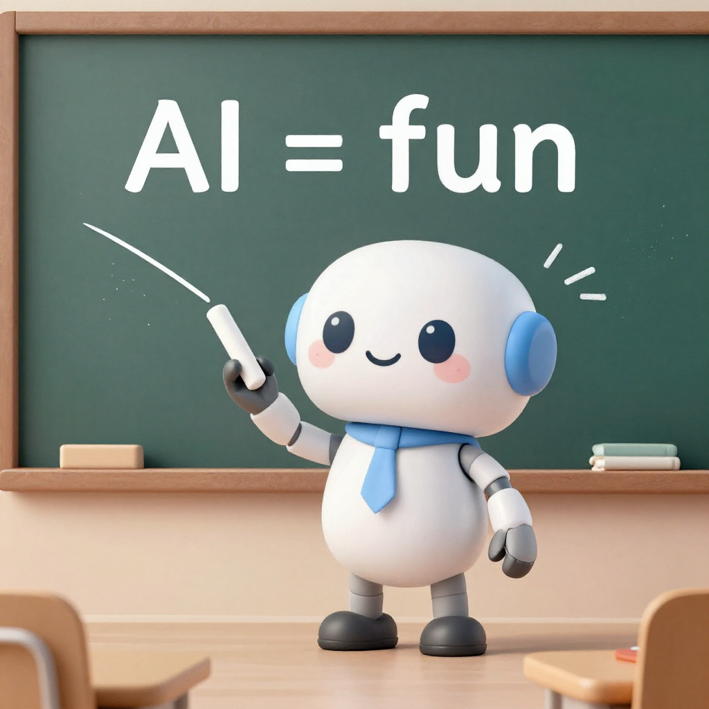

#+TITLE: O que é IA hoje?
#+AUTHOR: Lucas S. Vieira
#+SUBTITLE: Nomenclaturas de IA
#+REVEAL_ROOT: https://cdn.jsdelivr.net/npm/reveal.js@4/
#+REVEAL_THEME: night
#+REVEAL_PLUGINS: (highlight)
#+REVEAL_MARGIN: 0.1
#+REVEAL_MIN_SCALE: 0.5
#+REVEAL_MAX_SCALE: 2.0
#+OPTIONS: toc:nil num:nil
#+REVEAL_TITLE_SLIDE: 
%a
 <h2>%t</h2> 
%s
 
Guilda de IA

#+REVEAL_TITLE_SLIDE_BACKGROUND: ./slide_01.gif

* O Problema
- Muita gente usa termos como se fossem a mesma coisa
- *Não são*
- Entender a diferença é fundamental

** Cinco termos principais
- IA (Inteligência Artificial)
- LLM (Large Language Model)
- Difusão (Modelos de Difusão)
- RAG (Retrieval Augmented Generation)
- Agente (AI Agent)

* 1. IA - Inteligência Artificial
- *O que é:* Campo geral
- Qualquer sistema que faz algo "inteligente"

** Exemplos de IA
- Spam filter do email → IA
- Reconhecimento facial → IA
- Chess engine → IA
- ChatGPT → IA

* 2. LLM - Large Language Model
- *O que é:* Um TIPO de IA *generativa*
- Modelo que prevê próxima palavra

** Capacidades que importam (pra construtores)
- *Tool calling* → Consegue chamar ferramentas externas
- *Raciocínio* → Pensamento passo a passo explícito
- *Contexto longo* → Para agentes: 64K mínimo; conversacional pode ser menos
- *Multimodalidade* → Imagem, áudio, vídeo

** Dica: o essencial pra agentes
Para construir agentes, o essencial é *tool calling + contexto longo*. Modelos densos (não-MoE) tendem a ser mais consistentes nisso.

** O panorama (Setembro 2026)
- *Frontier proprietário:* GPT-6 Astra, Claude Fable 5.1, Gemini 3.8 Flash
- *Open weights topo:* GLM-5.3 (MIT), Kimi K3, DeepSeek V4 Pro
- *Custo-benefício:* DeepSeek V4 Flash, GLM-5.3 Flash, MiniMax M3
- *Edge/celular:* Gemma 4 E2B, Qwen3.5-4B, LFM2.5-2.6B
- *Agentes locais:* Qwen3.8-27B, Qwen 3.6-35B-A3B, Ornith-1.5

** Destaques da semana (03-04/09)
#+HTML: 

- *GPT-6 Astra* (ontem!): computer use nativo — primeiro modelo classificado *CRÍTICO* em cybersecurity, lançamento com monitoramento total de trajetórias
- *Claude Fable 5.1 / Mythos 5.1* (01/09): mesma arquitetura, salvaguardas diferentes; Fable tem *fallback automático pro Opus 5*
- *Gemini 3.8 Flash* (ontem): workhorse rápido

#+begin_quote
GPT-5.6 ficou em três tiers: *Sol* (topo), *Terra* (~GPT-5.5 por 2x menos), *Luna* (econômico).
#+end_quote
#+HTML: 

** Open weights: os destaques
- *GLM-5.3 vs Flash:* 5.3 é o topo em coding; Flash é rápido, barato e tem *visão nativa* (o 5.3 não tem)
- *DeepSeek V4 Flash:* ~USD 0.14/0.28 por M tokens — *14x mais barato* que o V4 Pro, 1M de contexto
- *Pequenos que rodam em tudo:* LFM2.5-2.6B (denso, o destaque pra celular) e Qwen 3.6-35B-A3B / Ornith-1.5 (MoE, 3B ativos)

** Paradoxo da eficiência
- 2023: GPT-4 era o estado da arte, com ~1,8 trilhão de parâmetros (*estimativa*)
- 2026: Qwen3.5-4B tem 4 bilhões de parâmetros e rivaliza com o GPT-4o
- Modelos modernos são *~450x menores* e igualmente capazes

#+begin_quote
Como? Mais dados de treino, destilação, MoE e pós-treino.
#+end_quote

** Sobre o termo "AGI"
- "AGI virou um termo de hype, não um termo com significado preciso" — Andrew Ng (Google Brain)

#+begin_quote
Para quem constrói: o que importa são capacidades mensuráveis. O modelo faz tool calling? É estável? Foco no que você pode testar.
#+end_quote

** Modelos Densos vs MoE
#+HTML: 

- *Densos:* todos os parâmetros ativos em cada inferência
- *MoE (Mixture of Experts):* só uma fração dos parâmetros ativa por token
- Densos tendem a ser mais *estáveis* em tool calling; MoE *pode* variar mais de um modelo pra outro
- MoE é *amigável ao hardware*: modelo maior, custo de inferência menor
- A escolha entre "27B denso ou 35B MoE" é, na prática, uma *decisão de hardware*: quanta memória de vídeo você tem (e se vale offload)
#+HTML: 

** O que LLM NÃO faz
- Não calcula (234 × 987 = ? → ele chuta)
- Não sabe fatos específicos (suas notas, documentos)
- Não tem memória de longo prazo

* 3. RAG - Retrieval Augmented Generation
#+HTML: 

- *O que é:* Técnica para fazer LLM "saber" coisas
- Usado para documentos que não estavam no treinamento
- Fluxo: pergunta → busca em documentos → documentos + pergunta → LLM → resposta
- (Aula inteira sobre isso na Semana 9!)

#+BEGIN_SRC text
"Quando foi fundada a Liga de IA?"
→ LLM sem RAG: "Não sei" ou inventa data
→ Com RAG: busca no documento, encontra "2025", responde "2025"
#+END_SRC
#+HTML: 

* 4. Agente (AI Agent)
- *O que é:* Sistema que usa LLM + ferramentas + memória
- Diferença: LLM só fala, Agente *faz coisas*

** Comparação
#+BEGIN_SRC text
LLM puro:
Usuário: "Quanto é 234 × 987?"
LLM: "230.898" (pode estar errado, ele chutou)

Agente:
Usuário: "Quanto é 234 × 987?"
Agente: "Deixa eu calcular..."
→ Usa ferramenta de calculadora
→ Responde: "230.958" (correto)
#+END_SRC

** Componentes de um agente
1. *LLM* → faz inferência com linguagem natural
2. *Ferramentas* → o que ele pode fazer
3. *Memória* → histórico da conversa
4. *Decisão* → lógica de quando usar cada ferramenta

#+begin_quote
LLM só fala. Agente fala E faz coisas.
#+end_quote

* 5. IA Generativa além do texto — Modelos de Difusão
- LLM é IA generativa de *texto*
- *Difusão* é outra família de IA generativa: gera *imagem, vídeo e música*
- Funciona por "denoising": começa com ruído, remove em passos até formar a mídia

** Modelos de difusão: onde os LLMs não chegam
- LLM gera *texto*; difusão gera *pixels* e *áudio*
- *Z-Image* (imagem) → difusão de imagem, rápida e local
- *MiniMax H3* → vídeo com áudio nativo
- *MiniMax Music 3* → música completa (letra + melodia + vozes)

** Demo 1: Z-Image — geração de imagem
#+HTML: 

#+HTML: 

- A imagem foi gerada por difusão a partir de um prompt de texto
- *Texto legível no quadro* ("AI = fun") — desafio histórico dos geradores, hoje resolvido
- Geração local: RTX 3050 6GB, ~4 minutos, 1024x1024
#+HTML: 

#+HTML: 

#+ATTR_HTML: :height 420px

#+HTML: 

#+HTML: 

** Demo 2: MiniMax H3 — vídeo a partir de uma referência
#+HTML: 

#+HTML: 

- O clipe foi gerado a partir de uma imagem de referência
- *4 segundos com áudio nativo* (fala, efeitos e movimento no mesmo passe)
- Geração local: RTX 3050 6GB, ~11 minutos
#+HTML: 

#+HTML: 

#+HTML: <video width="460" controls preload="metadata">
#+HTML: <source src="sonic-h3-demo.mp4" type="video/mp4">
#+HTML: Seu navegador não suporta vídeo HTML5.
#+HTML: </video>
#+HTML: 

#+HTML: 

** Demo 3: MiniMax Music 3 — música completa
- Faixa gerada com o Music 3: letra fornecida, melodia e vozes geradas
- Ouça a qualidade da geração:

#+HTML: <audio controls preload="metadata" style="width: 90%;">
#+HTML: <source src="tokens-na-roca-music3.mp3" type="audio/mpeg">
#+HTML: Seu navegador não suporta áudio HTML5.
#+HTML: </audio>

** Os três modelos de difusão da demo
- *Z-Image* → imagem a partir de texto
- *MiniMax H3* → vídeo a partir de referência, com áudio nativo
- *MiniMax Music 3* → música completa a partir de letra

#+begin_quote
Exemplos independentes — cada um demonstra sua própria modalidade.
#+end_quote

* Resumo Visual
#+HTML: 

| Termo | O que é | Exemplo |
|-------+---------+---------|
| IA | Campo geral (contém tudo) | Spam filter, Xadrez, ChatGPT |
| LLM | IA generativa de texto | GPT-6 Astra, GLM-5.3, Gemma 4 |
| Difusão | IA generativa de imagem/vídeo/música | Z-Image, MiniMax H3, Music 3 |
| RAG | Busca + geração | Chatbot que consulta PDFs |
| Agente | LLM + ferramentas + memória | Assistente que calcula, busca, age |

#+HTML: 

* Confusões Comuns

| Frase | Termo correto |
|-------+---------------|
| "Vou usar IA para responder" | LLM ou Agente |
| "Meu RAG responde perguntas" | Agente com RAG |
| "O agente alucina" | LLM alucina |
| "Preciso treinar minha IA" | LLM fine-tuning |

* Roadmap
#+HTML: 

| Semana | Conceito |
|--------+----------|
| 1 | IA, LLM, RAG, Agentes (conceitos) |
| 2 | Prompting básico |
| 3 | Demo prática de agentes |
| 4-5 | Python mínimo, Python + API de LLM |
| 6-8 | Estrutura de um agente, ferramentas, ferramentas múltiplas |
| 9 | Embeddings, similaridade e RAG |
| 10 | Fine-tuning |
| 11 | Apresentação final |

#+HTML: 

* Perguntas?
:PROPERTIES:
:REVEAL_BACKGROUND: ./slide_01.gif
:END:

Agora, você vai ouvir "RAG", "Agente", "LLM" e saber exatamente o que é.